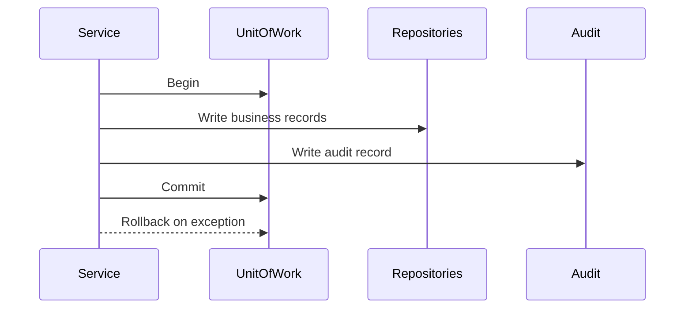

# Transaction Boundary Rules

Purpose: Defines where database transactions start and end for sales, payments, stock, refunds, sync and configuration updates.

This document is written for the Unified Commerce backend: a multi-tenant SaaS platform combining POS, E-Commerce, inventory, payment, refund, receipt, return, exchange, offline sync, reporting and audit capabilities.

Related reading: [[service-layer-rules]], [[repository-layer-rules]], [[offline-sync-backend-rules]]

## Architecture Position

- Backend implementation follows Clean Architecture with explicit Application Services and Repositories.
- CQRS is not part of this backend design.
- MediatR is not part of this backend design.
- The backend is the final authority for tenant isolation, RBAC, feature access, stock, tax, payment, refund, sync and audit.
- Frontend visibility is allowed for usability, but it is not security.
- Except platform-admin-only features, tenant-level features must be configurable by tenant roles, permissions and feature assignments.

## Approved Pattern



## System-Specific Responsibilities

| Workflow | Must be atomic records | Notes |
|---|---|---|
| POS sale completion | sale, sale lines, payments, allocations, stock movements, receipt, audit | One transaction |
| E-Commerce order placement | order, items, address snapshots, reservations, status history | One transaction |
| Return approval | return, lines, refund allocation, stock movement, audit | One transaction |
| Offline sync item | sync item update, source-of-truth insert, conflict/audit | One item transaction |
| Feature assignment | role feature assignment, permission mapping, audit | One transaction |

## Core Rules

- Do not introduce CQRS, MediatR, command handlers or query handlers for this backend.
- Use explicit services, repositories, validators, DTOs and UnitOfWork transactions.
- Follow SOLID: services depend on interfaces, domain stays pure, infrastructure is replaceable.

## 1. Transaction ownership

Use one transaction for workflows that update financial, inventory and audit records together.
Write audit records inside the same transaction for sensitive business actions.
Rollback must leave no partial sale, payment allocation, stock movement or refund state.

## 2. Atomic workflows

Use one transaction for workflows that update financial, inventory and audit records together.
Write audit records inside the same transaction for sensitive business actions.
Rollback must leave no partial sale, payment allocation, stock movement or refund state.

## 3. Idempotency

This area must follow the approved scope, database and backend architecture.
Implementation must stay tenant-scoped and permission-aware.
Avoid adding tables, patterns or modules that are not supported by the approved design.

## 4. Rollback behavior

Use one transaction for workflows that update financial, inventory and audit records together.
Write audit records inside the same transaction for sensitive business actions.
Rollback must leave no partial sale, payment allocation, stock movement or refund state.

## 5. Concurrency examples

This area must follow the approved scope, database and backend architecture.
Implementation must stay tenant-scoped and permission-aware.
Avoid adding tables, patterns or modules that are not supported by the approved design.

## Implementation Example

```csharp
await _unitOfWork.BeginAsync();
try
{
    await _sales.AddAsync(sale);
    await _payments.AddAsync(payment);
    await _stockMovements.AddRangeAsync(movements);
    await _audit.WriteAsync(audit);
    await _unitOfWork.CommitAsync();
}
catch
{
    await _unitOfWork.RollbackAsync();
    throw;
}
```

## API Behavior Example

```http
POST /api/v1/{module}/{resource}
Authorization: Bearer <jwt>
X-Tenant-Id: <tenant-id>
Content-Type: application/json
```

## Tenant-Specific Behavior

- A platform admin may enable a feature for a tenant through tenant feature entitlements.
- A tenant admin configures roles and assigns permissions only inside that tenant boundary.
- Outlet-scoped users must be validated against `outlet_user_roles` where outlet context is required.
- Tenant-level users must be validated against `tenant_user_roles` for tenant-wide actions.
- Runtime flags may disable a feature for a tenant, outlet or user even when entitlement exists.
- Backend services must check this model on every protected write and sensitive read.

## Data Flow References

- `tenants` controls tenant lifecycle and operating mode.
- `platform_features` defines platform-owned feature catalog.
- `tenant_feature_entitlements` controls which features are available to each tenant.
- `roles` and `permissions` define configurable tenant access behavior.
- `role_permissions` and `role_feature_assignments` connect tenant roles to actions and features.
- `feature_flags` applies runtime tenant/outlet/user-level configuration.
- `audit_logs` records sensitive business or configuration changes.

## Implementation Considerations

- Keep controllers thin and move workflow orchestration into application services.
- Keep repositories persistence-focused and transaction-neutral.
- Keep domain models free from EF Core, HTTP and infrastructure concerns.
- Use UnitOfWork for workflows that span multiple tables or modules.
- Use stable permission codes instead of hardcoded role names.
- Use tenant id in all tenant-owned repository methods.
- Do not add generic cache tables or unsupported database shortcuts.
- Do not store secrets, plain OTP codes, card data or payment private keys in JSON columns.
- Record actor, tenant, outlet/device context and reason for sensitive actions.
- Prefer explicit validators over hidden validation inside controllers.
- Use row-level locking or equivalent concurrency control for document sequences and coupon usage.
- Payment idempotency keys must be tenant-scoped.

## Do Not Implement

- Do not implement CQRS handlers for this backend.
- Do not introduce MediatR pipelines.
- Do not hardcode cashier, manager or tenant admin capabilities in service logic.
- Do not trust frontend-calculated totals for final sale, order, refund or tax decisions.
- Do not bypass tenant ownership validation for any FK in request payloads.
- Do not create undocumented tables or generic cache tables.

## Review Questions

- Does this implementation preserve tenant isolation?
- Does the service check tenant entitlement, permission and runtime feature flags?
- Does the repository query include tenant id for tenant-owned records?
- Is the transaction boundary correct for all records written?
- Are DTOs separated from API request and database entity models?
- Are sensitive changes audited with actor and reason where required?

## Related Documents

- [[service-layer-rules]]
- [[repository-layer-rules]]
- [[offline-sync-backend-rules]]

- Note: Keep module dependencies visible through interfaces and documented service calls.
- Note: Avoid circular service dependencies by moving shared pure logic into domain services or shared application services.
- Note: Do not mix platform admin operations with tenant staff operations in one authorization path.
- Note: Keep payment, stock and audit writes in the same workflow transaction when business consistency requires it.
- Note: Prefer explicit code over hidden magic for enterprise workflows.
- Note: Use database constraints as safety guarantees, not as the only business validation layer.
- Note: Keep feature configuration readable for support, audit and tenant administration.
- Note: Use structured logs with tenant id, actor id, trace id and module name.
