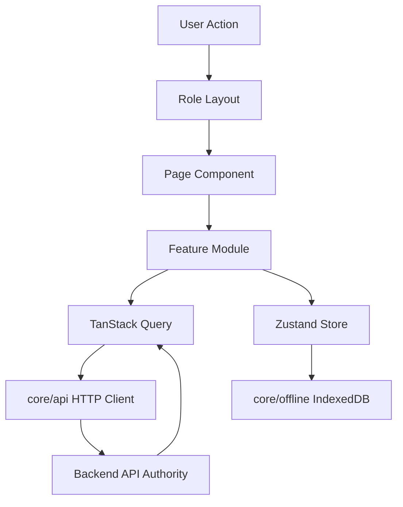
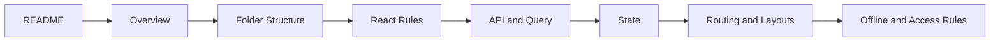

# 06 Frontend Documentation

## Purpose
- Defines the frontend implementation standard for the Unified Commerce SaaS platform.
- Applies to POS terminal screens, Super Admin screens, Tenant Admin screens, outlet staff screens, and manager workflows.
- Uses React with TypeScript as the application foundation.
- Uses TanStack Query for server state and API cache behavior.
- Uses Zustand for client workflow state such as cart, session, till, UI, and offline status.
- Uses Tailwind CSS for consistent enterprise UI styling.
- Uses IndexedDB through `core/offline` for offline POS storage and sync queue persistence.

## Source Alignment
| Area | Frontend interpretation |
|---|---|
| Scope | POS, E-Commerce, tenant admin, platform admin, reports, configuration, offline workflows |
| Database | Tenant, outlet, role, permission, feature, stock, sale, payment, receipt, sync entities shape UI flows |
| Backend | Frontend calls service/repository-backed APIs and never becomes source of authority |
| Frontend architecture | `bootstrap`, `core`, `features`, `shells`, `pages`, `state`, `shared-kernel` |

## Frontend Authority Boundary
- Frontend may guide user behavior, hide unavailable actions, and preview totals.
- Frontend must not make final security, pricing, tax, stock, payment, or entitlement decisions.
- Backend remains final authority for tenant isolation, RBAC, feature entitlements, runtime flags, stock, tax, and audit.
- All tenant-level features must support tenant-specific permissions instead of fixed role behavior.

## Approved Frontend Stack
| Concern | Approved tool | Notes |
|---|---|---|
| UI framework | React | Component-driven frontend |
| Language | TypeScript | Strict types for DTOs and UI state |
| Server state | TanStack Query | API cache, loading, retries, invalidation |
| Client state | Zustand | POS cart, session, till, offline, UI stores |
| Styling | Tailwind CSS | Responsive admin UI and touch-first POS |
| Offline storage | IndexedDB | Accessed only through `core/offline` |
| Routing | React Router style routing | Guarded routes under `bootstrap/router` |

## Folder Responsibility Map
| Folder | Responsibility |
|---|---|
| `bootstrap` | App startup, providers, router, route guards, layouts |
| `core/api` | HTTP client, endpoint registry, query client |
| `core/auth` | Token and session handling |
| `core/offline` | IndexedDB sync queue and connectivity monitor |
| `core/peripherals` | Printer, scanner, cash drawer bridges |
| `features` | Business feature modules |
| `shells` | POS and workflow composition shells |
| `pages` | Route-level pages |
| `state` | Zustand stores and orchestrators |
| `shared-kernel` | Shared frontend calculation/formatting helpers |

## Architecture Diagram


## Tenant-Configurable UI Rule
- Super Admin features are platform controlled.
- Tenant operational features are tenant configurable.
- Tenant Admin screens must load feature entitlements, role assignments, permissions, and runtime flags.
- POS actions must depend on cashier outlet role and current till session.
- Manager actions must depend on permissions such as discount approval, refund, void, stock adjustment, and reprint.
- E-Commerce staff screens must depend on order, payment, fulfillment, customer, and catalog permissions.

## Required Frontend Context
| Context | Source | Required by |
|---|---|---|
| Tenant | JWT/session API | Every tenant screen |
| Outlet | outlet selection or assigned device | POS, stock, reports |
| Role | access context API | menu/action visibility |
| Permissions | access context API | guarded actions |
| Features | entitlement/config APIs | module availability |
| Till session | till session APIs | POS billing and cash workflows |
| Device | POS device registration | offline sync and peripherals |

## Document Set
- `frontend-overview.md` explains the enterprise frontend direction.
- `frontend-folder-structure.md` defines folder ownership.
- `react-architecture-rules.md` defines React/TypeScript rules.
- `api-client-and-query-rules.md` defines TanStack Query and HTTP behavior.
- `state-management-rules.md` defines Zustand store ownership.
- `routing-and-guards.md` defines Auth, Role, and Till guards.
- `feature-access-ui-rules.md` defines tenant-configurable UI access.
- `offline-frontend-rules.md` defines IndexedDB and sync queue rules.
- `layout-architecture.md` defines Super Admin, Tenant Admin, and POS layouts.

## Frontend Reading Flow


## Implementation Position
- Build UI by business module, not by random component grouping.
- Keep shared infrastructure inside `core`.
- Keep POS composition inside `shells` and `pages`.
- Keep business API calls inside `features/<module>/api`.
- Keep module UI components inside `features/<module>/components`.
- Keep route-level orchestration inside `pages`.
- Keep cross-module client state inside `state` only when truly shared.

## Example Feature Access Payload
```json
{
  "tenantId": "tenant-001",
  "outletId": "outlet-001",
  "features": ["pos.sales", "payments.refunds"],
  "permissions": ["pos.sale.create", "payments.refund.approve"],
  "runtimeFlags": { "offlinePos": true, "cashSessionRequired": true }
}
```

## Non-Negotiable Frontend Rules
- Do not hardcode access based on role names.
- Do not bypass route guards for protected pages.
- Do not store payment secrets or private gateway credentials in the browser.
- Do not write directly to IndexedDB outside `core/offline`.
- Do not duplicate backend business validation as final authority.
- Do not make POS sale completion possible without backend or offline-sync accepted rules.

## Related Documents

- [[frontend-overview]]
- [[frontend-folder-structure]]
- [[react-architecture-rules]]
- [[routing-and-guards]]
- [[feature-access-ui-rules]]
- [[state-management-rules]]
- [[offline-frontend-rules]]
- [[theme-and-configuration-rules]]
- [[layout-architecture]]

