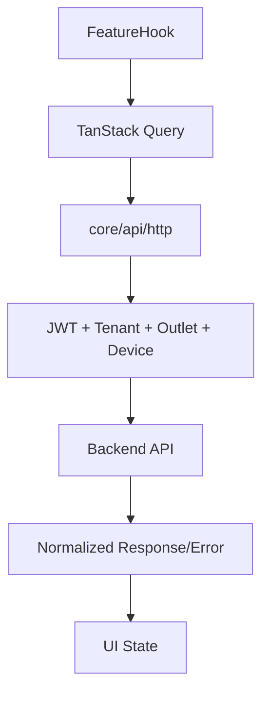

# API Client and Query Rules

## Purpose
- Defines HTTP client and TanStack Query behavior for frontend-server communication.
- Applies to the approved React + TypeScript + TanStack Query + Zustand + Tailwind CSS frontend.
- Must support tenant-specific feature access and configurable permissions.
- Must stay consistent with backend Clean Architecture API boundaries.

## Core API Files
| File | Responsibility |
|---|---|
| `core/api/http.ts` | Axios/fetch wrapper, auth headers, tenant headers, error mapping |
| `core/api/endpoints.ts` | named endpoint registry |
| `core/api/queryClient.ts` | TanStack Query defaults |

## API Client Rule
- All HTTP calls must go through `core/api/http.ts` or a wrapper built from it.
- Feature modules must not instantiate their own raw HTTP clients.
- Auth token and tenant context must be attached centrally.
- Request correlation id should be passed when supported.
- API errors must be normalized before UI rendering.

## Header Example
```http
Authorization: Bearer <jwt>
X-Tenant-Id: <tenant-id>
X-Outlet-Id: <outlet-id-when-required>
X-Device-Id: <pos-device-id-when-required>
X-Correlation-Id: <client-generated-id>
```

## TanStack Query Defaults
| Setting | Default direction | Reason |
|---|---|---|
| `retry` | limited for reads, careful for writes | avoid duplicate operations |
| `staleTime` | module-specific | POS catalog can be cached; payments should be fresh |
| `gcTime` | module-specific | avoid memory growth on POS terminals |
| `refetchOnWindowFocus` | disabled for POS critical flows | avoid unexpected checkout refresh |
| mutations | idempotency-aware | payments/orders/sync must avoid duplicates |

## Query Key Standard
```ts
export const productKeys = {
  all: ["products"] as const,
  search: (tenantId: string, outletId: string, q: string) =>
    ["products", tenantId, outletId, "search", q] as const,
};
```

## Feature API Example
```ts
export function useProductSearchQuery(query: string) {
  const ctx = useSessionContext();
  return useQuery({
    queryKey: productKeys.search(ctx.tenantId, ctx.outletId, query),
    queryFn: () => productApi.search({ query, outletId: ctx.outletId }),
    enabled: Boolean(ctx.tenantId && ctx.outletId),
  });
}
```

## Mutation Rule
- Mutations that create payments, sales, orders, refunds, returns, or sync items must include idempotency key when backend supports it.
- UI must disable duplicate submission while mutation is pending.
- Retrying write mutations must be deliberate.
- Failed write mutation must show recoverable status when backend result is uncertain.

## Mutation Example
```ts
await completeSaleMutation.mutateAsync({
  idempotencyKey: createClientId(),
  tenantId,
  outletId,
  tillSessionId,
  lines,
  payments,
});
```

## Cache Invalidation
| Operation | Invalidate |
|---|---|
| product updated | product detail, product list, POS cache refresh marker |
| sale completed | inventory balance, till session summary, receipt list |
| refund completed | payment summary, sale/order detail, report projections |
| feature config changed | access context, route menu, tenant settings |

## API Flow


## Offline API Behavior
- Offline POS must not fake successful server mutations.
- Offline sale/payment/receipt data goes to IndexedDB through `core/offline`.
- Sync APIs are called after reconnection.
- UI must show pending sync vs server accepted vs conflict states.

## Related Documents

- [[offline-frontend-rules]]
- [[state-management-rules]]
- [[feature-access-ui-rules]]

