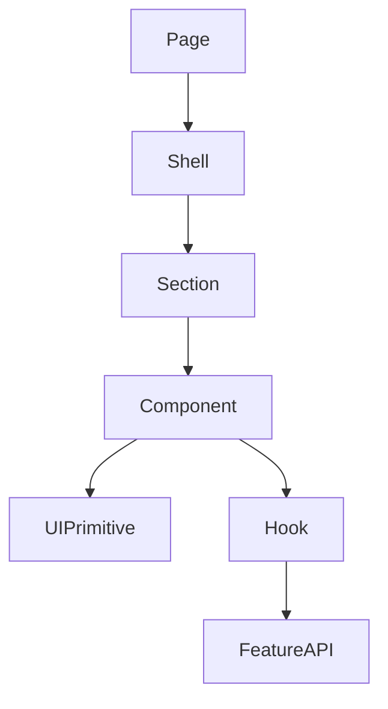

# Component Design Rules

## Purpose
- Defines reusable component standards for POS and enterprise admin UI.
- Applies to the approved React + TypeScript + TanStack Query + Zustand + Tailwind CSS frontend.
- Must support tenant-specific feature access and configurable permissions.
- Must stay consistent with backend Clean Architecture API boundaries.

## Component Principles
- Components must be typed with explicit props.
- Components must be reusable inside their intended module scope.
- POS components must support touch-first use.
- Admin components must support dense but readable enterprise workflows.
- Access-controlled actions must receive feature and permission context.

## Component Types
| Type | Example | Rule |
|---|---|---|
| Display | `MoneyText` | formatting only |
| Input | `BarcodeInput` | controlled and accessible |
| Action | `PermissionButton` | permission-aware |
| Data | `TenantTable` | server-driven data |
| Workflow | `PaymentPanel` | limited business orchestration |
| Shell | `CartShell` | composes feature components |

## Permission Button Example
```tsx
export function PermissionButton(props: PermissionButtonProps) {
  const allowed = useCan(props.featureKey, props.permission);
  if (!allowed && props.hideWhenDenied) return null;
  return <button disabled={!allowed} onClick={props.onClick}>{props.children}</button>;
}
```

## Tailwind CSS Rules
- Use utility classes consistently.
- Create semantic component wrappers when repeated patterns emerge.
- Avoid random colors; use theme tokens where available.
- POS primary buttons must use large padding and clear labels.
- Admin forms must use consistent spacing and validation placement.

## POS Component Requirements
| Component | Requirement |
|---|---|
| barcode input | autofocus and scanner-friendly behavior |
| product tile | large tap target and clear stock/price display |
| cart line | quantity controls reachable by touch |
| payment button | clear method, amount, and status |
| receipt action | print/reprint permission awareness |
| offline badge | visible and non-intrusive |

## Admin Component Requirements
| Component | Requirement |
|---|---|
| data table | filter, search, status, pagination |
| form section | grouped fields and validation |
| side panel | detail/edit without losing list context |
| role matrix | feature + permission grouping |
| audit viewer | timestamp, actor, entity, action |

## Component Composition Flow


## Validation Display
- Field validation appears near the field.
- Form-level validation appears above submit controls.
- Backend validation errors must map to fields when possible.
- Permission denial must be clearly different from validation failure.

## Avoid
- Avoid components that call unrelated module APIs.
- Avoid hardcoded tenant names, role names, outlet codes, or permission shortcuts.
- Avoid hidden side effects on render.
- Avoid direct IndexedDB access from UI components.

## Related Documents

- [[ui-ux-page-design-rules]]
- [[theme-and-configuration-rules]]
- [[feature-access-ui-rules]]

