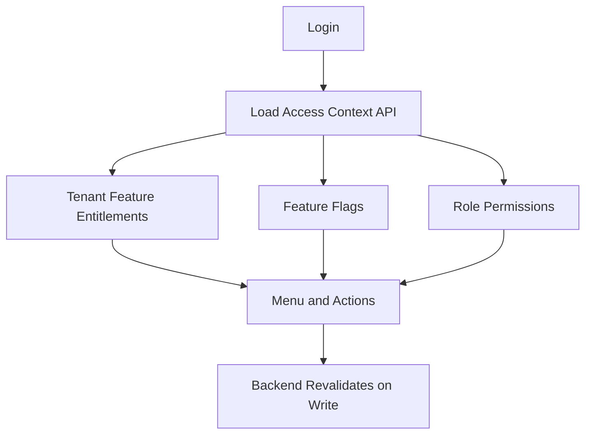

# Feature Access UI Rules

## Purpose
- Defines how configurable tenant feature access appears in frontend screens.
- Applies to the approved React + TypeScript + TanStack Query + Zustand + Tailwind CSS frontend.
- Must support tenant-specific feature access and configurable permissions.
- Must stay consistent with backend Clean Architecture API boundaries.

## Core Rule
- Except platform-admin-level features, every feature must be controlled by tenant-specific configuration.
- The UI must not hardcode access based on fixed job titles.
- Access is decided by tenant entitlement, runtime flags, role permissions, outlet role assignment, and backend validation.

## Access Inputs
| Input | Database source | UI effect |
|---|---|---|
| Platform feature | `platform_features` | known feature catalog |
| Tenant entitlement | `tenant_feature_entitlements` | module availability |
| Runtime flag | `feature_flags` | tenant/outlet/user behavior |
| Role permission | `role_permissions` | action availability |
| Feature role assignment | `role_feature_assignments` | feature-to-role access |
| Tenant user role | `tenant_user_roles` | tenant-level access |
| Outlet user role | `outlet_user_roles` | outlet-level access |

## UI Access Algorithm
```ts
function canUseAction(ctx: AccessContext, featureKey: string, permission: string) {
  return ctx.features.includes(featureKey)
    && ctx.permissions.includes(permission)
    && ctx.runtimeFlags[featureKey] !== false;
}
```

## Important Limitation
- The helper above is only a UI decision helper.
- Backend must still validate the same operation.
- UI hiding improves usability; it is not security.

## Permission Flow


## Action Visibility Table
| Action | Required feature | Required permission | Extra state |
|---|---|---|---|
| Create sale | `pos.sales` | `pos.sale.create` | active till session |
| Void sale | `pos.sales` | `pos.sale.void` | sale voidable |
| Approve discount | `discounts.approvals` | `discount.approve` | pending request |
| Refund payment | `payments.refunds` | `payment.refund.create` | eligible captured payment |
| Reprint receipt | `receipts` | `receipt.reprint` | receipt exists |
| Stock adjustment | `inventory.adjustments` | `inventory.adjustment.create` | outlet access |
| Configure role | `access.roles` | `role.update` | tenant admin area |

## Disabled vs Hidden
| Condition | Preferred UI behavior |
|---|---|
| Feature not entitled | hide module |
| Permission missing | hide or disable action with reason |
| Business state invalid | show disabled action with explanation |
| Backend rejects action | show controlled error and refresh data |
| Runtime flag off | hide feature or show configuration notice |

## Tenant Admin Behavior
- Tenant Admin sees only features enabled by platform for that tenant.
- Tenant Admin may configure roles and permissions only inside tenant boundaries.
- Tenant Admin cannot grant platform-disabled features.
- Tenant Admin cannot bypass backend permission validation.

## POS Behavior
- Cashier menu and buttons must be permission-aware.
- Manager override modal appears only when user can request or approve override.
- Outlet role assignment decides which outlet the user can operate.
- POS terminal must not allow cross-outlet sale completion by UI manipulation.

## Super Admin Behavior
- Super Admin controls platform-level tenant onboarding, entitlements, plans, platform features, and support visibility.
- Platform admin features are not tenant-configurable.
- Super Admin screens must not be mixed into tenant layouts.

## Related Documents

- [[routing-and-guards]]
- [[layout-architecture]]
- [[theme-and-configuration-rules]]

-