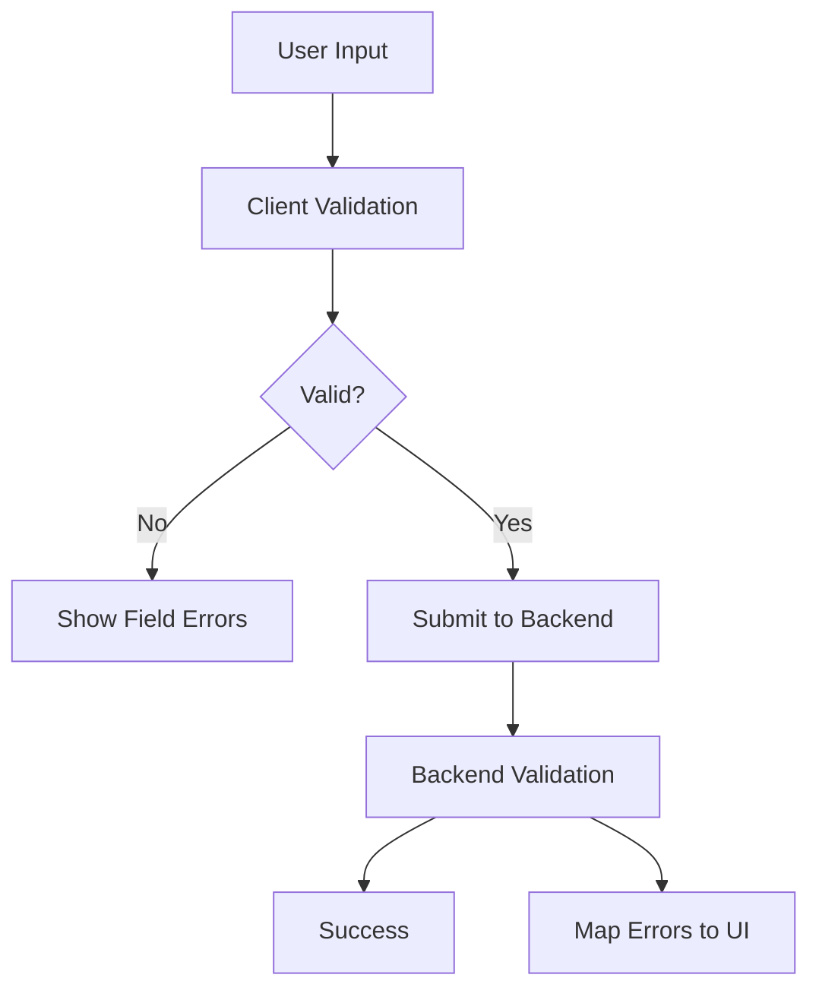

# Form Validation Rules

## Purpose
- Defines frontend validation behavior and backend validation alignment.
- Applies to the approved React + TypeScript + TanStack Query + Zustand + Tailwind CSS frontend.
- Must support tenant-specific feature access and configurable permissions.
- Must stay consistent with backend Clean Architecture API boundaries.

## Validation Boundary
- Frontend validation improves user experience.
- Backend validation is final authority.
- Frontend must not assume validation success means operation is allowed.
- Tenant, permission, feature, and state validation must happen on backend writes.

## Validation Categories
| Category | Frontend example | Backend final? |
|---|---|---|
| required field | product name required | yes |
| format | email/phone format | yes |
| range | discount percent within range | yes |
| uniqueness | SKU/barcode duplicate check | yes |
| permission | refund approval allowed | yes |
| business state | till session open | yes |
| tenant isolation | outlet belongs to tenant | yes |

## Form Data Pattern
```ts
export type CreateProductForm = {
  name: string;
  categoryId?: string;
  returnPolicyId: string;
  variants: CreateVariantForm[];
  isSellablePos: boolean;
  isSellableOnline: boolean;
};
```

## Validation Flow


## Field Validation Examples
| Field | Rule | UI message example |
|---|---|---|
| SKU | required for variant where tracked | SKU is required for this variant |
| barcode | tenant-unique when provided | Barcode already exists |
| amount | greater than zero | Amount must be greater than zero |
| discount | within allowed policy | Discount exceeds allowed threshold |
| outlet | required for POS device | Select an outlet |
| role | scope must match assignment | Outlet role required for outlet assignment |

## Backend Error Mapping
```json
{
  "errorCode": "VALIDATION_FAILED",
  "message": "Request validation failed.",
  "fields": {
    "variants[0].sku": ["SKU is already used in this tenant."]
  }
}
```

## Permission Error Display
- Show authorization failure as access message, not field validation.
- Example: `You do not have permission to approve this discount.`
- Include action name and required permission when safe for internal admin users.
- For POS cashier, keep message short and operational.

## Tenant Configuration Forms
- Show platform-enabled features only.
- Prevent tenant admin from configuring disabled platform features.
- Show inherited tenant settings vs outlet/user overrides.
- Warn when changing settings affects active POS terminals.

## Offline Validation
- Offline POS performs local validation using cached config.
- Offline validation does not guarantee server acceptance.
- Sync conflicts must show backend validation result after reconnect.

## Related Documents

- [[api-client-and-query-rules]]
- [[feature-access-ui-rules]]
- [[offline-frontend-rules]]

