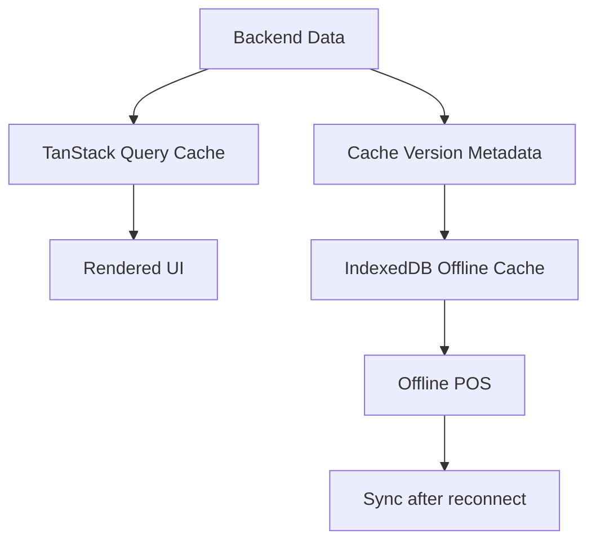

# Frontend Caching Rules

## Purpose
- Defines safe API cache and POS local data caching behavior.
- Applies to the approved React + TypeScript + TanStack Query + Zustand + Tailwind CSS frontend.
- Must support tenant-specific feature access and configurable permissions.
- Must stay consistent with backend Clean Architecture API boundaries.

## Cache Categories
| Cache type | Tool | Example |
|---|---|---|
| API cache | TanStack Query | product search, customer lookup |
| Durable offline cache | IndexedDB via `core/offline` | offline sale queue, cached product snapshot |
| UI state | Zustand | drawer open, cart selection |
| Theme cache | provider memory/query | tenant theme tokens |

## Cache Authority Rule
- Cached data improves speed; it does not override backend authority.
- POS may operate from cached product/pricing data only when offline mode is enabled.
- Online admin operations should use fresh API data for sensitive configuration.
- Payment/refund/order state must avoid stale risky cache behavior.

## TanStack Query Cache Policy
| Data | Suggested caching | Reason |
|---|---|---|
| access context | short stale time | changes affect security UX |
| product search | moderate stale time | POS speed and catalog lookup |
| price list | controlled refresh | pricing affects totals |
| till session | very fresh | checkout depends on state |
| payment status | very fresh | financial operation |
| reports | filter-based cache | dashboard usability |

## Invalidation Triggers
- Role or permission update invalidates access context.
- Feature entitlement update invalidates menus and route availability.
- Product update invalidates catalog and POS product cache marker.
- Price list update invalidates pricing queries and offline cache version.
- Till close invalidates POS session routes.
- Sale completion invalidates inventory, receipt, till, and report summaries.

## Cache Versioning
```json
{
  "tenantId": "tenant-001",
  "outletId": "outlet-001",
  "catalogVersion": "2026-05-10-001",
  "pricingVersion": "2026-05-10-003",
  "taxVersion": "2026-05-01-001",
  "featureVersion": "2026-05-10-002"
}
```

## Cache Flow


## IndexedDB Cache Rules
- Cache only fields required for offline POS operation.
- Store product/variant identifiers, barcode, name, price snapshot, tax rule snapshot, and availability context where needed.
- Do not store full admin datasets unnecessarily.
- Do not store secrets or raw card information.
- Apply retention cleanup for old offline queues and obsolete snapshots.

## Security Considerations
- Browser cache is not secure storage for secrets.
- JWT refresh behavior must be handled by auth/session manager.
- Offline mode must gracefully lock if token/session/device context is no longer valid after reconnect.
- Tenant context must be included in cache keys.

## Related Documents

- [[offline-frontend-rules]]
- [[api-client-and-query-rules]]
- [[feature-access-ui-rules]]

