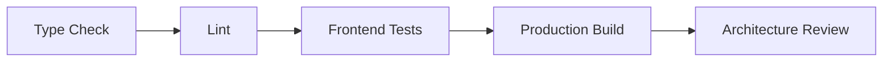

# Frontend Coding Standards

## Purpose
- Defines TypeScript, React, and module coding conventions.
- Applies to the approved React + TypeScript + TanStack Query + Zustand + Tailwind CSS frontend.
- Must support tenant-specific feature access and configurable permissions.
- Must stay consistent with backend Clean Architecture API boundaries.

## Code Quality Direction
- Use strict TypeScript.
- Prefer explicit types over inferred public interfaces.
- Keep modules small and readable.
- Use SOLID-inspired frontend boundaries: single responsibility, clear dependencies, replaceable adapters.
- Avoid hidden coupling across features.

## TypeScript Standards
| Rule | Requirement |
|---|---|
| API DTOs | typed and kept near feature API/types |
| Form models | separate from backend DTO when UI differs |
| Store state | explicit state and action types |
| Constants | named exports, no magic strings |
| Status values | union types aligned with backend statuses |

## File Style
- One component per file unless helper is private and tiny.
- One hook per file for reusable hooks.
- API files should group calls by module.
- Export through `index.ts` only when intentionally public.
- Keep filenames consistent and descriptive.

## Example Module Exports
```ts
export * from "./types/ProductTypes";
export * from "./api/useProductSearchQuery";
export * from "./components/ProductSearchPanel";
```

## Error Handling
- Normalize API errors centrally.
- Components should render business-safe messages.
- POS workflow errors must not leave cart/payment in unclear state.
- Include retry action only when operation is safe to retry.
- Show conflict resolution path when sync returns conflict.

## Logging
- Use `core/utils/logger.ts`.
- Do not log JWT tokens, card details, OTP values, or private customer data.
- Log correlation ids and client transaction ids for debugging.
- Offline sync logs should support support-team diagnosis without exposing secrets.

## Naming Example
```ts
const canApproveRefund = useCan("payments.refunds", "payment.refund.approve");
const openTillSession = useTillStore((state) => state.openTillSession);
const completeSaleMutation = useCompleteSaleMutation();
```

## Dependency Rules
- Do not import from pages into features.
- Do not import from features into core.
- Do not import POS shell components into generic admin pages.
- Do not create circular dependencies between stores and feature modules.
- Shared kernel must not depend on React Router or DOM-only APIs unless explicitly isolated.

## Security Coding Rules
- Do not embed permission bypasses for testing.
- Do not hardcode tenant ids, outlet ids, or admin emails.
- Do not store sensitive values in localStorage.
- Do not expose platform-only screens in tenant route groups.

## Build Readiness


## Related Documents

- [[frontend-naming-conventions]]
- [[frontend-folder-structure]]
- [[react-architecture-rules]]

