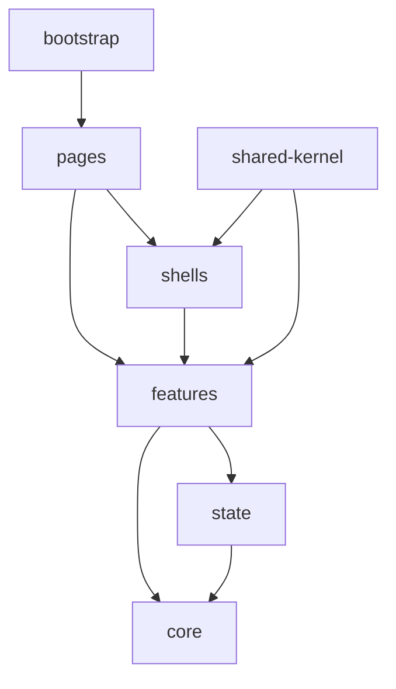

# Frontend Folder Structure

## Purpose
- Defines exact folder ownership for the React TypeScript frontend.
- Applies to the approved React + TypeScript + TanStack Query + Zustand + Tailwind CSS frontend.
- Must support tenant-specific feature access and configurable permissions.
- Must stay consistent with backend Clean Architecture API boundaries.

## Approved Structure
```text
src/
├── bootstrap/
├── core/
├── features/
├── shells/
├── pages/
├── state/
└── shared-kernel/
```

## Folder Ownership Table
| Folder | Owns | Must not own |
|---|---|---|
| `bootstrap` | app startup, providers, routes, guards, layouts | feature business logic |
| `core/api` | HTTP client, endpoints, query client | module-specific form logic |
| `core/auth` | token/session helpers | UI role decisions |
| `core/offline` | IndexedDB adapter, sync queue, connectivity | random local storage writes |
| `core/peripherals` | printer/scanner/cash drawer bridges | sales business rules |
| `features` | module API hooks, types, components | global app startup |
| `shells` | POS panel composition | API contracts |
| `pages` | route-level orchestration | reusable domain utilities |
| `state` | shared Zustand stores | API caching |
| `shared-kernel` | frontend-safe calculators/builders | backend authority decisions |

## Feature Module Template
```text
features/products/
├── api/
├── components/
├── hooks/
├── services/
├── types/
└── index.ts
```

## Feature Module Rules
- `api` contains TanStack Query hooks and endpoint callers.
- `components` contains module-only UI components.
- `hooks` contains module-specific UI hooks.
- `services` contains frontend-only transformation and orchestration helpers.
- `types` contains TypeScript DTOs and view models.
- `index.ts` exports only approved public module items.

## Bootstrap Folder
| File or folder | Responsibility |
|---|---|
| `main.tsx` | React mount and root provider wiring |
| `App.tsx` | app shell entry |
| `router/index.tsx` | router creation |
| `router/routes.tsx` | route declarations |
| `guards/AuthGuard.tsx` | authenticated access |
| `guards/TillSessionGuard.tsx` | POS session access |
| `guards/RoleGuard.tsx` | permission/feature-aware route protection |
| `providers/QueryProvider.tsx` | TanStack Query provider |
| `providers/ThemeProvider.tsx` | tenant theme tokens |
| `providers/SessionProvider.tsx` | authenticated session context |

## Layout Folder
- `AdminLayout.tsx` may be split into Super Admin and Tenant Admin variants as the project grows.
- `POSLayout.tsx` owns terminal-specific structure, not sale business logic.
- `AuthLayout.tsx` owns login/reset flow shell.
- See [[layout-architecture]] for Super Admin, POS terminal, and tenant role layouts.

## State Folder
| Store | Purpose |
|---|---|
| `app.store.ts` | global app UI flags |
| `session.store.ts` | selected tenant/outlet/device context mirror |
| `till.store.ts` | open till session state |
| `cart.store.ts` | POS cart state |
| `ui.store.ts` | drawers, modals, panels |
| `offline.store.ts` | connectivity and queue summary |
| `cart.orchestrator.ts` | cart workflow coordination |

## Folder Dependency Direction


## Import Rules
- Features may import from `core`, `state`, and `shared-kernel`.
- Core must not import from features.
- Pages may compose multiple features.
- Shells may compose POS panels but must avoid API details.
- Shared kernel must remain framework-light and frontend-safe.

## Related Documents

- [[react-architecture-rules]]
- [[state-management-rules]]
- [[api-client-and-query-rules]]
- [[layout-architecture]]

