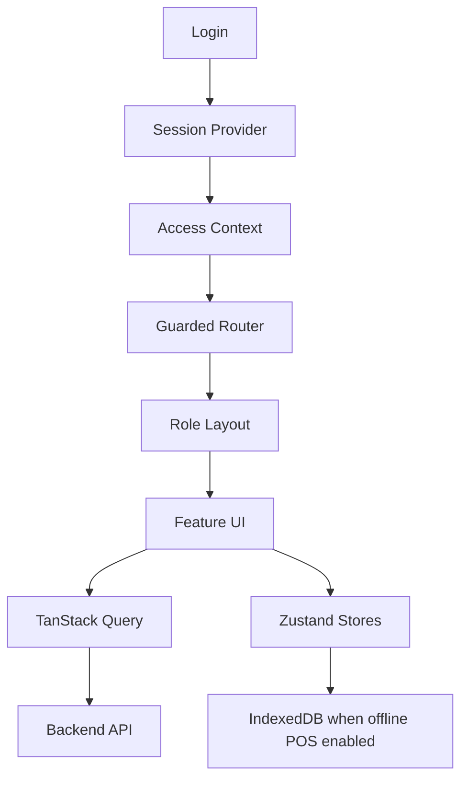

# Frontend Overview

## Purpose
- Defines the full frontend role in the enterprise Unified Commerce system.
- Applies to the approved React + TypeScript + TanStack Query + Zustand + Tailwind CSS frontend.
- Must support tenant-specific feature access and configurable permissions.
- Must stay consistent with backend Clean Architecture API boundaries.

## Application Surfaces
| Surface | Primary users | Main layout |
|---|---|---|
| Super Admin Portal | Platform admins | Super Admin layout |
| Tenant Admin Portal | Tenant admins, managers | Tenant layout |
| POS Terminal | Cashiers, outlet managers | POS terminal layout |
| Manager Operations | Outlet manager, inventory staff | Tenant role layout |
| E-Commerce Operations | Online order staff | Tenant role layout |

## Core Design Principle
- The frontend is a controlled interface over tenant-aware backend services.
- It must present only allowed modules and actions for the current tenant, role, outlet, device, and runtime configuration.
- It must not assume fixed capabilities for cashiers, managers, or tenant admins.
- A role name is display information; permissions and feature assignments decide behavior.

## Source of UI Truth
| UI decision | Source |
|---|---|
| Show module | tenant feature entitlement + runtime flag |
| Show action button | permission + feature + business state |
| Enable POS billing | outlet role + device + active till session |
| Allow refund | refund permission + policy + backend validation |
| Allow reprint | receipt reprint permission + audit rule |
| Allow stock adjustment | inventory permission + tenant feature |

## Frontend Runtime Layers
- `bootstrap` starts application providers and guarded routing.
- `core` contains reusable technical infrastructure.
- `features` contains module-specific UI, API hooks, and types.
- `shells` compose high-speed POS and operational panels.
- `pages` provide route-level screens.
- `state` contains shared Zustand workflow stores.
- `shared-kernel` contains frontend-safe calculation helpers.

## POS Experience Direction
- Touch-first, large target interface.
- Always-focused barcode/search input.
- Minimal typing during checkout.
- Visible subtotal, discount, tax, payable amount, and payment state.
- Clear offline indicator and sync status.
- Till session status must be visible to cashier.

## Admin Experience Direction
- Desktop-focused enterprise UI.
- Data tables, filters, status badges, side panels, and guided forms.
- Permission-aware action menus.
- Tenant configuration screens must explain inherited vs overridden settings.
- Role and permission screens must avoid hardcoded fixed-role assumptions.

## Data Flow Summary

## Backend Authority Reminder
- Frontend previews price, tax, and discounts for speed.
- Backend recalculates final sale, order, return, refund, and stock movements.
- Offline POS sync submits queued client data for server validation.
- Conflicts must be shown clearly rather than hidden.

## Module Coverage
| Module | Frontend responsibility |
|---|---|
| Auth | login, logout, token refresh UI states |
| Till session | open, close, cash count, variance prompts |
| Products | catalog management and POS product lookup |
| Cart | POS cart composition and local interaction |
| Sales | checkout flow and sale lifecycle display |
| Payments | payment capture UI and split payment screens |
| Customers | customer lookup, creation, profile screens |
| Discounts | coupon/manual discount and approval UI |
| Returns | sale/order lookup and return flow |
| Inventory | stocktake, transfer, adjustment screens |
| Receipts | preview, print, reprint, download actions |

## Related Documents

- [[frontend-folder-structure]]
- [[layout-architecture]]
- [[feature-access-ui-rules]]
- [[offline-frontend-rules]]

