# Layout Architecture

## Purpose
- Defines Super Admin, Tenant Admin role layouts, and POS terminal layout.
- Applies to the approved React + TypeScript + TanStack Query + Zustand + Tailwind CSS frontend.
- Must support tenant-specific feature access and configurable permissions.
- Must stay consistent with backend Clean Architecture API boundaries.

## Layout Purpose
- Layouts control navigation, header context, content shell, and role-specific visibility.
- Layouts do not own backend business logic.
- Layouts consume access context and configuration to decide what the user can see.
- Layouts must support tenant-customized feature access.

## Approved Layouts
| Layout | User group | Main concern |
|---|---|---|
| Super Admin Layout | platform admin | tenant lifecycle, platform features, subscriptions, support |
| Tenant Layout | tenant admin, outlet manager, inventory staff, reporting user | configurable business operations |
| POS Terminal Layout | cashier, outlet POS user | high-speed checkout and till workflow |
| Auth Layout | all unauthenticated users | login, reset, OTP, session recovery |

## Super Admin Layout
- Desktop-focused full admin dashboard.
- Left sidebar for platform-level modules.
- Top header with search, environment selector, notifications, profile, and create tenant action.
- Main area for tenant management, plans, platform features, modules, permissions, audit, support, and reports.
- Right panel may show platform alerts or recent tenant activities.

## Super Admin Navigation
| Menu | Notes |
|---|---|
| Dashboard | platform health and tenant metrics |
| Tenants | create, suspend, activate tenants |
| Subscription Plans | SaaS plan configuration |
| Platform Features | global feature catalog |
| Modules & Permissions | platform permission catalog |
| User Roles & User Rights | platform-side admin rights only |
| Admin Users | platform users |
| Payment Gateways | provider setup references |
| System Settings | platform operational settings |
| Audit Logs | platform-level audit |
| Reports & Analytics | platform reporting |
| Support / Tickets | tenant support view |

## Tenant Layout
- Desktop-focused enterprise admin layout.
- Sidebar adapts to tenant entitlements, runtime flags, and user permissions.
- Header shows tenant, outlet selector when relevant, notifications, profile, and quick actions.
- Content area supports tables, forms, side panels, role matrix, reports, and workflow pages.
- Tenant layout must not show platform-only controls.

## Tenant Role-Based Layout Examples
| Role assignment | Possible visible areas | Controlled by |
|---|---|---|
| Tenant Admin | outlets, staff, roles, catalog, settings, reports | tenant permissions + entitlements |
| Outlet Manager | outlet dashboard, cash, returns, inventory, staff actions | outlet role + permissions |
| Inventory Staff | stocktake, transfers, receiving, adjustments | inventory permissions |
| E-Commerce Operator | orders, fulfillment, customers, delivery | order/fulfillment permissions |
| Reporting User | dashboards and exports | report permissions |

## POS Terminal Layout
- Touch-first and full-screen oriented.
- Minimal navigation and maximum workflow clarity.
- Header shows outlet, till, cashier, business date, connection, sync, and session state.
- Main area usually contains product/search area and cart/payment area.
- Bottom or side actions depend on POS device type and configured UX.

## POS Layout Zones
| Zone | Purpose |
|---|---|
| POS header | outlet, till, cashier, session, offline indicator |
| Product grid/search | barcode scan, product lookup, quick add |
| Cart panel | line items, quantity, remove, discounts |
| Totals panel | subtotal, tax, discount, payable |
| Workflow actions | hold, recall, payment, return, close session |
| Notification area | sync conflict, printer status, access errors |

## Layout Selection Flow

```mermaid
flowchart TD
  Login --> UserType{User Type}
  UserType -->|Platform User| Super[Super Admin Layout]
  UserType -->|Tenant Staff| Access[Load Tenant Access]
  Access --> POSNeed{POS Device/Route?}
  POSNeed -->|Yes| POS[POS Terminal Layout]
  POSNeed -->|No| Tenant[Tenant Layout]
  UserType -->|Unauthenticated| Auth[Auth Layout]
```


## Layout Access Rules
- Super Admin layout requires platform user session.
- Tenant layout requires tenant staff session and tenant access context.
- POS layout requires tenant, outlet, device, and where configured active till session.
- Layout navigation must refresh after role, feature, or permission changes.

## Implementation Example
```tsx
export function TenantLayout() {
  const access = useTenantAccessContext();
  const menu = buildTenantMenu(access.features, access.permissions);
  return <AdminShell menu={menu} />;
}
```

## Related Documents

- [[routing-and-guards]]
- [[feature-access-ui-rules]]
- [[ui-ux-page-design-rules]]

