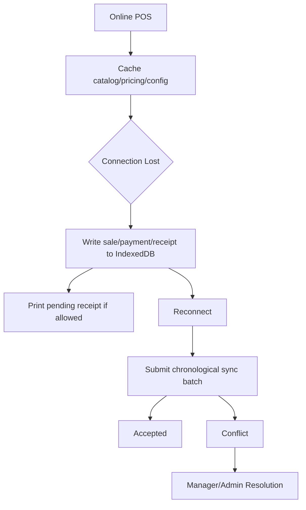

# Offline Frontend Rules

## Purpose
- Defines offline POS browser behavior using IndexedDB through core/offline.
- Applies to the approved React + TypeScript + TanStack Query + Zustand + Tailwind CSS frontend.
- Must support tenant-specific feature access and configurable permissions.
- Must stay consistent with backend Clean Architecture API boundaries.

## Offline Scope
- Offline mode is for POS terminal continuity where enabled for the tenant.
- Offline storage must use IndexedDB through `core/offline` only.
- Local cached data supports billing, receipt generation, and later sync.
- Server validation remains required after reconnection.

## Approved Offline Files
| File | Responsibility |
|---|---|
| `core/offline/syncQueue.ts` | IndexedDB queue operations |
| `core/offline/connectivityMonitor.ts` | online/offline detection |
| `state/offline.store.ts` | UI summary of offline status |

## IndexedDB Rule
- Do not write directly to IndexedDB from feature components.
- Do not use localStorage for sale/payment/receipt queues.
- Queue payload must include tenant, outlet, device, till session, client ids, and timestamps.
- Sensitive payment data must not be stored beyond allowed references.

## Offline Queue Entity Types
| Entity | Backend target | Notes |
|---|---|---|
| sale | `offline_sync_items`, `offline_sale_sync_queue` | accepted server sale becomes source of truth |
| payment | `offline_sync_items`, `offline_payment_sync_queue` | cash allowed; card/QR depends on configured rule |
| receipt | `receipts` after sync | may print offline with pending sync label |
| stock movement | `stock_movements` after validation | conflict possible |
| cash movement | `cash_movements` after validation | session must be valid |

## Offline Data Shape Example
```json
{
  "tenantId": "tenant-001",
  "outletId": "outlet-001",
  "deviceId": "device-001",
  "clientTransactionId": "local-sale-0001",
  "entityType": "sale",
  "createdAt": "2026-05-10T10:00:00Z",
  "payload": { "lines": [], "payments": [] }
}
```

## Offline Flow


## UI Requirements
- Show clear online/offline indicator.
- Show pending sync count.
- Show last successful sync time.
- Show conflict count when returned by backend.
- Label offline receipts clearly if server receipt number is pending.
- Prevent actions that are not allowed offline.

## Offline Payment Rules
- Cash payments can be recorded offline if tenant configuration allows offline cash sale.
- Card/QR offline must be blocked unless external terminal confirmation flow is explicitly configured.
- Payment reference must be captured when required.
- Backend may reject or conflict offline payment during sync.

## Conflict Handling UI
| Conflict | UI response |
|---|---|
| duplicate | show already synced/duplicate result |
| stock mismatch | show conflict resolution required |
| price changed | show accepted/repriced/rejected status from backend |
| closed session | require manager/admin review |
| validation failed | show reason and keep local record for review |

## Connectivity Monitor
- Must listen to browser online/offline events.
- Must verify backend reachability before marking sync-ready.
- Must avoid starting multiple sync loops simultaneously.
- Must pause sync during active checkout if configured.

## Related Documents

- [[state-management-rules]]
- [[api-client-and-query-rules]]
- [[frontend-caching-rules]]

