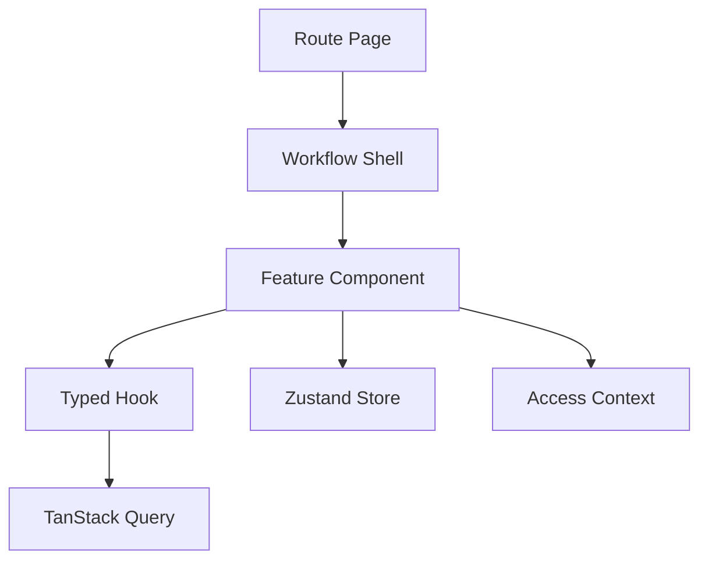

# React Architecture Rules

## Purpose
- Defines React and TypeScript implementation standards for the platform UI.
- Applies to the approved React + TypeScript + TanStack Query + Zustand + Tailwind CSS frontend.
- Must support tenant-specific feature access and configurable permissions.
- Must stay consistent with backend Clean Architecture API boundaries.

## React Design Style
- Use function components only.
- Use TypeScript for props, API DTOs, view models, and store state.
- Prefer small composable components over large route components.
- Keep route orchestration in pages and reusable UI in feature components.
- Avoid embedding backend business decisions into JSX.

## Component Categories
| Category | Location | Example |
|---|---|---|
| Route page | `pages` | `POSPage.tsx` |
| Layout | `bootstrap/layouts` | `POSLayout.tsx` |
| Feature component | `features/products/components` | `ProductSearchPanel.tsx` |
| Shell | `shells/CartShell` | cart/payment composition |
| Shared utility | `shared-kernel` | `Money.ts` |

## Props Rule
```tsx
export type PermissionButtonProps = {
  permission: string;
  featureKey: string;
  disabledReason?: string;
  onClick: () => void;
  children: React.ReactNode;
};
```

## Component Responsibility Example
```tsx
export function ProductSearchPanel() {
  const { data, isFetching } = useProductSearchQuery();
  const addItem = useCartStore((s) => s.addItem);
  return <ProductSearchResults items={data?.items ?? []} loading={isFetching} onAdd={addItem} />;
}
```

## TypeScript Rules
- Do not use `any` for API responses.
- Define API response types inside feature `types` or shared API types.
- Use discriminated unions for status-specific UI states.
- Model nullable backend fields explicitly.
- Use exact permission strings from the permission catalog.

## Status Modeling Example
```ts
export type TillSessionUiState =
  | { kind: "closed" }
  | { kind: "opening" }
  | { kind: "open"; sessionId: string; businessDate: string }
  | { kind: "closing"; sessionId: string };
```

## Rendering Access-Controlled Actions
- Components should consume an access helper or context.
- Access helpers must use backend-provided permission and feature context.
- Never use `roleName === "Manager"` as authority.
- Disabled states should explain missing permission or invalid business state.
- Hidden actions are acceptable for UX but not considered security.

## React Flow Diagram


## Error Boundary Usage
- Use route-level error boundaries for admin pages.
- Use POS-safe fallback panels for terminal workflow errors.
- Never show raw backend stack traces.
- Display trace id/correlation id when returned by backend.

## Accessibility and Touch Rules
- POS controls must use large tap targets.
- Admin tables must support keyboard navigation where practical.
- Disabled controls must have visible reason text or tooltip.
- Color alone must not indicate payment, stock, or sync status.

## Related Documents

- [[component-design-rules]]
- [[feature-access-ui-rules]]
- [[ui-ux-page-design-rules]]

