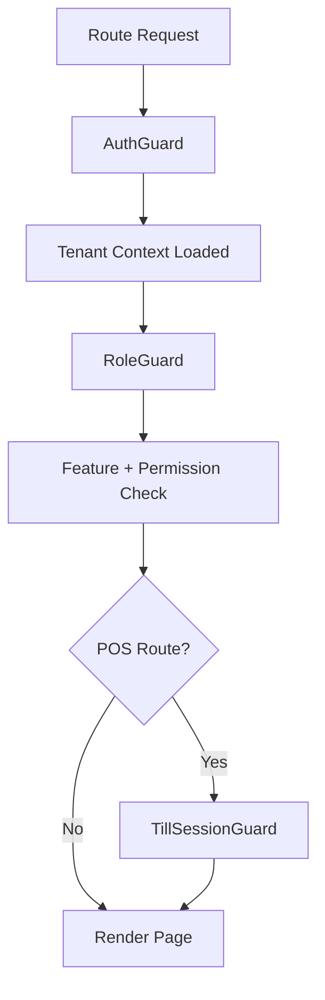

# Routing and Guards

## Purpose
- Defines protected routing, layout selection, and guard behavior.
- Applies to the approved React + TypeScript + TanStack Query + Zustand + Tailwind CSS frontend.
- Must support tenant-specific feature access and configurable permissions.
- Must stay consistent with backend Clean Architecture API boundaries.

## Routing Location
- Routes live under `bootstrap/router`.
- Guards live under `bootstrap/router/guards`.
- Layouts live under `bootstrap/layouts`.
- Route pages live under `pages`.

## Approved Guards
| Guard | Responsibility |
|---|---|
| `AuthGuard` | requires authenticated platform/tenant/customer session |
| `RoleGuard` | requires feature and permission access |
| `TillSessionGuard` | requires active till session for POS billing routes |

## Route Context Requirements
| Route group | Required context |
|---|---|
| Super Admin | platform user JWT, platform permissions |
| Tenant Admin | tenant staff JWT, tenant id, feature access |
| POS Terminal | tenant id, outlet id, device id, till session state |
| Manager | tenant id, outlet role, manager permissions |
| Auth | no active protected context required |

## Route Example
```tsx
<Route element={<AuthGuard />}>
  <Route element={<RoleGuard feature="pos.sales" permission="pos.sale.create" />}>
    <Route element={<TillSessionGuard />}>
      <Route path="/pos" element={<POSPage />} />
    </Route>
  </Route>
</Route>
```

## Guard Evaluation Order


## Auth Guard Rules
- Validate token presence and session expiry state.
- Trigger refresh flow if supported and safe.
- Redirect expired sessions to login.
- Preserve intended route after successful login where appropriate.
- Do not infer role or permission from token alone if access context API is required.

## Role Guard Rules
- Accept feature key and permission code.
- Check backend-provided access context.
- Support tenant, outlet, and user-scoped runtime flags.
- Render access-denied page when the user is authenticated but unauthorized.
- Avoid redirect loops when access context is loading.

## Till Session Guard Rules
- Applies only to POS workflows requiring open session.
- Checks active till session for current tenant, outlet, till, and device.
- Redirects to `TillOpenPage` when no active session exists.
- Blocks checkout/payment route if session is closed.
- Must refresh session state before final sale completion.

## Layout Routing
| Layout | Applies to |
|---|---|
| `AuthLayout` | login, reset, OTP, session recovery |
| Super Admin layout | tenant creation, platform features, subscription, audit support |
| Tenant layout | tenant admin, manager, catalog, inventory, reports |
| `POSLayout` | cashier terminal, payment, return, till open/close |

## Navigation Visibility
- Sidebar/menu items must be generated from access context and feature configuration.
- Tenant admin menu must vary by tenant enabled features and role permissions.
- POS navigation must stay minimal and workflow-first.
- Super Admin navigation is platform-level and not tenant-configurable.

## Related Documents

- [[layout-architecture]]
- [[feature-access-ui-rules]]
- [[frontend-folder-structure]]

