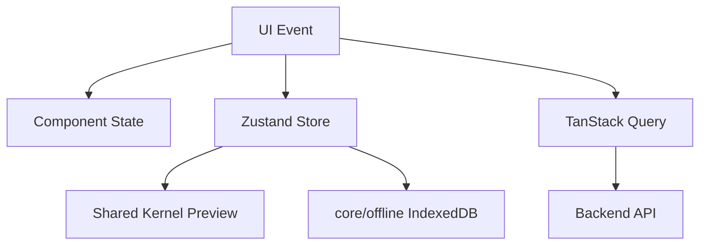

# State Management Rules

## Purpose
- Defines Zustand and TanStack Query state ownership boundaries.
- Applies to the approved React + TypeScript + TanStack Query + Zustand + Tailwind CSS frontend.
- Must support tenant-specific feature access and configurable permissions.
- Must stay consistent with backend Clean Architecture API boundaries.

## State Ownership Principle
- TanStack Query owns server state.
- Zustand owns client workflow state.
- IndexedDB owns offline POS durable queue through `core/offline`.
- React local state owns short-lived component state.

## State Decision Table
| State | Tool | Example |
|---|---|---|
| API data | TanStack Query | products, sales history, orders |
| POS cart | Zustand | current cart lines and UI selections |
| Till session mirror | Zustand + Query | open session id and status |
| Offline queue summary | Zustand + IndexedDB | pending count, sync status |
| Form field input | React state/form library | product create form |
| Tenant settings | Query + theme provider | runtime config and theme tokens |

## Zustand Store Rules
- Stores must be small and workflow-specific.
- Do not store large server collections in Zustand.
- Do not store JWT secrets in Zustand.
- Do not persist sensitive payment details.
- Persist only approved POS offline data through `core/offline`.
- Keep store actions named by business action.

## Cart Store Example
```ts
type CartStore = {
  lines: CartLine[];
  addItem: (item: CartItemInput) => void;
  changeQty: (lineId: string, qty: number) => void;
  removeLine: (lineId: string) => void;
  clearCart: () => void;
};
```

## Store Responsibility Matrix
| Store | Owns | Does not own |
|---|---|---|
| `session.store.ts` | selected tenant/outlet/device mirror | authentication token validation |
| `till.store.ts` | active till session UI state | backend till close authority |
| `cart.store.ts` | active POS cart | final tax/payment authority |
| `ui.store.ts` | drawers, modals, panels | business records |
| `offline.store.ts` | connectivity and queue summary | raw IndexedDB writes |

## Cart Orchestrator
- `cart.orchestrator.ts` coordinates add item, pricing preview, discount preview, and payment readiness.
- It may use `shared-kernel/pricing-engine` for preview only.
- It must call backend or offline queue rules for final completion.
- It must not directly update inventory or payment server state.

## State Flow


## Permission State
- Access context may be cached through TanStack Query.
- UI helper may expose `can(featureKey, permissionCode)`.
- Access context must be refreshed after role, permission, feature, or flag changes.
- Do not manually patch permissions in Zustand after configuration changes; refetch from backend.

## Offline State
- Offline queue durability belongs to IndexedDB.
- `offline.store.ts` exposes derived UI state such as online/offline, queue count, last sync, and conflict count.
- Do not duplicate full queue payload in Zustand.
- Sync processing should update store summary after durable IndexedDB changes.

## Related Documents

- [[api-client-and-query-rules]]
- [[offline-frontend-rules]]
- [[feature-access-ui-rules]]

