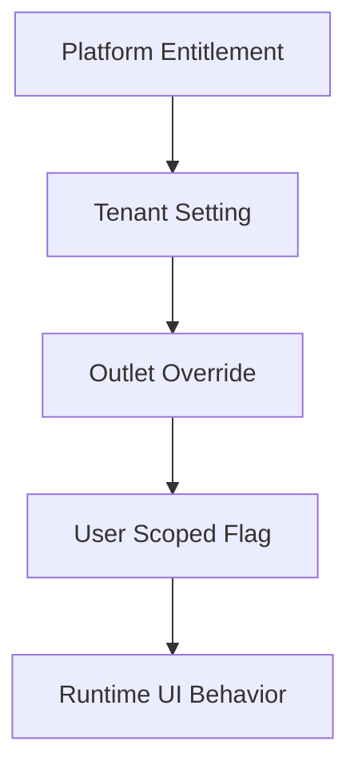

# Theme and Configuration Rules

## Purpose
- Defines tenant theme tokens and runtime configuration behavior.
- Applies to the approved React + TypeScript + TanStack Query + Zustand + Tailwind CSS frontend.
- Must support tenant-specific feature access and configurable permissions.
- Must stay consistent with backend Clean Architecture API boundaries.

## Configuration Scope
- Platform enables available features for a tenant.
- Tenant admins configure enabled tenant features.
- Outlet/user/channel overrides may apply where backend supports feature flags or settings.
- UI must explain inherited and overridden configuration clearly.

## Theme Source
| Concept | Database reference | Frontend usage |
|---|---|---|
| tenant theme | `ui_themes` | ThemeProvider tokens |
| tenant settings | `tenant_settings` | runtime behavior |
| feature flags | `feature_flags` | module/action availability |
| feature entitlements | `tenant_feature_entitlements` | enabled capability set |

## ThemeProvider Rule
- ThemeProvider loads tenant theme tokens after tenant context is known.
- Auth screens may use platform/default theme before tenant selection.
- POS layout must preserve readability under tenant theme.
- Theme tokens must be validated before application.

## Theme Token Example
```json
{
  "colors": {
    "primary": "#2563eb",
    "surface": "#ffffff",
    "danger": "#dc2626"
  },
  "radius": { "card": "16px", "button": "12px" },
  "typography": { "fontFamily": "Inter" }
}
```

## Tailwind Integration
- Tailwind classes provide layout and spacing consistency.
- CSS variables may map tenant theme tokens into Tailwind-compatible usage.
- Do not create one-off colors in individual components.
- POS danger/success/status colors must remain accessible.

## Configuration Priority


## Runtime Configuration Examples
| Setting | Effect |
|---|---|
| `cashSessionRequired` | POS routes require active till session |
| `offlinePosEnabled` | offline queue and indicator enabled |
| `allowNegativeStock` | UI may warn but backend decides |
| `receiptReprintRequiresApproval` | show approval flow |
| `discountApprovalThreshold` | show request/approve discount flow |

## Tenant Role Customization UI
- Role screens must support tenant-created roles.
- Permission matrix must be grouped by module and feature.
- Feature assignment must reflect enabled platform features only.
- User rights must support tenant and outlet role assignments.
- UI must show which actions become available after role changes.

## Configuration Safety
- Changing feature access should refresh access context.
- Changing POS settings should warn if active terminals may be affected.
- Changing receipt templates should not mutate historical receipts.
- Changing theme should preview before saving where practical.

## Related Documents

- [[feature-access-ui-rules]]
- [[layout-architecture]]
- [[frontend-caching-rules]]

- Implementation consideration 1: keep this theme and configuration rules rule aligned with tenant context, role rights, feature flags, and backend validation.
