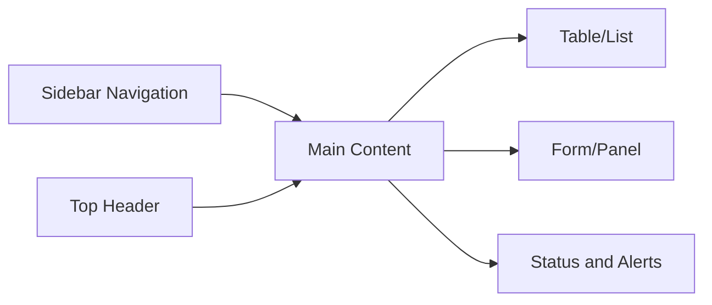
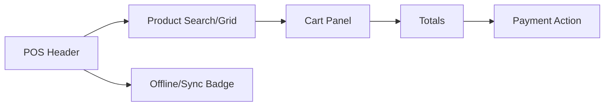

# UI UX Page Design Rules

## Purpose
- Defines page-level UX standards for POS, Super Admin, and Tenant Admin surfaces.
- Applies to the approved React + TypeScript + TanStack Query + Zustand + Tailwind CSS frontend.
- Must support tenant-specific feature access and configurable permissions.
- Must stay consistent with backend Clean Architecture API boundaries.

## Page Design Principle
- POS pages optimize speed and low typing.
- Admin pages optimize control, auditability, and configuration clarity.
- Tenant role pages adapt to assigned permissions and enabled features.
- Platform admin pages stay separate from tenant operational screens.

## Page Types
| Page type | Example | UX priority |
|---|---|---|
| POS terminal | `POSPage` | speed, touch, offline clarity |
| POS payment | `PaymentPage` | payment accuracy and split clarity |
| Tenant admin | product/role/settings pages | configuration and validation |
| Manager operations | stocktake/transfer/returns | guided workflow |
| Super admin | tenant/platform features | SaaS control and monitoring |

## POS Page Rules
- Keep scan/search field always available.
- Keep cart and totals visible.
- Avoid modal-heavy checkout unless manager override is required.
- Show active outlet, till, cashier, session, and offline status.
- Disable payment completion when required state is missing.

## Admin Page Rules
- Use searchable/filterable tables for large datasets.
- Use side panels for detail/edit flows where context matters.
- Use multi-step forms for tenant creation and complex configurations.
- Show audit-sensitive changes with confirmation and reason fields.
- Show status badges consistently.

## Layout Sketch

## POS Terminal Layout Sketch

## Form UX
- Required fields must be visible before submit.
- Backend errors must be mapped to fields or form summary.
- Permission failure must not look like validation failure.
- Long forms should be grouped into sections.
- Destructive actions require confirmation and reason where audited.

## Data Table UX
| Requirement | Description |
|---|---|
| search | by business code/name where relevant |
| filters | status, outlet, channel, date |
| actions | permission-aware row actions |
| empty state | clear next step based on permission |
| loading state | skeleton or progress indicator |
| error state | retry if safe |

## Role-Based Tenant Layout Behavior
- Tenant Admin may see catalog, staff, roles, outlets, settings, reports, and configuration depending on permissions.
- Outlet Manager may see outlet operations, staff schedule/context, stock, cash, returns, and reports if assigned.
- Cashier primarily sees POS terminal, payment, receipt, hold/recall, and allowed return actions.
- Inventory staff sees stocktake, transfers, adjustments, receiving if assigned.

## Accessibility
- Use semantic buttons for actions.
- Ensure keyboard access for admin forms and tables.
- POS buttons must be large enough for touch.
- Status labels must include text, not color alone.

## Related Documents

- [[layout-architecture]]
- [[component-design-rules]]
- [[feature-access-ui-rules]]

- Implementation consideration 1: keep this ui ux page design rules rule aligned with tenant context, role rights, feature flags, and backend validation.

