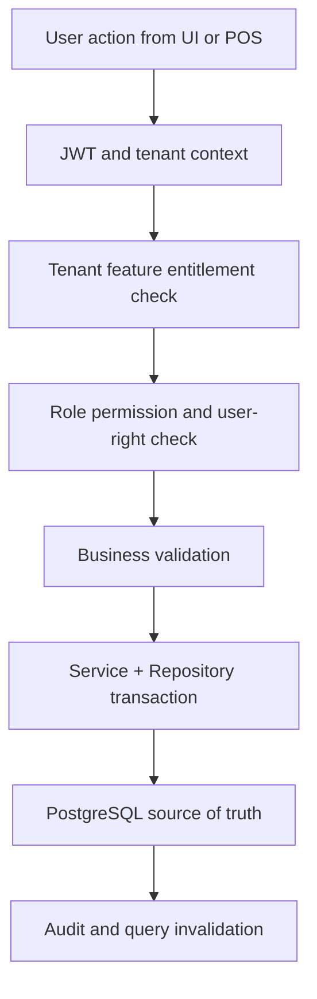

# 07 Modules Documentation Index

This folder is the module-level implementation reference for the Unified Commerce platform.
It is regenerated from the approved scope, database design, frontend architecture, backend architecture, and tenant-configurable access rule.

## Module Index
| Module | Overview |
|---|---|
| `audit-compliance` | [[audit-compliance/README|Audit Compliance]] |
| `caching-storage-strategy` | [[caching-storage-strategy/README|Caching Storage Strategy]] |
| `catalog` | [[catalog/README|Catalog]] |
| `customers` | [[customers/README|Customers]] |
| `data-import-ai` | [[data-import-ai/README|Data Import Ai]] |
| `discounts-promotions` | [[discounts-promotions/README|Discounts Promotions]] |
| `ecommerce-orders` | [[ecommerce-orders/README|Ecommerce Orders]] |
| `fulfillment-logistics` | [[fulfillment-logistics/README|Fulfillment Logistics]] |
| `identity-access` | [[identity-access/README|Identity Access]] |
| `inventory` | [[inventory/README|Inventory]] |
| `loyalty` | [[loyalty/README|Loyalty]] |
| `offline-sync` | [[offline-sync/README|Offline Sync]] |
| `order-workflow` | [[order-workflow/README|Order Workflow]] |
| `otp-auth-security` | [[otp-auth-security/README|Otp Auth Security]] |
| `payments` | [[payments/README|Payments]] |
| `platform-administration` | [[platform-administration/README|Platform Administration]] |
| `pos-devices-hardware` | [[pos-devices-hardware/README|Pos Devices Hardware]] |
| `pricing` | [[pricing/README|Pricing]] |
| `receipts` | [[receipts/README|Receipts]] |
| `reporting` | [[reporting/README|Reporting]] |
| `returns-exchanges` | [[returns-exchanges/README|Returns Exchanges]] |
| `sales-pos` | [[sales-pos/README|Sales Pos]] |
| `settings-configuration` | [[settings-configuration/README|Settings Configuration]] |
| `tax` | [[tax/README|Tax]] |
| `tenant-management` | [[tenant-management/README|Tenant Management]] |

## Mandatory Feature Document Set
Every feature folder must contain `feature-spec.md`, `api-spec.md`, and `feature-history.md`.
Existing content was replaced and missing API specs were created.

## Cross-Cutting Storage Rules
- Backend caching uses PostgreSQL read optimization, indexes, existing summaries, and deterministic repository queries.
- Redis is not part of the current architecture.
- Generic cache tables are not allowed.
- Frontend server-state caching uses TanStack Query.
- Local UI/workflow state uses Zustand.
- Offline POS durable browser storage uses IndexedDB through `core/offline`.
- Backend remains final authority after sync, mutation, payment, stock, tax, refund, and audit operations.

- Access consideration 1: Permission `07-modules.index.read` may show data, while command permissions must be separately configured per role.
- Access consideration 2: Permission `07-modules.index.read` may show data, while command permissions must be separately configured per role.
- Access consideration 3: Permission `07-modules.index.read` may show data, while command permissions must be separately configured per role.
- Access consideration 4: Permission `07-modules.index.read` may show data, while command permissions must be separately configured per role.
- Access consideration 5: Permission `07-modules.index.read` may show data, while command permissions must be separately configured per role.
- Access consideration 6: Permission `07-modules.index.read` may show data, while command permissions must be separately configured per role.
- Data consideration 7: Use PostgreSQL indexes/read models for repeated reads; do not create Redis dependency or generic cache tables.
- Data consideration 8: Use PostgreSQL indexes/read models for repeated reads; do not create Redis dependency or generic cache tables.
- Data consideration 9: Use PostgreSQL indexes/read models for repeated reads; do not create Redis dependency or generic cache tables.
- Data consideration 10: Use PostgreSQL indexes/read models for repeated reads; do not create Redis dependency or generic cache tables.
- Data consideration 11: Use PostgreSQL indexes/read models for repeated reads; do not create Redis dependency or generic cache tables.
- Data consideration 12: Use PostgreSQL indexes/read models for repeated reads; do not create Redis dependency or generic cache tables.
- Data consideration 13: Use PostgreSQL indexes/read models for repeated reads; do not create Redis dependency or generic cache tables.
- Data consideration 14: Use PostgreSQL indexes/read models for repeated reads; do not create Redis dependency or generic cache tables.
- Data consideration 15: Use PostgreSQL indexes/read models for repeated reads; do not create Redis dependency or generic cache tables.
- Data consideration 16: Use PostgreSQL indexes/read models for repeated reads; do not create Redis dependency or generic cache tables.
- Data consideration 17: Use PostgreSQL indexes/read models for repeated reads; do not create Redis dependency or generic cache tables.
- Data consideration 18: Use PostgreSQL indexes/read models for repeated reads; do not create Redis dependency or generic cache tables.
- Frontend consideration 19: Use TanStack Query for server data and Zustand only for local interaction state.
- Frontend consideration 20: Use TanStack Query for server data and Zustand only for local interaction state.
- Frontend consideration 21: Use TanStack Query for server data and Zustand only for local interaction state.
- Frontend consideration 22: Use TanStack Query for server data and Zustand only for local interaction state.
- Frontend consideration 23: Use TanStack Query for server data and Zustand only for local interaction state.
- Frontend consideration 24: Use TanStack Query for server data and Zustand only for local interaction state.
- Frontend consideration 25: Use TanStack Query for server data and Zustand only for local interaction state.
- Frontend consideration 26: Use TanStack Query for server data and Zustand only for local interaction state.
- Frontend consideration 27: Use TanStack Query for server data and Zustand only for local interaction state.
- Frontend consideration 28: Use TanStack Query for server data and Zustand only for local interaction state.
- Frontend consideration 29: Use TanStack Query for server data and Zustand only for local interaction state.
- Frontend consideration 30: Use TanStack Query for server data and Zustand only for local interaction state.
- Offline consideration 31: Use IndexedDB only when this feature participates in POS offline continuity or sync recovery.
- Offline consideration 32: Use IndexedDB only when this feature participates in POS offline continuity or sync recovery.
- Offline consideration 33: Use IndexedDB only when this feature participates in POS offline continuity or sync recovery.
- Offline consideration 34: Use IndexedDB only when this feature participates in POS offline continuity or sync recovery.
- Offline consideration 35: Use IndexedDB only when this feature participates in POS offline continuity or sync recovery.
- Offline consideration 36: Use IndexedDB only when this feature participates in POS offline continuity or sync recovery.
- Offline consideration 37: Use IndexedDB only when this feature participates in POS offline continuity or sync recovery.
- Offline consideration 38: Use IndexedDB only when this feature participates in POS offline continuity or sync recovery.
- Offline consideration 39: Use IndexedDB only when this feature participates in POS offline continuity or sync recovery.
- Offline consideration 40: Use IndexedDB only when this feature participates in POS offline continuity or sync recovery.
- Offline consideration 41: Use IndexedDB only when this feature participates in POS offline continuity or sync recovery.
- Offline consideration 42: Use IndexedDB only when this feature participates in POS offline continuity or sync recovery.
- Implementation consideration 43: Keep `index` tenant-scoped and never resolve records without `tenant_id` or a tenant-owned parent reference.
- Implementation consideration 44: Keep `index` tenant-scoped and never resolve records without `tenant_id` or a tenant-owned parent reference.
- Implementation consideration 45: Keep `index` tenant-scoped and never resolve records without `tenant_id` or a tenant-owned parent reference.
- Implementation consideration 46: Keep `index` tenant-scoped and never resolve records without `tenant_id` or a tenant-owned parent reference.
- Implementation consideration 47: Keep `index` tenant-scoped and never resolve records without `tenant_id` or a tenant-owned parent reference.
- Implementation consideration 48: Keep `index` tenant-scoped and never resolve records without `tenant_id` or a tenant-owned parent reference.
- Implementation consideration 49: Keep `index` tenant-scoped and never resolve records without `tenant_id` or a tenant-owned parent reference.
- Implementation consideration 50: Keep `index` tenant-scoped and never resolve records without `tenant_id` or a tenant-owned parent reference.
- Implementation consideration 51: Keep `index` tenant-scoped and never resolve records without `tenant_id` or a tenant-owned parent reference.
- Implementation consideration 52: Keep `index` tenant-scoped and never resolve records without `tenant_id` or a tenant-owned parent reference.
- Implementation consideration 53: Keep `index` tenant-scoped and never resolve records without `tenant_id` or a tenant-owned parent reference.
- Implementation consideration 54: Keep `index` tenant-scoped and never resolve records without `tenant_id` or a tenant-owned parent reference.
- Access consideration 55: Permission `07-modules.index.read` may show data, while command permissions must be separately configured per role.
- Access consideration 56: Permission `07-modules.index.read` may show data, while command permissions must be separately configured per role.
- Access consideration 57: Permission `07-modules.index.read` may show data, while command permissions must be separately configured per role.
- Access consideration 58: Permission `07-modules.index.read` may show data, while command permissions must be separately configured per role.
- Access consideration 59: Permission `07-modules.index.read` may show data, while command permissions must be separately configured per role.
- Access consideration 60: Permission `07-modules.index.read` may show data, while command permissions must be separately configured per role.
- Access consideration 61: Permission `07-modules.index.read` may show data, while command permissions must be separately configured per role.
- Access consideration 62: Permission `07-modules.index.read` may show data, while command permissions must be separately configured per role.
- Access consideration 63: Permission `07-modules.index.read` may show data, while command permissions must be separately configured per role.
- Access consideration 64: Permission `07-modules.index.read` may show data, while command permissions must be separately configured per role.
- Access consideration 65: Permission `07-modules.index.read` may show data, while command permissions must be separately configured per role.
- Access consideration 66: Permission `07-modules.index.read` may show data, while command permissions must be separately configured per role.
- Data consideration 67: Use PostgreSQL indexes/read models for repeated reads; do not create Redis dependency or generic cache tables.
- Data consideration 68: Use PostgreSQL indexes/read models for repeated reads; do not create Redis dependency or generic cache tables.
- Data consideration 69: Use PostgreSQL indexes/read models for repeated reads; do not create Redis dependency or generic cache tables.
- Data consideration 70: Use PostgreSQL indexes/read models for repeated reads; do not create Redis dependency or generic cache tables.
- Data consideration 71: Use PostgreSQL indexes/read models for repeated reads; do not create Redis dependency or generic cache tables.
- Data consideration 72: Use PostgreSQL indexes/read models for repeated reads; do not create Redis dependency or generic cache tables.
- Data consideration 73: Use PostgreSQL indexes/read models for repeated reads; do not create Redis dependency or generic cache tables.
- Data consideration 74: Use PostgreSQL indexes/read models for repeated reads; do not create Redis dependency or generic cache tables.
- Data consideration 75: Use PostgreSQL indexes/read models for repeated reads; do not create Redis dependency or generic cache tables.
- Data consideration 76: Use PostgreSQL indexes/read models for repeated reads; do not create Redis dependency or generic cache tables.
- Data consideration 77: Use PostgreSQL indexes/read models for repeated reads; do not create Redis dependency or generic cache tables.
- Data consideration 78: Use PostgreSQL indexes/read models for repeated reads; do not create Redis dependency or generic cache tables.
- Frontend consideration 79: Use TanStack Query for server data and Zustand only for local interaction state.
- Frontend consideration 80: Use TanStack Query for server data and Zustand only for local interaction state.
- Frontend consideration 81: Use TanStack Query for server data and Zustand only for local interaction state.
- Frontend consideration 82: Use TanStack Query for server data and Zustand only for local interaction state.
- Frontend consideration 83: Use TanStack Query for server data and Zustand only for local interaction state.
- Frontend consideration 84: Use TanStack Query for server data and Zustand only for local interaction state.
- Frontend consideration 85: Use TanStack Query for server data and Zustand only for local interaction state.
- Frontend consideration 86: Use TanStack Query for server data and Zustand only for local interaction state.
