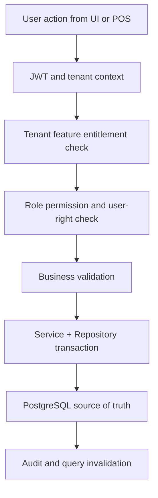

# Catalog Module Overview

## Module Purpose
The `catalog` module groups related Unified Commerce capabilities and documents how they are implemented across database, backend, API, frontend, security, and cache/storage layers.
All tenant-operational capabilities in this module must support tenant-specific configuration through feature entitlements, role permissions, role-feature assignment, and runtime feature flags.

## Feature Folders
| Feature | Spec | API | History |
|---|---|---|---|
| `brand-management` | [[features/brand-management/feature-spec|Spec]] | [[features/brand-management/api-spec|API]] | [[features/brand-management/feature-history|History]] |
| `catalog-search` | [[features/catalog-search/feature-spec|Spec]] | [[features/catalog-search/api-spec|API]] | [[features/catalog-search/feature-history|History]] |
| `category-management` | [[features/category-management/feature-spec|Spec]] | [[features/category-management/api-spec|API]] | [[features/category-management/feature-history|History]] |
| `product-attribute-management` | [[features/product-attribute-management/feature-spec|Spec]] | [[features/product-attribute-management/api-spec|API]] | [[features/product-attribute-management/feature-history|History]] |
| `product-channel-availability` | [[features/product-channel-availability/feature-spec|Spec]] | [[features/product-channel-availability/api-spec|API]] | [[features/product-channel-availability/feature-history|History]] |
| `product-image-upload` | [[features/product-image-upload/feature-spec|Spec]] | [[features/product-image-upload/api-spec|API]] | [[features/product-image-upload/feature-history|History]] |
| `product-management` | [[features/product-management/feature-spec|Spec]] | [[features/product-management/api-spec|API]] | [[features/product-management/feature-history|History]] |
| `product-pricing` | [[features/product-pricing/feature-spec|Spec]] | [[features/product-pricing/api-spec|API]] | [[features/product-pricing/feature-history|History]] |
| `product-publishing` | [[features/product-publishing/feature-spec|Spec]] | [[features/product-publishing/api-spec|API]] | [[features/product-publishing/feature-history|History]] |
| `product-return-policy` | [[features/product-return-policy/feature-spec|Spec]] | [[features/product-return-policy/api-spec|API]] | [[features/product-return-policy/feature-history|History]] |
| `product-variant-management` | [[features/product-variant-management/feature-spec|Spec]] | [[features/product-variant-management/api-spec|API]] | [[features/product-variant-management/feature-history|History]] |
| `supplier-management` | [[features/supplier-management/feature-spec|Spec]] | [[features/supplier-management/api-spec|API]] | [[features/supplier-management/feature-history|History]] |

## Database Tables Commonly Used
| Table | Purpose in module |
|---|---|
| `brands` | Supports `catalog` module workflows and tenant-scoped persistence. |
| `suppliers` | Supports `catalog` module workflows and tenant-scoped persistence. |
| `categories` | Supports `catalog` module workflows and tenant-scoped persistence. |
| `products` | Supports `catalog` module workflows and tenant-scoped persistence. |
| `product_variants` | Supports `catalog` module workflows and tenant-scoped persistence. |
| `product_attributes` | Supports `catalog` module workflows and tenant-scoped persistence. |
| `attribute_values` | Supports `catalog` module workflows and tenant-scoped persistence. |
| `product_images` | Supports `catalog` module workflows and tenant-scoped persistence. |
| `price_lists` | Supports `catalog` module workflows and tenant-scoped persistence. |
| `price_list_items` | Supports `catalog` module workflows and tenant-scoped persistence. |

## Access Control Position
- Platform-admin-only configuration remains platform-controlled.
- Tenant-facing features must be configurable for each customer tenant.
- Feature availability starts with `platform_features` and `tenant_feature_entitlements`.
- Tenant admins configure roles, role permissions, and role-feature access where allowed.
- Backend checks cannot be replaced by menu hiding or disabled buttons.

## Architecture Flow

## Backend Placement
| Layer | Folder | Responsibility |
|---|---|---|
| API | `POS.API/Modules/Catalog` | Controllers, request models, response models. |
| Application | `POS.Application/Modules/Catalog` | Services, validators, interfaces, and `Dtos/`. |
| Domain | `POS.Domain/Modules/Catalog` | Pure rules and entities where needed. |
| Infrastructure | `POS.Infrastructure/Repositories/Catalog` | EF Core repositories and persistence logic. |

## Frontend Placement
- Feature UI belongs under `src/features/` using React with TypeScript.
- Page composition belongs under `src/pages/` and layout shell folders.
- Server state uses TanStack Query from `core/api/queryClient.ts`.
- Workflow state uses Zustand stores from `src/state/`.
- Offline POS storage uses `core/offline/syncQueue.ts` and IndexedDB.

## Caching and Storage Placement
| Layer | Placement | Rule |
|---|---|---|
| Backend PostgreSQL | Reference and lookup tables with tenant/outlet/channel indexes | Optimize repeated reads; do not add generic cache tables. |
| Frontend TanStack Query | Catalog lists, product details, prices, tax classes, stock visibility | Use tenant/outlet/channel query keys and invalidate after mutation. |
| Zustand | Filters, selected rows, local draft wizard state | Do not store authoritative product, stock, or price data here. |
| IndexedDB | POS-safe product/price/tax snapshots only | Used for offline billing, not for admin master-data editing. |

## Related Knowledge Base Links
- Product scope: [[../../01-product/project-scope|Project Scope]]
- Architecture: [[../../02-architecture/README|Architecture]]
- Data: [[../../03-data/README|Data Design]]
- API: [[../../04-api/README|API Standards]]
- Backend: [[../../05-backend/README|Backend]]
- Frontend: [[../../06-frontend/README|Frontend]]
- Security: [[../../09-security-and-compliance/README|Security and Compliance]]

## Implementation Considerations
- Do not add new tables unless approved by database design or a formal schema change.
- Do not create generic cache tables such as tenant cache, product cache, POS cache, or query cache.
- Use PostgreSQL indexes, deterministic queries, and existing read models for repeated backend reads.
- Use invalidation rather than stale UI assumptions after create/update/delete/approval actions.
- Keep tenant boundaries visible in API, repository queries, tests, and audit logs.
- Offline consideration 1: Use IndexedDB only when this feature participates in POS offline continuity or sync recovery.
- Offline consideration 2: Use IndexedDB only when this feature participates in POS offline continuity or sync recovery.
- Offline consideration 3: Use IndexedDB only when this feature participates in POS offline continuity or sync recovery.
- Offline consideration 4: Use IndexedDB only when this feature participates in POS offline continuity or sync recovery.
- Offline consideration 5: Use IndexedDB only when this feature participates in POS offline continuity or sync recovery.
- Offline consideration 6: Use IndexedDB only when this feature participates in POS offline continuity or sync recovery.
- Implementation consideration 7: Keep `module` tenant-scoped and never resolve records without `tenant_id` or a tenant-owned parent reference.
- Implementation consideration 8: Keep `module` tenant-scoped and never resolve records without `tenant_id` or a tenant-owned parent reference.
- Implementation consideration 9: Keep `module` tenant-scoped and never resolve records without `tenant_id` or a tenant-owned parent reference.
- Implementation consideration 10: Keep `module` tenant-scoped and never resolve records without `tenant_id` or a tenant-owned parent reference.
- Implementation consideration 11: Keep `module` tenant-scoped and never resolve records without `tenant_id` or a tenant-owned parent reference.
- Implementation consideration 12: Keep `module` tenant-scoped and never resolve records without `tenant_id` or a tenant-owned parent reference.
- Implementation consideration 13: Keep `module` tenant-scoped and never resolve records without `tenant_id` or a tenant-owned parent reference.
- Implementation consideration 14: Keep `module` tenant-scoped and never resolve records without `tenant_id` or a tenant-owned parent reference.
- Implementation consideration 15: Keep `module` tenant-scoped and never resolve records without `tenant_id` or a tenant-owned parent reference.
- Implementation consideration 16: Keep `module` tenant-scoped and never resolve records without `tenant_id` or a tenant-owned parent reference.
- Implementation consideration 17: Keep `module` tenant-scoped and never resolve records without `tenant_id` or a tenant-owned parent reference.
- Implementation consideration 18: Keep `module` tenant-scoped and never resolve records without `tenant_id` or a tenant-owned parent reference.
- Access consideration 19: Permission `catalog.module.read` may show data, while command permissions must be separately configured per role.
- Access consideration 20: Permission `catalog.module.read` may show data, while command permissions must be separately configured per role.
- Access consideration 21: Permission `catalog.module.read` may show data, while command permissions must be separately configured per role.
- Access consideration 22: Permission `catalog.module.read` may show data, while command permissions must be separately configured per role.
- Access consideration 23: Permission `catalog.module.read` may show data, while command permissions must be separately configured per role.
- Access consideration 24: Permission `catalog.module.read` may show data, while command permissions must be separately configured per role.
- Access consideration 25: Permission `catalog.module.read` may show data, while command permissions must be separately configured per role.
- Access consideration 26: Permission `catalog.module.read` may show data, while command permissions must be separately configured per role.
- Access consideration 27: Permission `catalog.module.read` may show data, while command permissions must be separately configured per role.
- Access consideration 28: Permission `catalog.module.read` may show data, while command permissions must be separately configured per role.
- Access consideration 29: Permission `catalog.module.read` may show data, while command permissions must be separately configured per role.
- Access consideration 30: Permission `catalog.module.read` may show data, while command permissions must be separately configured per role.
- Data consideration 31: Use PostgreSQL indexes/read models for repeated reads; do not create Redis dependency or generic cache tables.
- Data consideration 32: Use PostgreSQL indexes/read models for repeated reads; do not create Redis dependency or generic cache tables.
- Data consideration 33: Use PostgreSQL indexes/read models for repeated reads; do not create Redis dependency or generic cache tables.
- Data consideration 34: Use PostgreSQL indexes/read models for repeated reads; do not create Redis dependency or generic cache tables.
- Data consideration 35: Use PostgreSQL indexes/read models for repeated reads; do not create Redis dependency or generic cache tables.
- Data consideration 36: Use PostgreSQL indexes/read models for repeated reads; do not create Redis dependency or generic cache tables.
- Data consideration 37: Use PostgreSQL indexes/read models for repeated reads; do not create Redis dependency or generic cache tables.
- Data consideration 38: Use PostgreSQL indexes/read models for repeated reads; do not create Redis dependency or generic cache tables.
- Data consideration 39: Use PostgreSQL indexes/read models for repeated reads; do not create Redis dependency or generic cache tables.
- Data consideration 40: Use PostgreSQL indexes/read models for repeated reads; do not create Redis dependency or generic cache tables.
- Data consideration 41: Use PostgreSQL indexes/read models for repeated reads; do not create Redis dependency or generic cache tables.
- Data consideration 42: Use PostgreSQL indexes/read models for repeated reads; do not create Redis dependency or generic cache tables.
- Frontend consideration 43: Use TanStack Query for server data and Zustand only for local interaction state.
- Frontend consideration 44: Use TanStack Query for server data and Zustand only for local interaction state.
- Frontend consideration 45: Use TanStack Query for server data and Zustand only for local interaction state.
- Frontend consideration 46: Use TanStack Query for server data and Zustand only for local interaction state.
- Frontend consideration 47: Use TanStack Query for server data and Zustand only for local interaction state.
- Frontend consideration 48: Use TanStack Query for server data and Zustand only for local interaction state.
- Frontend consideration 49: Use TanStack Query for server data and Zustand only for local interaction state.
- Frontend consideration 50: Use TanStack Query for server data and Zustand only for local interaction state.
