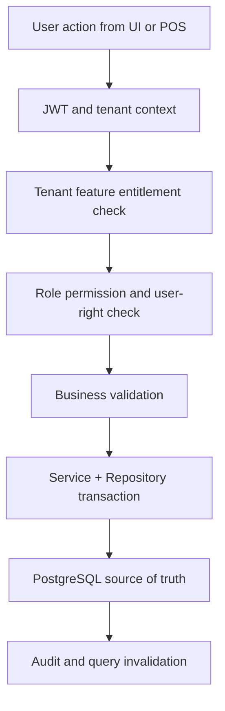

# Ecommerce Orders Module Overview

## Module Purpose
The `ecommerce-orders` module groups related Unified Commerce capabilities and documents how they are implemented across database, backend, API, frontend, security, and cache/storage layers.
All tenant-operational capabilities in this module must support tenant-specific configuration through feature entitlements, role permissions, role-feature assignment, and runtime feature flags.

## Feature Folders
| Feature | Spec | API | History |
|---|---|---|---|
| `cart-items` | [[features/cart-items/feature-spec|Spec]] | [[features/cart-items/api-spec|API]] | [[features/cart-items/feature-history|History]] |
| `carts` | [[features/carts/feature-spec|Spec]] | [[features/carts/api-spec|API]] | [[features/carts/feature-history|History]] |
| `order-addresses` | [[features/order-addresses/feature-spec|Spec]] | [[features/order-addresses/api-spec|API]] | [[features/order-addresses/feature-history|History]] |
| `order-items` | [[features/order-items/feature-spec|Spec]] | [[features/order-items/api-spec|API]] | [[features/order-items/feature-history|History]] |
| `orders` | [[features/orders/feature-spec|Spec]] | [[features/orders/api-spec|API]] | [[features/orders/feature-history|History]] |
| `product-reviews` | [[features/product-reviews/feature-spec|Spec]] | [[features/product-reviews/api-spec|API]] | [[features/product-reviews/feature-history|History]] |
| `wishlists` | [[features/wishlists/feature-spec|Spec]] | [[features/wishlists/api-spec|API]] | [[features/wishlists/feature-history|History]] |

## Database Tables Commonly Used
| Table | Purpose in module |
|---|---|
| `customers` | Supports `ecommerce-orders` module workflows and tenant-scoped persistence. |
| `carts` | Supports `ecommerce-orders` module workflows and tenant-scoped persistence. |
| `cart_items` | Supports `ecommerce-orders` module workflows and tenant-scoped persistence. |
| `orders` | Supports `ecommerce-orders` module workflows and tenant-scoped persistence. |
| `order_items` | Supports `ecommerce-orders` module workflows and tenant-scoped persistence. |
| `order_addresses` | Supports `ecommerce-orders` module workflows and tenant-scoped persistence. |
| `order_status_history` | Supports `ecommerce-orders` module workflows and tenant-scoped persistence. |

## Access Control Position
- Platform-admin-only configuration remains platform-controlled.
- Tenant-facing features must be configurable for each customer tenant.
- Feature availability starts with `platform_features` and `tenant_feature_entitlements`.
- Tenant admins configure roles, role permissions, and role-feature access where allowed.
- Backend checks cannot be replaced by menu hiding or disabled buttons.

## Architecture Flow

## Backend Placement
| Layer | Folder | Responsibility |
|---|---|---|
| API | `POS.API/Modules/EcommerceOrders` | Controllers, request models, response models. |
| Application | `POS.Application/Modules/EcommerceOrders` | Services, validators, interfaces, and `Dtos/`. |
| Domain | `POS.Domain/Modules/EcommerceOrders` | Pure rules and entities where needed. |
| Infrastructure | `POS.Infrastructure/Repositories/EcommerceOrders` | EF Core repositories and persistence logic. |

## Frontend Placement
- Feature UI belongs under `src/features/` using React with TypeScript.
- Page composition belongs under `src/pages/` and layout shell folders.
- Server state uses TanStack Query from `core/api/queryClient.ts`.
- Workflow state uses Zustand stores from `src/state/`.
- Offline POS storage uses `core/offline/syncQueue.ts` and IndexedDB.

## Caching and Storage Placement
| Layer | Placement | Rule |
|---|---|---|
| Backend PostgreSQL | Transaction tables with idempotency keys, status history, and summary read models | Transactions are durable records, not cache; no Redis. |
| Frontend TanStack Query | Entity detail, status history, payment/refund/order lookup | Invalidate aggressively after state-changing operations. |
| Zustand | Multi-step form progress, selected lines, approval modal state | Do not keep final totals as authoritative state. |
| IndexedDB | Only POS/offline transaction queues where the workflow is cashier-side | Online admin/e-commerce flows should not use IndexedDB as a system cache. |

## Related Knowledge Base Links
- Product scope: [[../../01-product/project-scope|Project Scope]]
- Architecture: [[../../02-architecture/README|Architecture]]
- Data: [[../../03-data/README|Data Design]]
- API: [[../../04-api/README|API Standards]]
- Backend: [[../../05-backend/README|Backend]]
- Frontend: [[../../06-frontend/README|Frontend]]
- Security: [[../../09-security-and-compliance/README|Security and Compliance]]

## Implementation Considerations
- Do not add new tables unless approved by database design or a formal schema change.
- Do not create generic cache tables such as tenant cache, product cache, POS cache, or query cache.
- Use PostgreSQL indexes, deterministic queries, and existing read models for repeated backend reads.
- Use invalidation rather than stale UI assumptions after create/update/delete/approval actions.
- Keep tenant boundaries visible in API, repository queries, tests, and audit logs.
- Frontend consideration 1: Use TanStack Query for server data and Zustand only for local interaction state.
- Frontend consideration 2: Use TanStack Query for server data and Zustand only for local interaction state.
- Offline consideration 3: Use IndexedDB only when this feature participates in POS offline continuity or sync recovery.
- Offline consideration 4: Use IndexedDB only when this feature participates in POS offline continuity or sync recovery.
- Offline consideration 5: Use IndexedDB only when this feature participates in POS offline continuity or sync recovery.
- Offline consideration 6: Use IndexedDB only when this feature participates in POS offline continuity or sync recovery.
- Offline consideration 7: Use IndexedDB only when this feature participates in POS offline continuity or sync recovery.
- Offline consideration 8: Use IndexedDB only when this feature participates in POS offline continuity or sync recovery.
- Offline consideration 9: Use IndexedDB only when this feature participates in POS offline continuity or sync recovery.
- Offline consideration 10: Use IndexedDB only when this feature participates in POS offline continuity or sync recovery.
- Offline consideration 11: Use IndexedDB only when this feature participates in POS offline continuity or sync recovery.
- Offline consideration 12: Use IndexedDB only when this feature participates in POS offline continuity or sync recovery.
- Offline consideration 13: Use IndexedDB only when this feature participates in POS offline continuity or sync recovery.
- Offline consideration 14: Use IndexedDB only when this feature participates in POS offline continuity or sync recovery.
- Implementation consideration 15: Keep `module` tenant-scoped and never resolve records without `tenant_id` or a tenant-owned parent reference.
- Implementation consideration 16: Keep `module` tenant-scoped and never resolve records without `tenant_id` or a tenant-owned parent reference.
- Implementation consideration 17: Keep `module` tenant-scoped and never resolve records without `tenant_id` or a tenant-owned parent reference.
- Implementation consideration 18: Keep `module` tenant-scoped and never resolve records without `tenant_id` or a tenant-owned parent reference.
- Implementation consideration 19: Keep `module` tenant-scoped and never resolve records without `tenant_id` or a tenant-owned parent reference.
- Implementation consideration 20: Keep `module` tenant-scoped and never resolve records without `tenant_id` or a tenant-owned parent reference.
- Implementation consideration 21: Keep `module` tenant-scoped and never resolve records without `tenant_id` or a tenant-owned parent reference.
- Implementation consideration 22: Keep `module` tenant-scoped and never resolve records without `tenant_id` or a tenant-owned parent reference.
- Implementation consideration 23: Keep `module` tenant-scoped and never resolve records without `tenant_id` or a tenant-owned parent reference.
- Implementation consideration 24: Keep `module` tenant-scoped and never resolve records without `tenant_id` or a tenant-owned parent reference.
- Implementation consideration 25: Keep `module` tenant-scoped and never resolve records without `tenant_id` or a tenant-owned parent reference.
- Implementation consideration 26: Keep `module` tenant-scoped and never resolve records without `tenant_id` or a tenant-owned parent reference.
- Access consideration 27: Permission `ecommerce-orders.module.read` may show data, while command permissions must be separately configured per role.
- Access consideration 28: Permission `ecommerce-orders.module.read` may show data, while command permissions must be separately configured per role.
- Access consideration 29: Permission `ecommerce-orders.module.read` may show data, while command permissions must be separately configured per role.
- Access consideration 30: Permission `ecommerce-orders.module.read` may show data, while command permissions must be separately configured per role.
- Access consideration 31: Permission `ecommerce-orders.module.read` may show data, while command permissions must be separately configured per role.
- Access consideration 32: Permission `ecommerce-orders.module.read` may show data, while command permissions must be separately configured per role.
- Access consideration 33: Permission `ecommerce-orders.module.read` may show data, while command permissions must be separately configured per role.
- Access consideration 34: Permission `ecommerce-orders.module.read` may show data, while command permissions must be separately configured per role.
- Access consideration 35: Permission `ecommerce-orders.module.read` may show data, while command permissions must be separately configured per role.
- Access consideration 36: Permission `ecommerce-orders.module.read` may show data, while command permissions must be separately configured per role.
- Access consideration 37: Permission `ecommerce-orders.module.read` may show data, while command permissions must be separately configured per role.
- Access consideration 38: Permission `ecommerce-orders.module.read` may show data, while command permissions must be separately configured per role.
- Data consideration 39: Use PostgreSQL indexes/read models for repeated reads; do not create Redis dependency or generic cache tables.
- Data consideration 40: Use PostgreSQL indexes/read models for repeated reads; do not create Redis dependency or generic cache tables.
- Data consideration 41: Use PostgreSQL indexes/read models for repeated reads; do not create Redis dependency or generic cache tables.
- Data consideration 42: Use PostgreSQL indexes/read models for repeated reads; do not create Redis dependency or generic cache tables.
- Data consideration 43: Use PostgreSQL indexes/read models for repeated reads; do not create Redis dependency or generic cache tables.
- Data consideration 44: Use PostgreSQL indexes/read models for repeated reads; do not create Redis dependency or generic cache tables.
- Data consideration 45: Use PostgreSQL indexes/read models for repeated reads; do not create Redis dependency or generic cache tables.
- Data consideration 46: Use PostgreSQL indexes/read models for repeated reads; do not create Redis dependency or generic cache tables.
- Data consideration 47: Use PostgreSQL indexes/read models for repeated reads; do not create Redis dependency or generic cache tables.
- Data consideration 48: Use PostgreSQL indexes/read models for repeated reads; do not create Redis dependency or generic cache tables.
- Data consideration 49: Use PostgreSQL indexes/read models for repeated reads; do not create Redis dependency or generic cache tables.
- Data consideration 50: Use PostgreSQL indexes/read models for repeated reads; do not create Redis dependency or generic cache tables.
- Frontend consideration 51: Use TanStack Query for server data and Zustand only for local interaction state.
- Frontend consideration 52: Use TanStack Query for server data and Zustand only for local interaction state.
- Frontend consideration 53: Use TanStack Query for server data and Zustand only for local interaction state.
- Frontend consideration 54: Use TanStack Query for server data and Zustand only for local interaction state.
- Frontend consideration 55: Use TanStack Query for server data and Zustand only for local interaction state.
- Frontend consideration 56: Use TanStack Query for server data and Zustand only for local interaction state.
- Frontend consideration 57: Use TanStack Query for server data and Zustand only for local interaction state.
- Frontend consideration 58: Use TanStack Query for server data and Zustand only for local interaction state.
