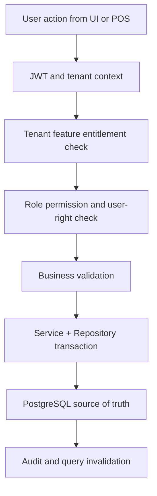

# Fulfillment Logistics Module Overview

## Module Purpose
The `fulfillment-logistics` module groups related Unified Commerce capabilities and documents how they are implemented across database, backend, API, frontend, security, and cache/storage layers.
All tenant-operational capabilities in this module must support tenant-specific configuration through feature entitlements, role permissions, role-feature assignment, and runtime feature flags.

## Feature Folders
| Feature | Spec | API | History |
|---|---|---|---|
| `deliveries` | [[features/deliveries/feature-spec|Spec]] | [[features/deliveries/api-spec|API]] | [[features/deliveries/feature-history|History]] |
| `delivery-items` | [[features/delivery-items/feature-spec|Spec]] | [[features/delivery-items/api-spec|API]] | [[features/delivery-items/feature-history|History]] |
| `delivery-methods` | [[features/delivery-methods/feature-spec|Spec]] | [[features/delivery-methods/api-spec|API]] | [[features/delivery-methods/feature-history|History]] |
| `delivery-tracking` | [[features/delivery-tracking/feature-spec|Spec]] | [[features/delivery-tracking/api-spec|API]] | [[features/delivery-tracking/feature-history|History]] |
| `delivery-zone-rates` | [[features/delivery-zone-rates/feature-spec|Spec]] | [[features/delivery-zone-rates/api-spec|API]] | [[features/delivery-zone-rates/feature-history|History]] |
| `delivery-zones` | [[features/delivery-zones/feature-spec|Spec]] | [[features/delivery-zones/api-spec|API]] | [[features/delivery-zones/feature-history|History]] |

## Database Tables Commonly Used
| Table | Purpose in module |
|---|---|
| `delivery_methods` | Supports `fulfillment-logistics` module workflows and tenant-scoped persistence. |
| `delivery_zones` | Supports `fulfillment-logistics` module workflows and tenant-scoped persistence. |
| `delivery_zone_rates` | Supports `fulfillment-logistics` module workflows and tenant-scoped persistence. |
| `deliveries` | Supports `fulfillment-logistics` module workflows and tenant-scoped persistence. |
| `delivery_items` | Supports `fulfillment-logistics` module workflows and tenant-scoped persistence. |
| `delivery_tracking` | Supports `fulfillment-logistics` module workflows and tenant-scoped persistence. |

## Access Control Position
- Platform-admin-only configuration remains platform-controlled.
- Tenant-facing features must be configurable for each customer tenant.
- Feature availability starts with `platform_features` and `tenant_feature_entitlements`.
- Tenant admins configure roles, role permissions, and role-feature access where allowed.
- Backend checks cannot be replaced by menu hiding or disabled buttons.

## Architecture Flow

## Backend Placement
| Layer | Folder | Responsibility |
|---|---|---|
| API | `POS.API/Modules/FulfillmentLogistics` | Controllers, request models, response models. |
| Application | `POS.Application/Modules/FulfillmentLogistics` | Services, validators, interfaces, and `Dtos/`. |
| Domain | `POS.Domain/Modules/FulfillmentLogistics` | Pure rules and entities where needed. |
| Infrastructure | `POS.Infrastructure/Repositories/FulfillmentLogistics` | EF Core repositories and persistence logic. |

## Frontend Placement
- Feature UI belongs under `src/features/` using React with TypeScript.
- Page composition belongs under `src/pages/` and layout shell folders.
- Server state uses TanStack Query from `core/api/queryClient.ts`.
- Workflow state uses Zustand stores from `src/state/`.
- Offline POS storage uses `core/offline/syncQueue.ts` and IndexedDB.

## Caching and Storage Placement
| Layer | Placement | Rule |
|---|---|---|
| Backend PostgreSQL | Reporting read models and indexed audit queries | Use `daily_*_summaries` where available; no Redis now. |
| Frontend TanStack Query | Report result pages, audit log pages, dashboards | Cache by tenant, scope, date range, permission context, and filters. |
| Zustand | Current filter panel state and selected report view | Keep only UI state. |
| IndexedDB | Not default | Only offline sync diagnostics on POS terminals should persist locally. |

## Related Knowledge Base Links
- Product scope: [[../../01-product/project-scope|Project Scope]]
- Architecture: [[../../02-architecture/README|Architecture]]
- Data: [[../../03-data/README|Data Design]]
- API: [[../../04-api/README|API Standards]]
- Backend: [[../../05-backend/README|Backend]]
- Frontend: [[../../06-frontend/README|Frontend]]
- Security: [[../../09-security-and-compliance/README|Security and Compliance]]

## Implementation Considerations
- Do not add new tables unless approved by database design or a formal schema change.
- Do not create generic cache tables such as tenant cache, product cache, POS cache, or query cache.
- Use PostgreSQL indexes, deterministic queries, and existing read models for repeated backend reads.
- Use invalidation rather than stale UI assumptions after create/update/delete/approval actions.
- Keep tenant boundaries visible in API, repository queries, tests, and audit logs.
- Frontend consideration 1: Use TanStack Query for server data and Zustand only for local interaction state.
- Frontend consideration 2: Use TanStack Query for server data and Zustand only for local interaction state.
- Frontend consideration 3: Use TanStack Query for server data and Zustand only for local interaction state.
- Frontend consideration 4: Use TanStack Query for server data and Zustand only for local interaction state.
- Offline consideration 5: Use IndexedDB only when this feature participates in POS offline continuity or sync recovery.
- Offline consideration 6: Use IndexedDB only when this feature participates in POS offline continuity or sync recovery.
- Offline consideration 7: Use IndexedDB only when this feature participates in POS offline continuity or sync recovery.
- Offline consideration 8: Use IndexedDB only when this feature participates in POS offline continuity or sync recovery.
- Offline consideration 9: Use IndexedDB only when this feature participates in POS offline continuity or sync recovery.
- Offline consideration 10: Use IndexedDB only when this feature participates in POS offline continuity or sync recovery.
- Offline consideration 11: Use IndexedDB only when this feature participates in POS offline continuity or sync recovery.
- Offline consideration 12: Use IndexedDB only when this feature participates in POS offline continuity or sync recovery.
- Offline consideration 13: Use IndexedDB only when this feature participates in POS offline continuity or sync recovery.
- Offline consideration 14: Use IndexedDB only when this feature participates in POS offline continuity or sync recovery.
- Offline consideration 15: Use IndexedDB only when this feature participates in POS offline continuity or sync recovery.
- Offline consideration 16: Use IndexedDB only when this feature participates in POS offline continuity or sync recovery.
- Implementation consideration 17: Keep `module` tenant-scoped and never resolve records without `tenant_id` or a tenant-owned parent reference.
- Implementation consideration 18: Keep `module` tenant-scoped and never resolve records without `tenant_id` or a tenant-owned parent reference.
- Implementation consideration 19: Keep `module` tenant-scoped and never resolve records without `tenant_id` or a tenant-owned parent reference.
- Implementation consideration 20: Keep `module` tenant-scoped and never resolve records without `tenant_id` or a tenant-owned parent reference.
- Implementation consideration 21: Keep `module` tenant-scoped and never resolve records without `tenant_id` or a tenant-owned parent reference.
- Implementation consideration 22: Keep `module` tenant-scoped and never resolve records without `tenant_id` or a tenant-owned parent reference.
- Implementation consideration 23: Keep `module` tenant-scoped and never resolve records without `tenant_id` or a tenant-owned parent reference.
- Implementation consideration 24: Keep `module` tenant-scoped and never resolve records without `tenant_id` or a tenant-owned parent reference.
- Implementation consideration 25: Keep `module` tenant-scoped and never resolve records without `tenant_id` or a tenant-owned parent reference.
- Implementation consideration 26: Keep `module` tenant-scoped and never resolve records without `tenant_id` or a tenant-owned parent reference.
- Implementation consideration 27: Keep `module` tenant-scoped and never resolve records without `tenant_id` or a tenant-owned parent reference.
- Implementation consideration 28: Keep `module` tenant-scoped and never resolve records without `tenant_id` or a tenant-owned parent reference.
- Access consideration 29: Permission `fulfillment-logistics.module.read` may show data, while command permissions must be separately configured per role.
- Access consideration 30: Permission `fulfillment-logistics.module.read` may show data, while command permissions must be separately configured per role.
- Access consideration 31: Permission `fulfillment-logistics.module.read` may show data, while command permissions must be separately configured per role.
- Access consideration 32: Permission `fulfillment-logistics.module.read` may show data, while command permissions must be separately configured per role.
- Access consideration 33: Permission `fulfillment-logistics.module.read` may show data, while command permissions must be separately configured per role.
- Access consideration 34: Permission `fulfillment-logistics.module.read` may show data, while command permissions must be separately configured per role.
- Access consideration 35: Permission `fulfillment-logistics.module.read` may show data, while command permissions must be separately configured per role.
- Access consideration 36: Permission `fulfillment-logistics.module.read` may show data, while command permissions must be separately configured per role.
- Access consideration 37: Permission `fulfillment-logistics.module.read` may show data, while command permissions must be separately configured per role.
- Access consideration 38: Permission `fulfillment-logistics.module.read` may show data, while command permissions must be separately configured per role.
- Access consideration 39: Permission `fulfillment-logistics.module.read` may show data, while command permissions must be separately configured per role.
- Access consideration 40: Permission `fulfillment-logistics.module.read` may show data, while command permissions must be separately configured per role.
- Data consideration 41: Use PostgreSQL indexes/read models for repeated reads; do not create Redis dependency or generic cache tables.
- Data consideration 42: Use PostgreSQL indexes/read models for repeated reads; do not create Redis dependency or generic cache tables.
- Data consideration 43: Use PostgreSQL indexes/read models for repeated reads; do not create Redis dependency or generic cache tables.
- Data consideration 44: Use PostgreSQL indexes/read models for repeated reads; do not create Redis dependency or generic cache tables.
- Data consideration 45: Use PostgreSQL indexes/read models for repeated reads; do not create Redis dependency or generic cache tables.
- Data consideration 46: Use PostgreSQL indexes/read models for repeated reads; do not create Redis dependency or generic cache tables.
- Data consideration 47: Use PostgreSQL indexes/read models for repeated reads; do not create Redis dependency or generic cache tables.
- Data consideration 48: Use PostgreSQL indexes/read models for repeated reads; do not create Redis dependency or generic cache tables.
- Data consideration 49: Use PostgreSQL indexes/read models for repeated reads; do not create Redis dependency or generic cache tables.
- Data consideration 50: Use PostgreSQL indexes/read models for repeated reads; do not create Redis dependency or generic cache tables.
- Data consideration 51: Use PostgreSQL indexes/read models for repeated reads; do not create Redis dependency or generic cache tables.
- Data consideration 52: Use PostgreSQL indexes/read models for repeated reads; do not create Redis dependency or generic cache tables.
- Frontend consideration 53: Use TanStack Query for server data and Zustand only for local interaction state.
- Frontend consideration 54: Use TanStack Query for server data and Zustand only for local interaction state.
- Frontend consideration 55: Use TanStack Query for server data and Zustand only for local interaction state.
- Frontend consideration 56: Use TanStack Query for server data and Zustand only for local interaction state.
- Frontend consideration 57: Use TanStack Query for server data and Zustand only for local interaction state.
- Frontend consideration 58: Use TanStack Query for server data and Zustand only for local interaction state.
- Frontend consideration 59: Use TanStack Query for server data and Zustand only for local interaction state.
- Frontend consideration 60: Use TanStack Query for server data and Zustand only for local interaction state.
