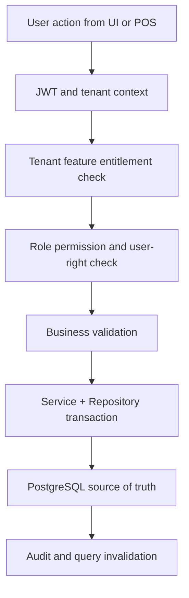

# Offline Sync Module Overview

## Module Purpose
The `offline-sync` module groups related Unified Commerce capabilities and documents how they are implemented across database, backend, API, frontend, security, and cache/storage layers.
All tenant-operational capabilities in this module must support tenant-specific configuration through feature entitlements, role permissions, role-feature assignment, and runtime feature flags.

## Feature Folders
| Feature | Spec | API | History |
|---|---|---|---|
| `offline-payment-sync-queue` | [[features/offline-payment-sync-queue/feature-spec|Spec]] | [[features/offline-payment-sync-queue/api-spec|API]] | [[features/offline-payment-sync-queue/feature-history|History]] |
| `offline-sale-sync-queue` | [[features/offline-sale-sync-queue/feature-spec|Spec]] | [[features/offline-sale-sync-queue/api-spec|API]] | [[features/offline-sale-sync-queue/feature-history|History]] |
| `offline-sync-audit-logs` | [[features/offline-sync-audit-logs/feature-spec|Spec]] | [[features/offline-sync-audit-logs/api-spec|API]] | [[features/offline-sync-audit-logs/feature-history|History]] |
| `offline-sync-batches` | [[features/offline-sync-batches/feature-spec|Spec]] | [[features/offline-sync-batches/api-spec|API]] | [[features/offline-sync-batches/feature-history|History]] |
| `offline-sync-conflicts` | [[features/offline-sync-conflicts/feature-spec|Spec]] | [[features/offline-sync-conflicts/api-spec|API]] | [[features/offline-sync-conflicts/feature-history|History]] |
| `offline-sync-items` | [[features/offline-sync-items/feature-spec|Spec]] | [[features/offline-sync-items/api-spec|API]] | [[features/offline-sync-items/feature-history|History]] |

## Database Tables Commonly Used
| Table | Purpose in module |
|---|---|
| `offline_sync_batches` | Supports `offline-sync` module workflows and tenant-scoped persistence. |
| `offline_sync_items` | Supports `offline-sync` module workflows and tenant-scoped persistence. |
| `offline_sale_sync_queue` | Supports `offline-sync` module workflows and tenant-scoped persistence. |
| `offline_payment_sync_queue` | Supports `offline-sync` module workflows and tenant-scoped persistence. |
| `offline_sync_conflicts` | Supports `offline-sync` module workflows and tenant-scoped persistence. |
| `offline_sync_audit_logs` | Supports `offline-sync` module workflows and tenant-scoped persistence. |

## Access Control Position
- Platform-admin-only configuration remains platform-controlled.
- Tenant-facing features must be configurable for each customer tenant.
- Feature availability starts with `platform_features` and `tenant_feature_entitlements`.
- Tenant admins configure roles, role permissions, and role-feature access where allowed.
- Backend checks cannot be replaced by menu hiding or disabled buttons.

## Architecture Flow

## Backend Placement
| Layer | Folder | Responsibility |
|---|---|---|
| API | `POS.API/Modules/OfflineSync` | Controllers, request models, response models. |
| Application | `POS.Application/Modules/OfflineSync` | Services, validators, interfaces, and `Dtos/`. |
| Domain | `POS.Domain/Modules/OfflineSync` | Pure rules and entities where needed. |
| Infrastructure | `POS.Infrastructure/Repositories/OfflineSync` | EF Core repositories and persistence logic. |

## Frontend Placement
- Feature UI belongs under `src/features/` using React with TypeScript.
- Page composition belongs under `src/pages/` and layout shell folders.
- Server state uses TanStack Query from `core/api/queryClient.ts`.
- Workflow state uses Zustand stores from `src/state/`.
- Offline POS storage uses `core/offline/syncQueue.ts` and IndexedDB.

## Caching and Storage Placement
| Layer | Placement | Rule |
|---|---|---|
| Backend PostgreSQL | `offline_sync_batches`, `offline_sync_items`, typed sync queues, conflict tables | Store durable sync records; do not introduce Redis or generic cache tables. |
| Frontend TanStack Query | Server-synced status, conflict list, device settings | Keep online status fresh and invalidate after each sync batch. |
| Zustand | Current offline banner, sync progress, active terminal workflow | Store UI/session state only, not authoritative business records. |
| IndexedDB | Product, price, tax, discount snapshots, offline sale/payment/receipt queue | Required for offline POS continuity and chronological sync. |

## Related Knowledge Base Links
- Product scope: [[../../01-product/project-scope|Project Scope]]
- Architecture: [[../../02-architecture/README|Architecture]]
- Data: [[../../03-data/README|Data Design]]
- API: [[../../04-api/README|API Standards]]
- Backend: [[../../05-backend/README|Backend]]
- Frontend: [[../../06-frontend/README|Frontend]]
- Security: [[../../09-security-and-compliance/README|Security and Compliance]]

## Implementation Considerations
- Do not add new tables unless approved by database design or a formal schema change.
- Do not create generic cache tables such as tenant cache, product cache, POS cache, or query cache.
- Use PostgreSQL indexes, deterministic queries, and existing read models for repeated backend reads.
- Use invalidation rather than stale UI assumptions after create/update/delete/approval actions.
- Keep tenant boundaries visible in API, repository queries, tests, and audit logs.
- Frontend consideration 1: Use TanStack Query for server data and Zustand only for local interaction state.
- Frontend consideration 2: Use TanStack Query for server data and Zustand only for local interaction state.
- Frontend consideration 3: Use TanStack Query for server data and Zustand only for local interaction state.
- Frontend consideration 4: Use TanStack Query for server data and Zustand only for local interaction state.
- Offline consideration 5: Use IndexedDB only when this feature participates in POS offline continuity or sync recovery.
- Offline consideration 6: Use IndexedDB only when this feature participates in POS offline continuity or sync recovery.
- Offline consideration 7: Use IndexedDB only when this feature participates in POS offline continuity or sync recovery.
- Offline consideration 8: Use IndexedDB only when this feature participates in POS offline continuity or sync recovery.
- Offline consideration 9: Use IndexedDB only when this feature participates in POS offline continuity or sync recovery.
- Offline consideration 10: Use IndexedDB only when this feature participates in POS offline continuity or sync recovery.
- Offline consideration 11: Use IndexedDB only when this feature participates in POS offline continuity or sync recovery.
- Offline consideration 12: Use IndexedDB only when this feature participates in POS offline continuity or sync recovery.
- Offline consideration 13: Use IndexedDB only when this feature participates in POS offline continuity or sync recovery.
- Offline consideration 14: Use IndexedDB only when this feature participates in POS offline continuity or sync recovery.
- Offline consideration 15: Use IndexedDB only when this feature participates in POS offline continuity or sync recovery.
- Offline consideration 16: Use IndexedDB only when this feature participates in POS offline continuity or sync recovery.
- Implementation consideration 17: Keep `module` tenant-scoped and never resolve records without `tenant_id` or a tenant-owned parent reference.
- Implementation consideration 18: Keep `module` tenant-scoped and never resolve records without `tenant_id` or a tenant-owned parent reference.
- Implementation consideration 19: Keep `module` tenant-scoped and never resolve records without `tenant_id` or a tenant-owned parent reference.
- Implementation consideration 20: Keep `module` tenant-scoped and never resolve records without `tenant_id` or a tenant-owned parent reference.
- Implementation consideration 21: Keep `module` tenant-scoped and never resolve records without `tenant_id` or a tenant-owned parent reference.
- Implementation consideration 22: Keep `module` tenant-scoped and never resolve records without `tenant_id` or a tenant-owned parent reference.
- Implementation consideration 23: Keep `module` tenant-scoped and never resolve records without `tenant_id` or a tenant-owned parent reference.
- Implementation consideration 24: Keep `module` tenant-scoped and never resolve records without `tenant_id` or a tenant-owned parent reference.
- Implementation consideration 25: Keep `module` tenant-scoped and never resolve records without `tenant_id` or a tenant-owned parent reference.
- Implementation consideration 26: Keep `module` tenant-scoped and never resolve records without `tenant_id` or a tenant-owned parent reference.
- Implementation consideration 27: Keep `module` tenant-scoped and never resolve records without `tenant_id` or a tenant-owned parent reference.
- Implementation consideration 28: Keep `module` tenant-scoped and never resolve records without `tenant_id` or a tenant-owned parent reference.
- Access consideration 29: Permission `offline-sync.module.read` may show data, while command permissions must be separately configured per role.
- Access consideration 30: Permission `offline-sync.module.read` may show data, while command permissions must be separately configured per role.
- Access consideration 31: Permission `offline-sync.module.read` may show data, while command permissions must be separately configured per role.
- Access consideration 32: Permission `offline-sync.module.read` may show data, while command permissions must be separately configured per role.
- Access consideration 33: Permission `offline-sync.module.read` may show data, while command permissions must be separately configured per role.
- Access consideration 34: Permission `offline-sync.module.read` may show data, while command permissions must be separately configured per role.
- Access consideration 35: Permission `offline-sync.module.read` may show data, while command permissions must be separately configured per role.
- Access consideration 36: Permission `offline-sync.module.read` may show data, while command permissions must be separately configured per role.
- Access consideration 37: Permission `offline-sync.module.read` may show data, while command permissions must be separately configured per role.
- Access consideration 38: Permission `offline-sync.module.read` may show data, while command permissions must be separately configured per role.
- Access consideration 39: Permission `offline-sync.module.read` may show data, while command permissions must be separately configured per role.
- Access consideration 40: Permission `offline-sync.module.read` may show data, while command permissions must be separately configured per role.
- Data consideration 41: Use PostgreSQL indexes/read models for repeated reads; do not create Redis dependency or generic cache tables.
- Data consideration 42: Use PostgreSQL indexes/read models for repeated reads; do not create Redis dependency or generic cache tables.
- Data consideration 43: Use PostgreSQL indexes/read models for repeated reads; do not create Redis dependency or generic cache tables.
- Data consideration 44: Use PostgreSQL indexes/read models for repeated reads; do not create Redis dependency or generic cache tables.
- Data consideration 45: Use PostgreSQL indexes/read models for repeated reads; do not create Redis dependency or generic cache tables.
- Data consideration 46: Use PostgreSQL indexes/read models for repeated reads; do not create Redis dependency or generic cache tables.
- Data consideration 47: Use PostgreSQL indexes/read models for repeated reads; do not create Redis dependency or generic cache tables.
- Data consideration 48: Use PostgreSQL indexes/read models for repeated reads; do not create Redis dependency or generic cache tables.
- Data consideration 49: Use PostgreSQL indexes/read models for repeated reads; do not create Redis dependency or generic cache tables.
- Data consideration 50: Use PostgreSQL indexes/read models for repeated reads; do not create Redis dependency or generic cache tables.
- Data consideration 51: Use PostgreSQL indexes/read models for repeated reads; do not create Redis dependency or generic cache tables.
- Data consideration 52: Use PostgreSQL indexes/read models for repeated reads; do not create Redis dependency or generic cache tables.
- Frontend consideration 53: Use TanStack Query for server data and Zustand only for local interaction state.
- Frontend consideration 54: Use TanStack Query for server data and Zustand only for local interaction state.
- Frontend consideration 55: Use TanStack Query for server data and Zustand only for local interaction state.
- Frontend consideration 56: Use TanStack Query for server data and Zustand only for local interaction state.
- Frontend consideration 57: Use TanStack Query for server data and Zustand only for local interaction state.
- Frontend consideration 58: Use TanStack Query for server data and Zustand only for local interaction state.
- Frontend consideration 59: Use TanStack Query for server data and Zustand only for local interaction state.
- Frontend consideration 60: Use TanStack Query for server data and Zustand only for local interaction state.
