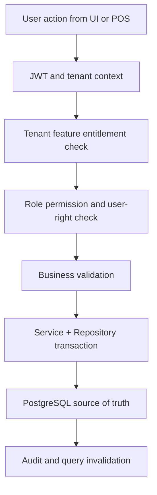

# Offline Sync Conflicts API Specification

## API Ownership
The `offline-sync-conflicts` API belongs to the `offline-sync` module and must be implemented through ASP.NET Core controllers, application services, validators, repositories, and Unit of Work.
The API must not expose fixed role assumptions; it must enforce configured tenant feature access and permission decisions.

## Endpoint Pattern
| Operation | Method | Route | Permission |
|---|---|---|---|
| Search/list | GET | `/api/v1/offline-sync/offline-sync-conflicts` | `offline-sync.offline-sync-conflicts.read` |
| Detail | GET | `/api/v1/offline-sync/offline-sync-conflicts/{id}` | `offline-sync.offline-sync-conflicts.read` |
| Create | POST | `/api/v1/offline-sync/offline-sync-conflicts` | `offline-sync.offline-sync-conflicts.create` |
| Update | PUT | `/api/v1/offline-sync/offline-sync-conflicts/{id}` | `offline-sync.offline-sync-conflicts.update` |
| State action | POST | `/api/v1/offline-sync/offline-sync-conflicts/{id}/actions/{action}` | Action-specific permission |

## Required Headers
| Header | Required | Rule |
|---|---|---|
| `Authorization` | Yes | JWT bearer token for platform user, tenant staff, customer, or device/session actor. |
| `X-Tenant-Id` | Tenant operations | Must match JWT tenant context or allowed platform support context. |
| `X-Outlet-Id` | Outlet workflows | Required for outlet-scoped POS, stock, till, and fulfillment operations. |
| `Idempotency-Key` | Commands | Required for retriable create/payment/sync/order-style commands. |
| `X-Device-Id` | POS device flows | Required where terminal/offline/device context changes behavior. |

## JWT and Access Validation Flow


## Request Example
```http
POST /api/v1/offline-sync/offline-sync-conflicts
Authorization: Bearer <jwt>
X-Tenant-Id: <tenant-id>
X-Outlet-Id: <outlet-id-if-outlet-scoped>
Idempotency-Key: <required-for-command-operations>
Content-Type: application/json

{
  "featureKey": "offline-sync.offline-sync-conflicts",
  "scope": "tenant-or-outlet",
  "payload": { "example": true }
}
```

## Response Example
```json
{
  "success": true,
  "data": {
    "module": "offline-sync",
    "feature": "offline-sync-conflicts",
    "tenantId": "00000000-0000-0000-0000-000000000000",
    "status": "active"
  },
  "errors": [],
  "traceId": "server-trace-id"
}
```

## Error Contract
| Code | HTTP | Meaning |
|---|---:|---|
| `TENANT_CONTEXT_INVALID` | 400 | Tenant header, JWT, or record tenant mismatch. |
| `FEATURE_NOT_ENTITLED` | 403 | Platform feature is not enabled for the tenant. |
| `FEATURE_FLAG_DISABLED` | 403 | Tenant/outlet/user runtime flag blocks the action. |
| `PERMISSION_DENIED` | 403 | Role/user-right configuration does not grant the operation. |
| `VALIDATION_FAILED` | 422 | Business rule or input validation failed. |
| `CONFLICT_DETECTED` | 409 | Version, stock, sync, payment, or duplicate conflict. |

## Backend Service Rules
- Controller must stay thin and call the application service.
- Service validates tenant context, entitlement, permissions, input, status, and side effects.
- Repositories only perform data access and must not contain UI or HTTP rules.
- DTOs belong in `Dtos/`, one DTO per `.cs` file.
- Use PostgreSQL transactions for multi-table writes.
- Do not use CQRS, MediatR, or event-sourced command handlers.

## Caching and Revalidation Rules
| Layer | Placement | Rule |
|---|---|---|
| Backend PostgreSQL | `offline_sync_batches`, `offline_sync_items`, typed sync queues, conflict tables | Store durable sync records; do not introduce Redis or generic cache tables. |
| Frontend TanStack Query | Server-synced status, conflict list, device settings | Keep online status fresh and invalidate after each sync batch. |
| Zustand | Current offline banner, sync progress, active terminal workflow | Store UI/session state only, not authoritative business records. |
| IndexedDB | Product, price, tax, discount snapshots, offline sale/payment/receipt queue | Required for offline POS continuity and chronological sync. |

## Frontend API Consumption
- Use `core/api/http.ts` and `core/api/endpoints.ts` for endpoint consistency.
- Use TanStack Query for query data and mutation invalidation.
- Query keys must include tenant, outlet, user/role-sensitive filters, and feature context.
- Never trust cached frontend totals, permissions, or stock as final values.
- POS offline flows may read IndexedDB snapshots but must sync to the API for final acceptance.

## Security Notes
- Backend is the final authority for tenant isolation and access control.
- Platform-admin-only endpoints must not accept tenant admin permissions as a substitute.
- Tenant operational endpoints must support tenant-specific permission customization.
- Audit should be written for sensitive creates, updates, approvals, voids, refunds, sync conflicts, and configuration changes.

## Related Links
- Feature spec: [[feature-spec|Offline Sync Conflicts Feature Spec]]
- API standards: [[../../../../04-api/README|API Standards]]
- Security: [[../../../../09-security-and-compliance/README|Security and Compliance]]
- Backend: [[../../../../05-backend/README|Backend Rules]]
- Frontend: [[../../../../06-frontend/README|Frontend Rules]]
- Access consideration 1: Permission `offline-sync.offline-sync-conflicts.read` may show data, while command permissions must be separately configured per role.
- Access consideration 2: Permission `offline-sync.offline-sync-conflicts.read` may show data, while command permissions must be separately configured per role.
- Access consideration 3: Permission `offline-sync.offline-sync-conflicts.read` may show data, while command permissions must be separately configured per role.
- Access consideration 4: Permission `offline-sync.offline-sync-conflicts.read` may show data, while command permissions must be separately configured per role.
- Access consideration 5: Permission `offline-sync.offline-sync-conflicts.read` may show data, while command permissions must be separately configured per role.
- Access consideration 6: Permission `offline-sync.offline-sync-conflicts.read` may show data, while command permissions must be separately configured per role.
- Access consideration 7: Permission `offline-sync.offline-sync-conflicts.read` may show data, while command permissions must be separately configured per role.
- Access consideration 8: Permission `offline-sync.offline-sync-conflicts.read` may show data, while command permissions must be separately configured per role.
- Access consideration 9: Permission `offline-sync.offline-sync-conflicts.read` may show data, while command permissions must be separately configured per role.
- Access consideration 10: Permission `offline-sync.offline-sync-conflicts.read` may show data, while command permissions must be separately configured per role.
- Access consideration 11: Permission `offline-sync.offline-sync-conflicts.read` may show data, while command permissions must be separately configured per role.
- Data consideration 12: Use PostgreSQL indexes/read models for repeated reads; do not create Redis dependency or generic cache tables.
- Data consideration 13: Use PostgreSQL indexes/read models for repeated reads; do not create Redis dependency or generic cache tables.
- Data consideration 14: Use PostgreSQL indexes/read models for repeated reads; do not create Redis dependency or generic cache tables.
- Data consideration 15: Use PostgreSQL indexes/read models for repeated reads; do not create Redis dependency or generic cache tables.
- Data consideration 16: Use PostgreSQL indexes/read models for repeated reads; do not create Redis dependency or generic cache tables.
- Data consideration 17: Use PostgreSQL indexes/read models for repeated reads; do not create Redis dependency or generic cache tables.
- Data consideration 18: Use PostgreSQL indexes/read models for repeated reads; do not create Redis dependency or generic cache tables.
- Data consideration 19: Use PostgreSQL indexes/read models for repeated reads; do not create Redis dependency or generic cache tables.
- Data consideration 20: Use PostgreSQL indexes/read models for repeated reads; do not create Redis dependency or generic cache tables.
- Data consideration 21: Use PostgreSQL indexes/read models for repeated reads; do not create Redis dependency or generic cache tables.
- Data consideration 22: Use PostgreSQL indexes/read models for repeated reads; do not create Redis dependency or generic cache tables.
- Data consideration 23: Use PostgreSQL indexes/read models for repeated reads; do not create Redis dependency or generic cache tables.
- Frontend consideration 24: Use TanStack Query for server data and Zustand only for local interaction state.
- Frontend consideration 25: Use TanStack Query for server data and Zustand only for local interaction state.
- Frontend consideration 26: Use TanStack Query for server data and Zustand only for local interaction state.
- Frontend consideration 27: Use TanStack Query for server data and Zustand only for local interaction state.
- Frontend consideration 28: Use TanStack Query for server data and Zustand only for local interaction state.
- Frontend consideration 29: Use TanStack Query for server data and Zustand only for local interaction state.
- Frontend consideration 30: Use TanStack Query for server data and Zustand only for local interaction state.
- Frontend consideration 31: Use TanStack Query for server data and Zustand only for local interaction state.
