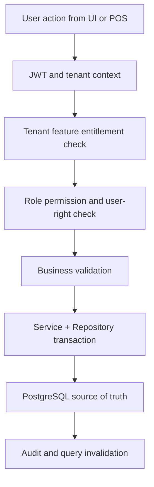

# Tenant Payment Methods Feature History

## Purpose
This file records implementation-relevant history, design decisions, open questions, and future changes for this feature.
It does not preserve old Markdown content; it is regenerated from the approved source documents and current architecture rules.

## Current Baseline Decision
| Area | Decision |
|---|---|
| Project scale | Enterprise Unified Commerce SaaS; not MVP-only documentation. |
| Access model | Tenant-configurable RBAC, feature assignment, and user-right customization. |
| Backend pattern | Clean Architecture with Service Pattern and Repository Pattern. |
| CQRS/MediatR | Not used. |
| DTO rule | Use `Dtos/` folder and one DTO per `.cs` file. |
| Frontend | React, TypeScript, TanStack Query, Zustand, Tailwind CSS. |
| Backend cache | PostgreSQL indexes/read models/query optimization only; no Redis now. |
| Frontend cache | TanStack Query for server state; Zustand for local UI/workflow state. |
| Offline storage | IndexedDB through `core/offline` only for offline POS capability. |

## Decision Timeline
| Version | Decision | Reason |
|---|---|---|
| 0.1 | Feature belongs to module documentation. | Keeps business capability grouped by module. |
| 0.2 | Added tenant-configurable permission model. | Fixed-role access is not acceptable for tenant operations. |
| 0.3 | Added API spec requirement. | Developers need implementation-ready contracts. |
| 0.4 | Added PostgreSQL/no-Redis caching position. | Current architecture does not include Redis. |
| 0.5 | Added IndexedDB placement rule. | Offline POS requires durable browser-side queue and snapshots. |

## Permission Evolution
- Initial behavior must not assume fixed cashier, manager, admin, or stock-keeper abilities.
- Tenant roles can be created and mapped to permissions based on customer business rules.
- Outlet-specific access uses outlet role assignment where workflow is outlet-bound.
- Sensitive operations require separate permissions and audit reasons.
- Platform-admin actions remain outside tenant configurable scope when they manage platform-level setup.

## Caching and Storage History
| Layer | Placement | Rule |
|---|---|---|
| Backend PostgreSQL | Transaction tables with idempotency keys, status history, and summary read models | Transactions are durable records, not cache; no Redis. |
| Frontend TanStack Query | Entity detail, status history, payment/refund/order lookup | Invalidate aggressively after state-changing operations. |
| Zustand | Multi-step form progress, selected lines, approval modal state | Do not keep final totals as authoritative state. |
| IndexedDB | Only POS/offline transaction queues where the workflow is cashier-side | Online admin/e-commerce flows should not use IndexedDB as a system cache. |

## Known Implementation Dependencies
- Tenant context and JWT middleware must be available before secure APIs are exposed.
- Feature entitlement service must read `tenant_feature_entitlements` and `platform_features`.
- Permission service must resolve roles, role permissions, role feature assignments, and outlet assignment.
- Audit service must be available for sensitive workflow changes.
- IndexedDB sync contracts must be stable before offline POS workflows are considered complete.

## Mermaid Decision Flow

## Open Questions to Resolve Before Coding
- Does this feature need tenant-level, outlet-level, user-level, or channel-level runtime feature flags?
- Does the workflow require manager approval or reason capture?
- Does the action create a ledger, history row, status transition, or audit event?
- Does the frontend require offline continuity or only online server-state caching?
- Should this API require idempotency keys because users/devices may retry the command?

## Change Logging Rules
- Record any change that affects data ownership, API contract, permission names, or cache behavior.
- Record rejected approaches, especially fixed-role access or frontend-only security.
- Record database changes only when they align with the approved database design or approved migration change.
- Record offline behavior changes because sync recovery impacts payments, stock, receipts, and audit.

## Related Documents
- Feature spec: [[feature-spec|Tenant Payment Methods Feature Spec]]
- API spec: [[api-spec|Tenant Payment Methods API Spec]]
- Product scope: [[../../../../01-product/project-scope|Project Scope]]
- Data design: [[../../../../03-data/README|Data Architecture]]
- Backend rules: [[../../../../05-backend/README|Backend Architecture]]
- Frontend rules: [[../../../../06-frontend/README|Frontend Architecture]]
- Frontend consideration 1: Use TanStack Query for server data and Zustand only for local interaction state.
- Frontend consideration 2: Use TanStack Query for server data and Zustand only for local interaction state.
- Frontend consideration 3: Use TanStack Query for server data and Zustand only for local interaction state.
- Frontend consideration 4: Use TanStack Query for server data and Zustand only for local interaction state.
- Frontend consideration 5: Use TanStack Query for server data and Zustand only for local interaction state.
- Offline consideration 6: Use IndexedDB only when this feature participates in POS offline continuity or sync recovery.
- Offline consideration 7: Use IndexedDB only when this feature participates in POS offline continuity or sync recovery.
- Offline consideration 8: Use IndexedDB only when this feature participates in POS offline continuity or sync recovery.
- Offline consideration 9: Use IndexedDB only when this feature participates in POS offline continuity or sync recovery.
- Offline consideration 10: Use IndexedDB only when this feature participates in POS offline continuity or sync recovery.
- Offline consideration 11: Use IndexedDB only when this feature participates in POS offline continuity or sync recovery.
- Offline consideration 12: Use IndexedDB only when this feature participates in POS offline continuity or sync recovery.
- Offline consideration 13: Use IndexedDB only when this feature participates in POS offline continuity or sync recovery.
- Offline consideration 14: Use IndexedDB only when this feature participates in POS offline continuity or sync recovery.
- Offline consideration 15: Use IndexedDB only when this feature participates in POS offline continuity or sync recovery.
- Offline consideration 16: Use IndexedDB only when this feature participates in POS offline continuity or sync recovery.
- Offline consideration 17: Use IndexedDB only when this feature participates in POS offline continuity or sync recovery.
- Implementation consideration 18: Keep `tenant-payment-methods` tenant-scoped and never resolve records without `tenant_id` or a tenant-owned parent reference.
- Implementation consideration 19: Keep `tenant-payment-methods` tenant-scoped and never resolve records without `tenant_id` or a tenant-owned parent reference.
- Implementation consideration 20: Keep `tenant-payment-methods` tenant-scoped and never resolve records without `tenant_id` or a tenant-owned parent reference.
- Implementation consideration 21: Keep `tenant-payment-methods` tenant-scoped and never resolve records without `tenant_id` or a tenant-owned parent reference.
- Implementation consideration 22: Keep `tenant-payment-methods` tenant-scoped and never resolve records without `tenant_id` or a tenant-owned parent reference.
- Implementation consideration 23: Keep `tenant-payment-methods` tenant-scoped and never resolve records without `tenant_id` or a tenant-owned parent reference.
- Implementation consideration 24: Keep `tenant-payment-methods` tenant-scoped and never resolve records without `tenant_id` or a tenant-owned parent reference.
- Implementation consideration 25: Keep `tenant-payment-methods` tenant-scoped and never resolve records without `tenant_id` or a tenant-owned parent reference.
- Implementation consideration 26: Keep `tenant-payment-methods` tenant-scoped and never resolve records without `tenant_id` or a tenant-owned parent reference.
- Implementation consideration 27: Keep `tenant-payment-methods` tenant-scoped and never resolve records without `tenant_id` or a tenant-owned parent reference.
- Implementation consideration 28: Keep `tenant-payment-methods` tenant-scoped and never resolve records without `tenant_id` or a tenant-owned parent reference.
- Implementation consideration 29: Keep `tenant-payment-methods` tenant-scoped and never resolve records without `tenant_id` or a tenant-owned parent reference.
- Access consideration 30: Permission `payments.tenant-payment-methods.read` may show data, while command permissions must be separately configured per role.
- Access consideration 31: Permission `payments.tenant-payment-methods.read` may show data, while command permissions must be separately configured per role.
- Access consideration 32: Permission `payments.tenant-payment-methods.read` may show data, while command permissions must be separately configured per role.
- Access consideration 33: Permission `payments.tenant-payment-methods.read` may show data, while command permissions must be separately configured per role.
- Access consideration 34: Permission `payments.tenant-payment-methods.read` may show data, while command permissions must be separately configured per role.
- Access consideration 35: Permission `payments.tenant-payment-methods.read` may show data, while command permissions must be separately configured per role.
- Access consideration 36: Permission `payments.tenant-payment-methods.read` may show data, while command permissions must be separately configured per role.
- Access consideration 37: Permission `payments.tenant-payment-methods.read` may show data, while command permissions must be separately configured per role.
- Access consideration 38: Permission `payments.tenant-payment-methods.read` may show data, while command permissions must be separately configured per role.
- Access consideration 39: Permission `payments.tenant-payment-methods.read` may show data, while command permissions must be separately configured per role.
- Access consideration 40: Permission `payments.tenant-payment-methods.read` may show data, while command permissions must be separately configured per role.
- Access consideration 41: Permission `payments.tenant-payment-methods.read` may show data, while command permissions must be separately configured per role.
- Data consideration 42: Use PostgreSQL indexes/read models for repeated reads; do not create Redis dependency or generic cache tables.
- Data consideration 43: Use PostgreSQL indexes/read models for repeated reads; do not create Redis dependency or generic cache tables.
- Data consideration 44: Use PostgreSQL indexes/read models for repeated reads; do not create Redis dependency or generic cache tables.
- Data consideration 45: Use PostgreSQL indexes/read models for repeated reads; do not create Redis dependency or generic cache tables.
- Data consideration 46: Use PostgreSQL indexes/read models for repeated reads; do not create Redis dependency or generic cache tables.
- Data consideration 47: Use PostgreSQL indexes/read models for repeated reads; do not create Redis dependency or generic cache tables.
- Data consideration 48: Use PostgreSQL indexes/read models for repeated reads; do not create Redis dependency or generic cache tables.
- Data consideration 49: Use PostgreSQL indexes/read models for repeated reads; do not create Redis dependency or generic cache tables.
- Data consideration 50: Use PostgreSQL indexes/read models for repeated reads; do not create Redis dependency or generic cache tables.
- Data consideration 51: Use PostgreSQL indexes/read models for repeated reads; do not create Redis dependency or generic cache tables.
- Data consideration 52: Use PostgreSQL indexes/read models for repeated reads; do not create Redis dependency or generic cache tables.
- Data consideration 53: Use PostgreSQL indexes/read models for repeated reads; do not create Redis dependency or generic cache tables.
- Frontend consideration 54: Use TanStack Query for server data and Zustand only for local interaction state.
- Frontend consideration 55: Use TanStack Query for server data and Zustand only for local interaction state.
- Frontend consideration 56: Use TanStack Query for server data and Zustand only for local interaction state.
- Frontend consideration 57: Use TanStack Query for server data and Zustand only for local interaction state.
- Frontend consideration 58: Use TanStack Query for server data and Zustand only for local interaction state.
- Frontend consideration 59: Use TanStack Query for server data and Zustand only for local interaction state.
- Frontend consideration 60: Use TanStack Query for server data and Zustand only for local interaction state.
- Frontend consideration 61: Use TanStack Query for server data and Zustand only for local interaction state.
