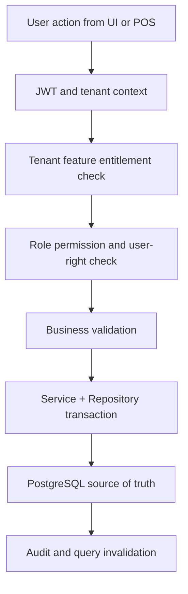

# Pos Devices Hardware Module Overview

## Module Purpose
The `pos-devices-hardware` module groups related Unified Commerce capabilities and documents how they are implemented across database, backend, API, frontend, security, and cache/storage layers.
All tenant-operational capabilities in this module must support tenant-specific configuration through feature entitlements, role permissions, role-feature assignment, and runtime feature flags.

## Feature Folders
| Feature | Spec | API | History |
|---|---|---|---|
| `pos-device-registration` | [[features/pos-device-registration/feature-spec|Spec]] | [[features/pos-device-registration/api-spec|API]] | [[features/pos-device-registration/feature-history|History]] |
| `scanner-printer-configuration` | [[features/scanner-printer-configuration/feature-spec|Spec]] | [[features/scanner-printer-configuration/api-spec|API]] | [[features/scanner-printer-configuration/feature-history|History]] |
| `terminal-outlet-assignment` | [[features/terminal-outlet-assignment/feature-spec|Spec]] | [[features/terminal-outlet-assignment/api-spec|API]] | [[features/terminal-outlet-assignment/feature-history|History]] |
| `tills` | [[features/tills/feature-spec|Spec]] | [[features/tills/api-spec|API]] | [[features/tills/feature-history|History]] |

## Database Tables Commonly Used
| Table | Purpose in module |
|---|---|
| `tills` | Supports `pos-devices-hardware` module workflows and tenant-scoped persistence. |
| `pos_devices` | Supports `pos-devices-hardware` module workflows and tenant-scoped persistence. |
| `receipt_templates` | Supports `pos-devices-hardware` module workflows and tenant-scoped persistence. |
| `receipt_print_logs` | Supports `pos-devices-hardware` module workflows and tenant-scoped persistence. |
| `offline_sync_batches` | Supports `pos-devices-hardware` module workflows and tenant-scoped persistence. |

## Access Control Position
- Platform-admin-only configuration remains platform-controlled.
- Tenant-facing features must be configurable for each customer tenant.
- Feature availability starts with `platform_features` and `tenant_feature_entitlements`.
- Tenant admins configure roles, role permissions, and role-feature access where allowed.
- Backend checks cannot be replaced by menu hiding or disabled buttons.

## Architecture Flow

## Backend Placement
| Layer | Folder | Responsibility |
|---|---|---|
| API | `POS.API/Modules/PosDevicesHardware` | Controllers, request models, response models. |
| Application | `POS.Application/Modules/PosDevicesHardware` | Services, validators, interfaces, and `Dtos/`. |
| Domain | `POS.Domain/Modules/PosDevicesHardware` | Pure rules and entities where needed. |
| Infrastructure | `POS.Infrastructure/Repositories/PosDevicesHardware` | EF Core repositories and persistence logic. |

## Frontend Placement
- Feature UI belongs under `src/features/` using React with TypeScript.
- Page composition belongs under `src/pages/` and layout shell folders.
- Server state uses TanStack Query from `core/api/queryClient.ts`.
- Workflow state uses Zustand stores from `src/state/`.
- Offline POS storage uses `core/offline/syncQueue.ts` and IndexedDB.

## Caching and Storage Placement
| Layer | Placement | Rule |
|---|---|---|
| Backend PostgreSQL | Read-optimized queries over till, device, product, price, stock, and receipt tables | Use indexes and existing read models; no Redis in current architecture. |
| Frontend TanStack Query | Terminal settings, active till session, product search, receipt templates | Cache server state per tenant, outlet, device, and user. |
| Zustand | Cart, selected customer, payment step, tendered amounts, modal state | Keep transient POS workflow fast without pretending it is final authority. |
| IndexedDB | Offline POS cart snapshots, queued sales/payments/receipts, last synced catalog version | Use only when offline mode is enabled for the tenant/outlet/device. |

## Related Knowledge Base Links
- Product scope: [[../../01-product/project-scope|Project Scope]]
- Architecture: [[../../02-architecture/README|Architecture]]
- Data: [[../../03-data/README|Data Design]]
- API: [[../../04-api/README|API Standards]]
- Backend: [[../../05-backend/README|Backend]]
- Frontend: [[../../06-frontend/README|Frontend]]
- Security: [[../../09-security-and-compliance/README|Security and Compliance]]

## Implementation Considerations
- Do not add new tables unless approved by database design or a formal schema change.
- Do not create generic cache tables such as tenant cache, product cache, POS cache, or query cache.
- Use PostgreSQL indexes, deterministic queries, and existing read models for repeated backend reads.
- Use invalidation rather than stale UI assumptions after create/update/delete/approval actions.
- Keep tenant boundaries visible in API, repository queries, tests, and audit logs.
- Frontend consideration 1: Use TanStack Query for server data and Zustand only for local interaction state.
- Frontend consideration 2: Use TanStack Query for server data and Zustand only for local interaction state.
- Frontend consideration 3: Use TanStack Query for server data and Zustand only for local interaction state.
- Frontend consideration 4: Use TanStack Query for server data and Zustand only for local interaction state.
- Frontend consideration 5: Use TanStack Query for server data and Zustand only for local interaction state.
- Frontend consideration 6: Use TanStack Query for server data and Zustand only for local interaction state.
- Frontend consideration 7: Use TanStack Query for server data and Zustand only for local interaction state.
- Offline consideration 8: Use IndexedDB only when this feature participates in POS offline continuity or sync recovery.
- Offline consideration 9: Use IndexedDB only when this feature participates in POS offline continuity or sync recovery.
- Offline consideration 10: Use IndexedDB only when this feature participates in POS offline continuity or sync recovery.
- Offline consideration 11: Use IndexedDB only when this feature participates in POS offline continuity or sync recovery.
- Offline consideration 12: Use IndexedDB only when this feature participates in POS offline continuity or sync recovery.
- Offline consideration 13: Use IndexedDB only when this feature participates in POS offline continuity or sync recovery.
- Offline consideration 14: Use IndexedDB only when this feature participates in POS offline continuity or sync recovery.
- Offline consideration 15: Use IndexedDB only when this feature participates in POS offline continuity or sync recovery.
- Offline consideration 16: Use IndexedDB only when this feature participates in POS offline continuity or sync recovery.
- Offline consideration 17: Use IndexedDB only when this feature participates in POS offline continuity or sync recovery.
- Offline consideration 18: Use IndexedDB only when this feature participates in POS offline continuity or sync recovery.
- Offline consideration 19: Use IndexedDB only when this feature participates in POS offline continuity or sync recovery.
- Implementation consideration 20: Keep `module` tenant-scoped and never resolve records without `tenant_id` or a tenant-owned parent reference.
- Implementation consideration 21: Keep `module` tenant-scoped and never resolve records without `tenant_id` or a tenant-owned parent reference.
- Implementation consideration 22: Keep `module` tenant-scoped and never resolve records without `tenant_id` or a tenant-owned parent reference.
- Implementation consideration 23: Keep `module` tenant-scoped and never resolve records without `tenant_id` or a tenant-owned parent reference.
- Implementation consideration 24: Keep `module` tenant-scoped and never resolve records without `tenant_id` or a tenant-owned parent reference.
- Implementation consideration 25: Keep `module` tenant-scoped and never resolve records without `tenant_id` or a tenant-owned parent reference.
- Implementation consideration 26: Keep `module` tenant-scoped and never resolve records without `tenant_id` or a tenant-owned parent reference.
- Implementation consideration 27: Keep `module` tenant-scoped and never resolve records without `tenant_id` or a tenant-owned parent reference.
- Implementation consideration 28: Keep `module` tenant-scoped and never resolve records without `tenant_id` or a tenant-owned parent reference.
- Implementation consideration 29: Keep `module` tenant-scoped and never resolve records without `tenant_id` or a tenant-owned parent reference.
- Implementation consideration 30: Keep `module` tenant-scoped and never resolve records without `tenant_id` or a tenant-owned parent reference.
- Implementation consideration 31: Keep `module` tenant-scoped and never resolve records without `tenant_id` or a tenant-owned parent reference.
- Access consideration 32: Permission `pos-devices-hardware.module.read` may show data, while command permissions must be separately configured per role.
- Access consideration 33: Permission `pos-devices-hardware.module.read` may show data, while command permissions must be separately configured per role.
- Access consideration 34: Permission `pos-devices-hardware.module.read` may show data, while command permissions must be separately configured per role.
- Access consideration 35: Permission `pos-devices-hardware.module.read` may show data, while command permissions must be separately configured per role.
- Access consideration 36: Permission `pos-devices-hardware.module.read` may show data, while command permissions must be separately configured per role.
- Access consideration 37: Permission `pos-devices-hardware.module.read` may show data, while command permissions must be separately configured per role.
- Access consideration 38: Permission `pos-devices-hardware.module.read` may show data, while command permissions must be separately configured per role.
- Access consideration 39: Permission `pos-devices-hardware.module.read` may show data, while command permissions must be separately configured per role.
- Access consideration 40: Permission `pos-devices-hardware.module.read` may show data, while command permissions must be separately configured per role.
- Access consideration 41: Permission `pos-devices-hardware.module.read` may show data, while command permissions must be separately configured per role.
- Access consideration 42: Permission `pos-devices-hardware.module.read` may show data, while command permissions must be separately configured per role.
- Access consideration 43: Permission `pos-devices-hardware.module.read` may show data, while command permissions must be separately configured per role.
- Data consideration 44: Use PostgreSQL indexes/read models for repeated reads; do not create Redis dependency or generic cache tables.
- Data consideration 45: Use PostgreSQL indexes/read models for repeated reads; do not create Redis dependency or generic cache tables.
- Data consideration 46: Use PostgreSQL indexes/read models for repeated reads; do not create Redis dependency or generic cache tables.
- Data consideration 47: Use PostgreSQL indexes/read models for repeated reads; do not create Redis dependency or generic cache tables.
- Data consideration 48: Use PostgreSQL indexes/read models for repeated reads; do not create Redis dependency or generic cache tables.
- Data consideration 49: Use PostgreSQL indexes/read models for repeated reads; do not create Redis dependency or generic cache tables.
- Data consideration 50: Use PostgreSQL indexes/read models for repeated reads; do not create Redis dependency or generic cache tables.
- Data consideration 51: Use PostgreSQL indexes/read models for repeated reads; do not create Redis dependency or generic cache tables.
- Data consideration 52: Use PostgreSQL indexes/read models for repeated reads; do not create Redis dependency or generic cache tables.
- Data consideration 53: Use PostgreSQL indexes/read models for repeated reads; do not create Redis dependency or generic cache tables.
- Data consideration 54: Use PostgreSQL indexes/read models for repeated reads; do not create Redis dependency or generic cache tables.
- Data consideration 55: Use PostgreSQL indexes/read models for repeated reads; do not create Redis dependency or generic cache tables.
- Frontend consideration 56: Use TanStack Query for server data and Zustand only for local interaction state.
- Frontend consideration 57: Use TanStack Query for server data and Zustand only for local interaction state.
- Frontend consideration 58: Use TanStack Query for server data and Zustand only for local interaction state.
- Frontend consideration 59: Use TanStack Query for server data and Zustand only for local interaction state.
- Frontend consideration 60: Use TanStack Query for server data and Zustand only for local interaction state.
- Frontend consideration 61: Use TanStack Query for server data and Zustand only for local interaction state.
- Frontend consideration 62: Use TanStack Query for server data and Zustand only for local interaction state.
- Frontend consideration 63: Use TanStack Query for server data and Zustand only for local interaction state.
