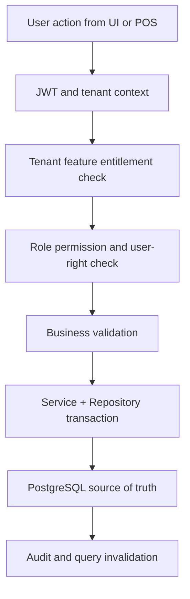

# Pos Checkout Feature Specification

## Purpose
This document defines the implementation scope for `pos-checkout` inside the `sales-pos` module of the Unified Commerce platform.
The feature must support enterprise multi-tenant operation and must never rely on fixed access behavior except for platform-admin-only capabilities.
Every tenant-facing operation is controlled by tenant entitlements, tenant-side feature flags, role permissions, outlet/user role assignment, and backend validation.

## Source Alignment
| Source | Applied decision |
|---|---|
| Scope | Unified POS + E-Commerce business capability with operational auditability. |
| Database | Tenant-owned records, normalized tables, FK consistency, immutable ledgers where required. |
| Backend | Clean Architecture with services, repositories, DTOs, validators, and Unit of Work. |
| Frontend | React TypeScript feature folders, TanStack Query, Zustand, Tailwind, and POS offline core. |

## Database References
| Table | Usage in this feature |
|---|---|
| `tills` | Source or supporting table for `pos-checkout` behavior. |
| `pos_devices` | Source or supporting table for `pos-checkout` behavior. |
| `till_sessions` | Source or supporting table for `pos-checkout` behavior. |
| `sales` | Source or supporting table for `pos-checkout` behavior. |
| `sale_lines` | Source or supporting table for `pos-checkout` behavior. |
| `cash_movements` | Source or supporting table for `pos-checkout` behavior. |
| `receipts` | Source or supporting table for `pos-checkout` behavior. |

## Permission Model
| Permission | Meaning | Configurable by tenant? |
|---|---|---|
| `sales-pos.pos-checkout.read` | View data and search records. | Yes |
| `sales-pos.pos-checkout.create` | Create new records or workflow drafts. | Yes |
| `sales-pos.pos-checkout.update` | Modify allowed editable fields. | Yes |
| `sales-pos.pos-checkout.approve` | Approve sensitive actions where applicable. | Yes |
| `sales-pos.pos-checkout.void` | Void/cancel/reverse where business rules allow. | Yes |

## Tenant-Specific Access Behavior
- Platform admin enables the platform feature for the tenant through `tenant_feature_entitlements`.
- Tenant admin maps enabled features to tenant roles through `role_feature_assignments`.
- Tenant roles receive granular permissions through `role_permissions`.
- Staff users receive tenant-level or outlet-level roles through `tenant_user_roles` or `outlet_user_roles`.
- Backend must evaluate entitlement, feature flag, role, permission, tenant, outlet, and user context before writes.
- Frontend may hide actions, but hidden UI is not security.

## Workflow


## Backend Implementation
- Place API request/response contracts in `POS.API/Modules/<Module>/Requests` and `Responses`.
- Place application service, validator, interfaces, and `Dtos/` in `POS.Application/Modules/<Module>`.
- Keep one DTO per `.cs` file inside the module `Dtos/` folder.
- Place pure business rules in `POS.Domain/Modules/<Module>` only when rules are not infrastructure-specific.
- Place EF Core repository implementations in `POS.Infrastructure/Repositories/<Module>`.
- Use service orchestration and repositories; do not introduce CQRS, MediatR, or handler pipelines.

```csharp
public sealed class PosCheckoutService : IPosCheckoutService
{
    private readonly IPosCheckoutRepository _repository;
    private readonly IUnitOfWork _unitOfWork;
    private readonly IAccessDecisionService _access;

    public async Task<ApiResponse<PosCheckoutDto>> HandleAsync(PosCheckoutRequest request, UserContext actor)
    {
        await _access.RequireAsync(actor, "sales-pos.pos-checkout.manage");
        // Validate tenant, outlet, feature entitlement, role permission, and request rules.
        // Query and persist through repositories; do not use CQRS or MediatR.
        await _unitOfWork.SaveChangesAsync();
        return ApiResponse.Success(new PosCheckoutDto());
    }
}
```

## Frontend Implementation
- Place API functions in `src/features/<feature>/api` or the closest existing module folder.
- Use TanStack Query for server state and invalidation after mutations.
- Use Zustand for local workflow state such as selected rows, cart steps, modals, and active panels.
- Use Tailwind CSS for consistent enterprise SaaS layouts and POS touch targets.
- Use `core/offline` and IndexedDB only where offline POS continuity is explicitly required.

```ts
export const poscheckoutQueryKey = (tenantId: string, outletId?: string) =>
  ["sales-pos", "pos-checkout", tenantId, outletId ?? "tenant"] as const;

export function usePosCheckout(tenantId: string, outletId?: string) {
  return useQuery({
    queryKey: poscheckoutQueryKey(tenantId, outletId),
    queryFn: () => api.get("/api/v1/sales-pos/pos-checkout"),
    staleTime: 60_000,
  });
}
```

## Caching and Offline Storage Placement
| Layer | Placement | Rule |
|---|---|---|
| Backend PostgreSQL | Read-optimized queries over till, device, product, price, stock, and receipt tables | Use indexes and existing read models; no Redis in current architecture. |
| Frontend TanStack Query | Terminal settings, active till session, product search, receipt templates | Cache server state per tenant, outlet, device, and user. |
| Zustand | Cart, selected customer, payment step, tendered amounts, modal state | Keep transient POS workflow fast without pretending it is final authority. |
| IndexedDB | Offline POS cart snapshots, queued sales/payments/receipts, last synced catalog version | Use only when offline mode is enabled for the tenant/outlet/device. |

## Validation Rules
- `tenant_id` must be resolved from JWT/context and must match every tenant-owned parent record.
- Outlet-scoped commands must validate `outlet_id` and user outlet role assignment.
- Feature entitlement must exist before tenant-side configuration can enable the feature.
- Sensitive actions must include actor, reason where required, and audit record.
- Commands that may be retried must use idempotency keys or client transaction identifiers.
- Calculated values previewed by frontend must be recalculated by backend before persistence.

## API Example
```http
POST /api/v1/sales-pos/pos-checkout
Authorization: Bearer <jwt>
X-Tenant-Id: <tenant-id>
X-Outlet-Id: <outlet-id-if-outlet-scoped>
Idempotency-Key: <required-for-command-operations>
Content-Type: application/json

{
  "featureKey": "sales-pos.pos-checkout",
  "scope": "tenant-or-outlet",
  "payload": { "example": true }
}
```

## Data Flow References
- Related module overview: [[../README|Sales Pos Overview]]
- API standards: [[../../04-api/README|API Standards]]
- Backend rules: [[../../05-backend/README|Backend Architecture]]
- Frontend rules: [[../../06-frontend/README|Frontend Architecture]]
- Data design: [[../../03-data/README|Data Architecture]]

## Implementation Notes
- This document defines feature behavior, not UI decoration only.
- Any cache decision must preserve PostgreSQL as the durable source of truth.
- IndexedDB data must be treated as local pending state until server sync accepts it.
- Permission names shown here are implementation guidance and must be aligned with the platform permission catalog.
- Feature-specific edge cases must be added to the feature history before coding starts.
