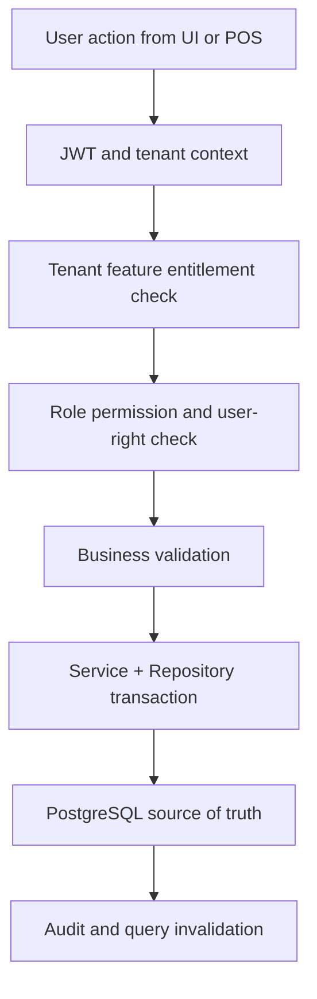

# Document Sequences Feature Specification

## Purpose
This document defines the implementation scope for `document-sequences` inside the `tenant-management` module of the Unified Commerce platform.
The feature must support enterprise multi-tenant operation and must never rely on fixed access behavior except for platform-admin-only capabilities.
Every tenant-facing operation is controlled by tenant entitlements, tenant-side feature flags, role permissions, outlet/user role assignment, and backend validation.

## Source Alignment
| Source | Applied decision |
|---|---|
| Scope | Unified POS + E-Commerce business capability with operational auditability. |
| Database | Tenant-owned records, normalized tables, FK consistency, immutable ledgers where required. |
| Backend | Clean Architecture with services, repositories, DTOs, validators, and Unit of Work. |
| Frontend | React TypeScript feature folders, TanStack Query, Zustand, Tailwind, and POS offline core. |

## Database References
| Table | Usage in this feature |
|---|---|
| `tenants` | Source or supporting table for `document-sequences` behavior. |
| `outlets` | Source or supporting table for `document-sequences` behavior. |
| `outlet_addresses` | Source or supporting table for `document-sequences` behavior. |
| `document_sequences` | Source or supporting table for `document-sequences` behavior. |
| `tenant_settings` | Source or supporting table for `document-sequences` behavior. |
| `ui_themes` | Source or supporting table for `document-sequences` behavior. |

## Permission Model
| Permission | Meaning | Configurable by tenant? |
|---|---|---|
| `tenant-management.document-sequences.read` | View data and search records. | Yes |
| `tenant-management.document-sequences.create` | Create new records or workflow drafts. | Yes |
| `tenant-management.document-sequences.update` | Modify allowed editable fields. | Yes |
| `tenant-management.document-sequences.approve` | Approve sensitive actions where applicable. | Yes |
| `tenant-management.document-sequences.void` | Void/cancel/reverse where business rules allow. | Yes |

## Tenant-Specific Access Behavior
- Platform admin enables the platform feature for the tenant through `tenant_feature_entitlements`.
- Tenant admin maps enabled features to tenant roles through `role_feature_assignments`.
- Tenant roles receive granular permissions through `role_permissions`.
- Staff users receive tenant-level or outlet-level roles through `tenant_user_roles` or `outlet_user_roles`.
- Backend must evaluate entitlement, feature flag, role, permission, tenant, outlet, and user context before writes.
- Frontend may hide actions, but hidden UI is not security.

## Workflow


## Backend Implementation
- Place API request/response contracts in `POS.API/Modules/<Module>/Requests` and `Responses`.
- Place application service, validator, interfaces, and `Dtos/` in `POS.Application/Modules/<Module>`.
- Keep one DTO per `.cs` file inside the module `Dtos/` folder.
- Place pure business rules in `POS.Domain/Modules/<Module>` only when rules are not infrastructure-specific.
- Place EF Core repository implementations in `POS.Infrastructure/Repositories/<Module>`.
- Use service orchestration and repositories; do not introduce CQRS, MediatR, or handler pipelines.

```csharp
public sealed class DocumentSequencesService : IDocumentSequencesService
{
    private readonly IDocumentSequencesRepository _repository;
    private readonly IUnitOfWork _unitOfWork;
    private readonly IAccessDecisionService _access;

    public async Task<ApiResponse<DocumentSequencesDto>> HandleAsync(DocumentSequencesRequest request, UserContext actor)
    {
        await _access.RequireAsync(actor, "tenant-management.document-sequences.manage");
        // Validate tenant, outlet, feature entitlement, role permission, and request rules.
        // Query and persist through repositories; do not use CQRS or MediatR.
        await _unitOfWork.SaveChangesAsync();
        return ApiResponse.Success(new DocumentSequencesDto());
    }
}
```

## Frontend Implementation
- Place API functions in `src/features/<feature>/api` or the closest existing module folder.
- Use TanStack Query for server state and invalidation after mutations.
- Use Zustand for local workflow state such as selected rows, cart steps, modals, and active panels.
- Use Tailwind CSS for consistent enterprise SaaS layouts and POS touch targets.
- Use `core/offline` and IndexedDB only where offline POS continuity is explicitly required.

```ts
export const documentsequencesQueryKey = (tenantId: string, outletId?: string) =>
  ["tenant-management", "document-sequences", tenantId, outletId ?? "tenant"] as const;

export function useDocumentSequences(tenantId: string, outletId?: string) {
  return useQuery({
    queryKey: documentsequencesQueryKey(tenantId, outletId),
    queryFn: () => api.get("/api/v1/tenant-management/document-sequences"),
    staleTime: 60_000,
  });
}
```

## Caching and Offline Storage Placement
| Layer | Placement | Rule |
|---|---|---|
| Backend PostgreSQL | Indexed tenant-scoped reads and existing normalized tables | No Redis and no generic cache table in current design. |
| Frontend TanStack Query | Server state returned from API queries | Use structured query keys and mutation invalidation. |
| Zustand | UI-only workflow state | Avoid duplicating server authority. |
| IndexedDB | Not default | Use only for offline POS support approved by feature flag. |

## Validation Rules
- `tenant_id` must be resolved from JWT/context and must match every tenant-owned parent record.
- Outlet-scoped commands must validate `outlet_id` and user outlet role assignment.
- Feature entitlement must exist before tenant-side configuration can enable the feature.
- Sensitive actions must include actor, reason where required, and audit record.
- Commands that may be retried must use idempotency keys or client transaction identifiers.
- Calculated values previewed by frontend must be recalculated by backend before persistence.

## API Example
```http
POST /api/v1/tenant-management/document-sequences
Authorization: Bearer <jwt>
X-Tenant-Id: <tenant-id>
X-Outlet-Id: <outlet-id-if-outlet-scoped>
Idempotency-Key: <required-for-command-operations>
Content-Type: application/json

{
  "featureKey": "tenant-management.document-sequences",
  "scope": "tenant-or-outlet",
  "payload": { "example": true }
}
```

## Data Flow References
- Related module overview: [[../README|Tenant Management Overview]]
- API standards: [[../../04-api/README|API Standards]]
- Backend rules: [[../../05-backend/README|Backend Architecture]]
- Frontend rules: [[../../06-frontend/README|Frontend Architecture]]
- Data design: [[../../03-data/README|Data Architecture]]

## Implementation Notes
- This document defines feature behavior, not UI decoration only.
- Any cache decision must preserve PostgreSQL as the durable source of truth.
- IndexedDB data must be treated as local pending state until server sync accepts it.
- Permission names shown here are implementation guidance and must be aligned with the platform permission catalog.
- Feature-specific edge cases must be added to the feature history before coding starts.
