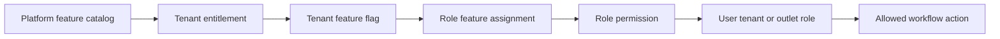

# Readme User Flows

This document indexes and governs user journeys for `README.md` in the Unified Commerce platform.

## 1. Purpose

- Define how users move through approved business workflows.
- Connect every journey to tenant isolation, feature entitlement, RBAC, frontend layout, backend services, API contracts, and database ownership.
- Prevent implementation teams from hardcoding access behavior into UI or backend code.
- Make the user-flow folder usable by developers, testers, product owners, and AI coding tools.

## 2. Scope Authority

| Authority | Usage |
|---|---|
| Scope document | Defines business modules and required operating behavior. |
| Database design | Defines source-of-truth tables, constraints, ownership, and FK relationships. |
| Frontend architecture | Defines React/TypeScript layout, features, state, and offline storage boundaries. |
| Backend architecture | Defines API, Application, Domain, Infrastructure, Service Pattern, Repository Pattern. |
| Tenant RBAC rule | Requires configurable tenant-level roles, permissions, feature assignments, and user rights. |

## 3. Actor Context

| Item | Value |
|---|---|
| Primary actor group | All Authorized Users |
| Responsibility | Role depends on user flow |
| Default layout | Configured Layout |
| Frontend areas | shared modules |
| Access behavior | Dynamic and tenant-configurable except platform-admin-only features. |

## 4. Flow Documents

- [[cancel-order]]
- [[delivery-tracking]]
- [[fulfillment]]
- [[order-processing]]
- [[refund-order]]

## 5. Standard User Flow Template

Every user-flow document in this folder must describe:

1. Flow classification and actor responsibility.
2. Related documentation links.
3. Business purpose.
4. Actors and access context.
5. Required permission model.
6. Permission flow example.
7. Database and data ownership.
8. API surface.
9. Main workflow diagram.
10. Step-by-step user journey.
11. Validation rules.
12. Frontend responsibilities.
13. Backend responsibilities.
14. Request and response examples.
15. Failure and exception paths.
16. Caching and offline storage placement.
17. Audit, history, and reporting.
18. Implementation considerations.
19. Acceptance conditions.
20. Open clarifications.

## 6. Access-Control Principle

## 7. Frontend Flow Rules

- React + TypeScript is the implementation baseline.
- TanStack Query owns server-state caching and invalidation.
- Zustand owns local workflow state only.
- Tailwind CSS owns styling utility patterns.
- IndexedDB is reserved for approved offline POS storage.
- UI may hide blocked actions but must never be treated as security.
- Layouts must separate Super Admin, Tenant Admin, POS Terminal, and tenant role-specific experiences.

## 8. Backend Flow Rules

- Backend uses Clean Architecture, Service Pattern, Repository Pattern, Unit of Work, and DTOs.
- Backend does not use CQRS or MediatR.
- Each DTO should live in a `Dtos/` folder with one DTO per `.cs` file.
- Application services must validate tenant, feature, permission, status, idempotency, and ownership.
- Repositories must not contain business workflow decisions.
- PostgreSQL is the operational source of truth.

## 9. Data and Audit Rules

| Rule | Requirement |
|---|---|
| Tenant data | Must be tenant-scoped or linked to tenant parent. |
| Platform data | Must remain separate from tenant staff/customer records. |
| Stock/payment/tax | Backend must calculate or validate final values. |
| Audit | Sensitive actions require immutable trace. |
| Offline POS | Queued records must sync through approved offline sync tables. |
| Reports | Must use transaction data or approved read models. |

## 10. Flow Quality Rules

- Do not duplicate business ownership across multiple modules.
- Do not invent tables, statuses, or permissions outside approved design.
- Do not describe fixed behavior such as “cashier can always refund”.
- Do not let frontend state become business source of truth.
- Do not silently accept offline conflicts.
- Do not mix platform users with tenant users.
- Do not bypass feature entitlements during testing or support.

## 11. Integration Map

| Area | Related folder |
|---|---|
| Product scope | [[../01-product/project-scope]] |
| Architecture | [[../02-architecture/system-overview]] |
| Data model | [[../03-data/database-overview]] |
| API standards | [[../04-api/api-guidelines]] |
| Backend implementation | [[../05-backend/backend-architecture]] |
| Frontend implementation | [[../06-frontend/frontend-architecture]] |
| Module specs | [[../07-modules/README]] |
| Security | [[../09-security-and-compliance/README]] |

## 12. Final Rule

User-flow documentation must describe real implementation behavior for this Unified Commerce platform. It must remain aligned with tenant-configurable RBAC, feature assignment, permission management, database ownership, frontend layout boundaries, backend service orchestration, and audit-ready enterprise SaaS behavior.

- Flow governance note 147: keep implementation aligned with approved scope, database, frontend, backend, and tenant-configurable access rules.
- Flow governance note 148: keep implementation aligned with approved scope, database, frontend, backend, and tenant-configurable access rules.
- Flow governance note 149: keep implementation aligned with approved scope, database, frontend, backend, and tenant-configurable access rules.
- Flow governance note 150: keep implementation aligned with approved scope, database, frontend, backend, and tenant-configurable access rules.
- Flow governance note 151: keep implementation aligned with approved scope, database, frontend, backend, and tenant-configurable access rules.
- Flow governance note 152: keep implementation aligned with approved scope, database, frontend, backend, and tenant-configurable access rules.
- Flow governance note 153: keep implementation aligned with approved scope, database, frontend, backend, and tenant-configurable access rules.
- Flow governance note 154: keep implementation aligned with approved scope, database, frontend, backend, and tenant-configurable access rules.
- Flow governance note 155: keep implementation aligned with approved scope, database, frontend, backend, and tenant-configurable access rules.
- Flow governance note 156: keep implementation aligned with approved scope, database, frontend, backend, and tenant-configurable access rules.
- Flow governance note 157: keep implementation aligned with approved scope, database, frontend, backend, and tenant-configurable access rules.
- Flow governance note 158: keep implementation aligned with approved scope, database, frontend, backend, and tenant-configurable access rules.
- Flow governance note 159: keep implementation aligned with approved scope, database, frontend, backend, and tenant-configurable access rules.