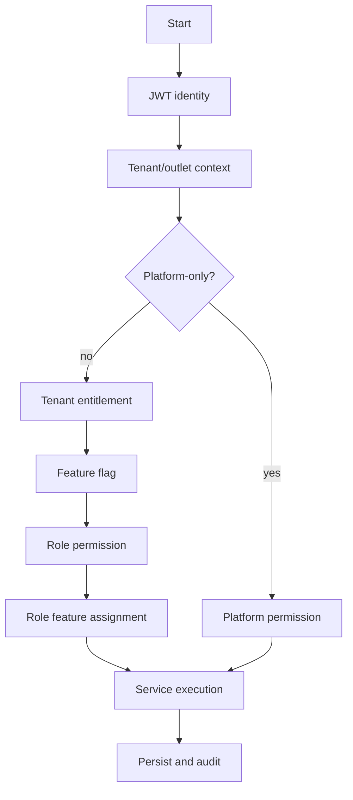
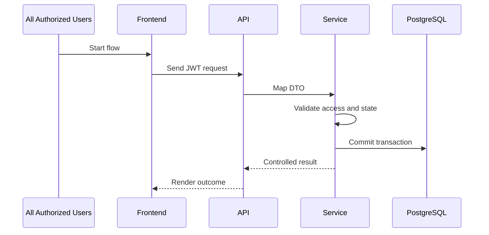

# Tenant Feature Configuration Flow
> Configure tenant-enabled features using tenant, outlet, or user scoped runtime flags.

## 1. Flow Classification
| Item | Value |
|---|---|
| Primary actor | All Authorized Users |
| Responsibility | Role depends on user flow |
| UI layout | Configured Layout |
| Access model | Tenant-configurable feature access through entitlement, flag, role, permission, and user/outlet assignment. |
| Backend pattern | Clean Architecture + Service Pattern + Repository Pattern; no CQRS or MediatR |
| Frontend stack | React + TypeScript, TanStack Query, Zustand, Tailwind CSS |

## 2. Related Documentation
- [[../01-product/project-scope]]
- [[../02-architecture/system-overview]]
- [[../03-data/database-overview]]
- [[../04-api/auth-and-authorization]]
- [[../05-backend/backend-architecture]]
- [[../06-frontend/layout-architecture]]

## 3. Business Purpose
- Supports this approved Unified Commerce operation: Configure tenant-enabled features using tenant, outlet, or user scoped runtime flags.
- Preserves tenant isolation for every tenant-owned record.
- Prevents hardcoded behavior such as fixed cashier/manager powers.
- Treats backend services as authority for permission, state, stock, tax, payment, sync, and audit.

## 4. Actors and Context
| Actor | Access source | Notes |
|---|---|---|
| All Authorized Users | JWT claims, tenant/outlet context, assigned roles | Main performer. |
| Approver | Configured role permission | Used when tenant policy requires approval. |
| System | Application service | Validates workflow and persists result. |
| Device/session | POS device, browser, or customer session | Required for terminal, offline, or storefront context. |

## 5. Required Permission Model
| Layer | Required check | Source |
|---|---|---|
| Tenant entitlement | Feature enabled unless platform-only | `tenant_feature_entitlements` |
| Runtime flag | Tenant/outlet/user flag allows feature | `feature_flags` |
| Role permission | User role includes permission | `role_permissions`, `permissions` |
| Feature assignment | Role allowed for enabled feature | `role_feature_assignments` |
| Outlet/user role | User assigned to correct scope | `tenant_user_roles`, `outlet_user_roles` |

## 6. Permission Flow


## 7. Database and Data Ownership
| Data object | Role in this flow | Ownership rule |
|---|---|---|
| `feature_flags` | Supports tenant feature configuration flow | Tenant-scoped or tenant-linked; enforce tenant consistency. |
| `tenant_feature_entitlements` | Supports tenant feature configuration flow | Tenant-scoped or tenant-linked; enforce tenant consistency. |
| `tenant_settings` | Supports tenant feature configuration flow | Tenant-scoped or tenant-linked; enforce tenant consistency. |

## 8. API Surface
| API | Purpose | Guard |
|---|---|---|
| `PUT /api/tenant/features/{featureKey}/flags` | Supports this flow | JWT + tenant context + `feature.configure` |
| `GET /api/tenant/features/effective` | Supports this flow | JWT + tenant context + `feature.configure` |

## 9. Main Workflow


## 10. Step-by-Step User Journey
1. Open the correct role/channel layout.
2. Load effective tenant features and user permissions.
3. Hide unavailable actions without treating UI hiding as security.
4. Enter or select required business data.
5. Validate basic UX rules and prepare request DTO.
6. Submit JWT-authenticated request with tenant/outlet context.
7. Validate entitlement, feature flag, permission, and assignment.
8. Validate state, references, idempotency, and tenant ownership.
9. Persist approved records in a transaction where required.
10. Record audit, history, ledger, or sync diagnostics where required.
11. Return success, validation, conflict, or authorization response.
12. Invalidate TanStack Query keys and clear temporary Zustand state.

## 11. Validation Rules
| Rule | Behavior | Failure |
|---|---|---|
| Missing tenant context | Reject before service execution | `400 TENANT_CONTEXT_REQUIRED` |
| Feature disabled | Reject tenant-level feature use | `403 FEATURE_NOT_ENABLED` |
| Permission missing | Reject direct API call | `403 PERMISSION_DENIED` |
| Wrong outlet | Reject unless policy allows cross-outlet action | `403 OUTLET_ACCESS_DENIED` |
| Invalid transition | Reject invalid state movement | `409 INVALID_STATUS_TRANSITION` |
| Duplicate request | Use idempotency or unique keys | `409 DUPLICATE_REQUEST` |

## 12. Frontend Responsibilities
- Use `Configured Layout` as the primary layout boundary.
- Use frontend feature areas: `shared modules`.
- Use TanStack Query for server state and mutation invalidation.
- Use Zustand for local workflow state only.
- Use IndexedDB only for approved offline POS cache and queues.
- Never store secrets, trusted permissions, or unrestricted tenant data in browser storage.

## 13. Backend Responsibilities
- Controller accepts request DTOs and returns response DTOs.
- DTOs live in a `Dtos/` folder with one DTO per `.cs` file.
- Application service owns orchestration and business validation.
- Repository handles data access only.
- Unit of Work controls multi-table transaction consistency.
- Backend validates sensitive totals, tax, stock, payment allocation, permissions, and tenant ownership.

## 14. API Example
```http
PUT /api/tenant/features/{featureKey}/flags
Authorization: Bearer <jwt>
X-Tenant-Id: <tenant-id>
X-Outlet-Id: <outlet-id-if-applicable>
Idempotency-Key: <uuid-where-required>
Content-Type: application/json

{ "permission": "feature.configure", "payload": { "example": "flow-specific data" } }
```

## 15. Failure and Exception Paths
| Scenario | Expected handling |
|---|---|
| Permission changes after screen load | Backend rejects; frontend refreshes effective permissions. |
| Cross-tenant reference | Backend rejects with tenant mismatch. |
| Approval required | Flow routes approval instead of completing action. |
| Offline POS conflict | Server creates conflict record for manager resolution. |
| Peripheral failure | Business transaction remains valid; log records failure. |

## 16. Caching and Offline Placement
| Layer | Use | Rule |
|---|---|---|
| PostgreSQL | Indexes/read models for approved read optimization | No Redis now; no generic cache tables. |
| TanStack Query | Cache server responses and permissions | Invalidate after mutation. |
| Zustand | Temporary UI workflow state | Not source of truth. |
| IndexedDB | Offline POS cache/queue only | Sync through approved offline APIs. |

## 17. Audit, Reporting, and Data Flow
- Sensitive actions write to `audit_logs` with actor, tenant, entity, action, and timestamp.
- Stock, payment, receipt, order, sync, and approval flows use dedicated ledger/history tables where available.
- Reports read transaction data or approved summary read models, not UI state.
- Platform actions may have nullable tenant context only when truly platform-level.

## 18. Implementation Notes
- Do not invent modules, tables, statuses, or permission codes.
- Do not hardcode role names as authorization logic.
- Do not trust client-calculated totals, stock, tax, discounts, or permissions.
- Use deterministic status transitions and idempotency for duplicate-prone actions.
- Use transaction guards for document numbers, coupon usage, stock posting, and payment allocation.

## 19. Acceptance Conditions
- The flow does not expose another tenant’s data.
- Tenant configuration can change access without code changes.
- Backend blocks unauthorized direct API calls.
- UI reflects effective rights but is not the security boundary.
- Audit/history records exist for sensitive or irreversible operations.
- Database writes respect foreign-key ownership and tenant consistency.

## 20. Final Rule
The `Tenant Feature Configuration Flow` must remain tenant-aware, permission-controlled, architecture-aligned, and consistent with the approved scope, database design, frontend architecture, backend architecture, and configurable RBAC model.
