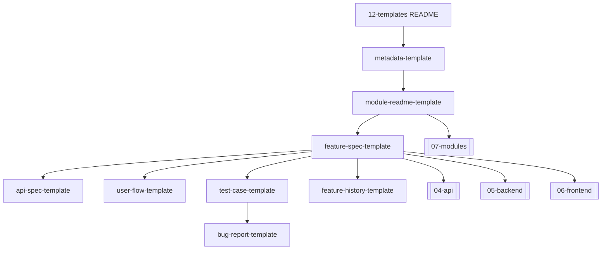

# 12 Templates README

## Purpose

This folder contains reusable documentation templates for the Unified Commerce 2nd Brain.
Templates must be used to create consistent implementation documents for the enterprise SaaS platform.
They are not generic software templates.
They are aligned to the approved scope, production database design, frontend architecture, and backend architecture.
The platform is multi-tenant, and tenant-level features must be configurable by business requirement, role, user right, permission, feature assignment, and runtime setting.
Platform-admin-only features may remain platform controlled, but tenant operational features must not use fixed access behavior.

## Template Set

| Template | Use When | Primary Owner |
| --- | --- | --- |
| [[module-readme-template]] | Creating a module overview document | Solution architect / module lead |
| [[feature-spec-template]] | Defining a buildable feature | System analyst / backend + frontend leads |
| [[api-spec-template]] | Defining API contracts | Backend/API lead |
| [[user-flow-template]] | Documenting actor workflow and screens | Product analyst / UI architect |
| [[test-case-template]] | Writing functional and technical tests | QA / developer |
| [[bug-report-template]] | Capturing reproducible defects | QA / developer / support |
| [[feature-history-template]] | Recording feature decisions and changes | Technical documentation owner |
| [[metadata-template]] | Adding consistent YAML frontmatter | Documentation owner |

## Required Documentation Principle

| Principle | Required Behavior |
| --- | --- |
| Tenant isolation | Every tenant-owned document must mention tenant boundaries. |
| Configurable access | Features must support tenant-specific roles, permissions, and user rights. |
| Backend authority | Backend validates tenant, RBAC, feature entitlement, runtime flag, and business state. |
| Architecture alignment | Backend uses Clean Architecture with service and repository patterns only. |
| Frontend alignment | Frontend uses React, TypeScript, TanStack Query, Zustand, Tailwind CSS, and IndexedDB for offline POS. |
| Database alignment | Table names and relationships must match the approved production schema. |

## Reading Flow

## When Creating New Documentation

1. Start with `metadata-template.md`.
2. Select the closest content template.
3. Replace placeholders with system-specific details.
4. Map the feature to database tables and API routes.
5. Define tenant-configurable access behavior.
6. Add links to module, API, backend, frontend, and user-flow documents.
7. Remove irrelevant sections rather than filling with vague content.
8. Verify no hardcoded tenant role behavior was introduced.

## Naming Rules

- Module docs should use lowercase kebab-case names.
- Feature specs should use the module prefix where useful.
- API docs should match the route group or capability name.
- User-flow docs should include actor and workflow name.
- Historical records should include the decision or change subject.

## Related Folders

- [[01-product]] for product and scope authority.
- [[02-architecture]] for architecture decisions.
- [[03-data]] for entity and data rules.
- [[04-api]] for API contracts.
- [[05-backend]] for backend implementation rules.
- [[06-frontend]] for frontend implementation rules.
- [[07-modules]] for module-level documentation.
- [[08-user-flows]] for actor workflows.
- [[09-security-and-compliance]] for access and audit rules.
- [[10-testing-quality]] for test strategy.
- [[14-ai-ide-rules]] for Cursor and AI implementation controls.

## Template Quality Controls
- Confirm the document uses tenant context instead of global assumptions.
- Confirm every non-platform capability has configurable permission behavior.
- Confirm platform-admin-only actions are separated from tenant-admin actions.
- Confirm backend authority is stated wherever business state changes occur.
- Confirm database table names match the approved production schema.
- Confirm API examples include tenant, outlet, device, or session context where relevant.
- Confirm frontend notes align with React, TypeScript, TanStack Query, Zustand, and Tailwind CSS.
- Confirm offline POS behavior references IndexedDB through `core/offline` when applicable.
- Confirm service/repository pattern is used; do not introduce CQRS or MediatR.
- Confirm DTOs are placed in `Dtos/` with one DTO per `.cs` file.
- Confirm audit requirements exist for sensitive actions such as refunds, voids, reprints, adjustments, and permission changes.
- Confirm user-right examples do not hardcode cashier, manager, or admin behavior.
- Confirm feature checks include entitlement, role feature assignment, permission, and runtime flag where applicable.
- Confirm Mermaid diagrams are simple enough for GitHub and Obsidian rendering.
- Confirm related links point to the correct 2nd Brain folder.
- Confirm examples are implementation-oriented and not marketing descriptions.
- Confirm validation rules identify blocking conditions and expected error behavior.
- Confirm status transitions are controlled and not free-text developer choices.
- Confirm tenant-owned data is never shared across tenants.
- Confirm reporting references transaction data or read models, not manual totals.
- Confirm the document uses tenant context instead of global assumptions.
- Confirm every non-platform capability has configurable permission behavior.
- Confirm platform-admin-only actions are separated from tenant-admin actions.
- Confirm backend authority is stated wherever business state changes occur.
- Confirm database table names match the approved production schema.
- Confirm API examples include tenant, outlet, device, or session context where relevant.
- Confirm frontend notes align with React, TypeScript, TanStack Query, Zustand, and Tailwind CSS.
- Confirm offline POS behavior references IndexedDB through `core/offline` when applicable.
- Confirm service/repository pattern is used; do not introduce CQRS or MediatR.
- Confirm DTOs are placed in `Dtos/` with one DTO per `.cs` file.
- Confirm audit requirements exist for sensitive actions such as refunds, voids, reprints, adjustments, and permission changes.
- Confirm user-right examples do not hardcode cashier, manager, or admin behavior.
- Confirm feature checks include entitlement, role feature assignment, permission, and runtime flag where applicable.
- Confirm Mermaid diagrams are simple enough for GitHub and Obsidian rendering.
- Confirm related links point to the correct 2nd Brain folder.
- Confirm examples are implementation-oriented and not marketing descriptions.
- Confirm validation rules identify blocking conditions and expected error behavior.
- Confirm status transitions are controlled and not free-text developer choices.
- Confirm tenant-owned data is never shared across tenants.
- Confirm reporting references transaction data or read models, not manual totals.
- Confirm the document uses tenant context instead of global assumptions.
- Confirm every non-platform capability has configurable permission behavior.
- Confirm platform-admin-only actions are separated from tenant-admin actions.
- Confirm backend authority is stated wherever business state changes occur.
- Confirm database table names match the approved production schema.
- Confirm API examples include tenant, outlet, device, or session context where relevant.
- Confirm frontend notes align with React, TypeScript, TanStack Query, Zustand, and Tailwind CSS.
- Confirm offline POS behavior references IndexedDB through `core/offline` when applicable.
- Confirm service/repository pattern is used; do not introduce CQRS or MediatR.
- Confirm DTOs are placed in `Dtos/` with one DTO per `.cs` file.
- Confirm audit requirements exist for sensitive actions such as refunds, voids, reprints, adjustments, and permission changes.
- Confirm user-right examples do not hardcode cashier, manager, or admin behavior.
- Confirm feature checks include entitlement, role feature assignment, permission, and runtime flag where applicable.
- Confirm Mermaid diagrams are simple enough for GitHub and Obsidian rendering.
- Confirm related links point to the correct 2nd Brain folder.
- Confirm examples are implementation-oriented and not marketing descriptions.
- Confirm validation rules identify blocking conditions and expected error behavior.
- Confirm status transitions are controlled and not free-text developer choices.
- Confirm tenant-owned data is never shared across tenants.
- Confirm reporting references transaction data or read models, not manual totals.
- Confirm the document uses tenant context instead of global assumptions.
- Confirm every non-platform capability has configurable permission behavior.
