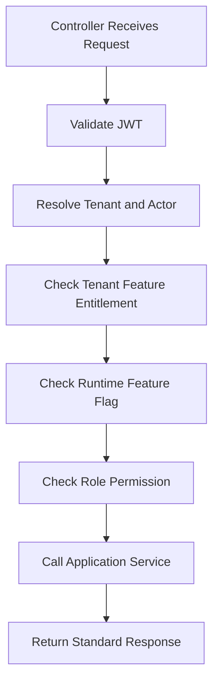

# API Spec Template

## Purpose

Use this template to document one API group or endpoint set.
API documentation must match backend Clean Architecture service orchestration and database ownership.
Do not define API behavior that bypasses tenant isolation, feature entitlement, role permissions, or runtime flags.

## API Identity

| Field | Value |
| --- | --- |
| API group | `/api/v1/<module>` |
| Module | `[[07-modules/<module>]]` |
| Feature spec | `[[feature-spec-template]]` |
| Auth required | `JWT bearer` |
| Tenant context | `required except platform-admin endpoints` |
| Idempotency | `required for duplicate-sensitive writes` |

## Authentication and Context Headers

| Header | Required | Purpose |
| --- | --- | --- |
| `Authorization: Bearer <jwt>` | Yes | Identifies platform user, tenant staff, or customer. |
| `X-Tenant-Id` | Tenant APIs | Scopes tenant-owned records. |
| `X-Outlet-Id` | Outlet workflows | Scopes POS, stock, till, and outlet operations. |
| `X-Device-Id` | POS/offline | Identifies POS terminal or browser device. |
| `Idempotency-Key` | Sensitive writes | Prevents duplicate sales, orders, payments, and sync items. |

## Endpoint Summary

| Method | Route | Permission | Notes |
| --- | --- | --- | --- |
| GET | `/api/v1/<module>` | `<module>.read` | Tenant-scoped list. |
| GET | `/api/v1/<module>/{id}` | `<module>.read` | Must verify record tenant ownership. |
| POST | `/api/v1/<module>` | `<module>.create` | Must check feature and permission. |
| PUT | `/api/v1/<module>/{id}` | `<module>.update` | Must validate immutable fields. |
| PATCH | `/api/v1/<module>/{id}/status` | `<module>.status.update` | Must validate transition. |

## Request Example

```http
POST /api/v1/products
Authorization: Bearer <jwt>
X-Tenant-Id: 8e0f9c6a-tenant
Content-Type: application/json
Idempotency-Key: product-create-tenant-local-key

{
  "name": "Classic Shirt",
  "productType": "variant_parent",
  "categoryId": "<category-id>",
  "returnPolicyId": "<return-policy-id>",
  "isSellablePos": true,
  "isSellableOnline": true
}
```

## Response Example

```json
{
  "success": true,
  "data": {
    "id": "<resource-id>",
    "tenantId": "<tenant-id>",
    "status": "active"
  },
  "errors": [],
  "traceId": "<trace-id>"
}
```

## Error Contract

| HTTP | Code | Meaning |
| --- | --- | --- |
| 400 | `VALIDATION_FAILED` | Request shape or business validation failed. |
| 401 | `AUTH_REQUIRED` | Missing or invalid JWT. |
| 403 | `PERMISSION_DENIED` | User lacks tenant feature, role, or permission. |
| 404 | `RESOURCE_NOT_FOUND` | Record missing or outside tenant scope. |
| 409 | `CONFLICT` | Duplicate key, invalid state, or idempotency conflict. |
| 422 | `BUSINESS_RULE_FAILED` | Valid JSON but business rule prevents action. |

## Authorization Flow



## Backend Implementation Notes

- Controller maps request to DTO and delegates to service.
- Service validates business rules and calls repositories.
- Repository performs data access only.
- Do not place authorization rules in repository.
- Do not introduce CQRS handlers or MediatR pipelines.
- DTO classes belong in `Dtos/`, one DTO per `.cs` file.


## Template Quality Controls
- Confirm the document uses tenant context instead of global assumptions.
- Confirm every non-platform capability has configurable permission behavior.
- Confirm platform-admin-only actions are separated from tenant-admin actions.
- Confirm backend authority is stated wherever business state changes occur.
- Confirm database table names match the approved production schema.
- Confirm API examples include tenant, outlet, device, or session context where relevant.
- Confirm frontend notes align with React, TypeScript, TanStack Query, Zustand, and Tailwind CSS.
- Confirm offline POS behavior references IndexedDB through `core/offline` when applicable.
- Confirm service/repository pattern is used; do not introduce CQRS or MediatR.
- Confirm DTOs are placed in `Dtos/` with one DTO per `.cs` file.
- Confirm audit requirements exist for sensitive actions such as refunds, voids, reprints, adjustments, and permission changes.
- Confirm user-right examples do not hardcode cashier, manager, or admin behavior.
- Confirm feature checks include entitlement, role feature assignment, permission, and runtime flag where applicable.
- Confirm Mermaid diagrams are simple enough for GitHub and Obsidian rendering.
- Confirm related links point to the correct 2nd Brain folder.
- Confirm examples are implementation-oriented and not marketing descriptions.
- Confirm validation rules identify blocking conditions and expected error behavior.
- Confirm status transitions are controlled and not free-text developer choices.
- Confirm tenant-owned data is never shared across tenants.
- Confirm reporting references transaction data or read models, not manual totals.
