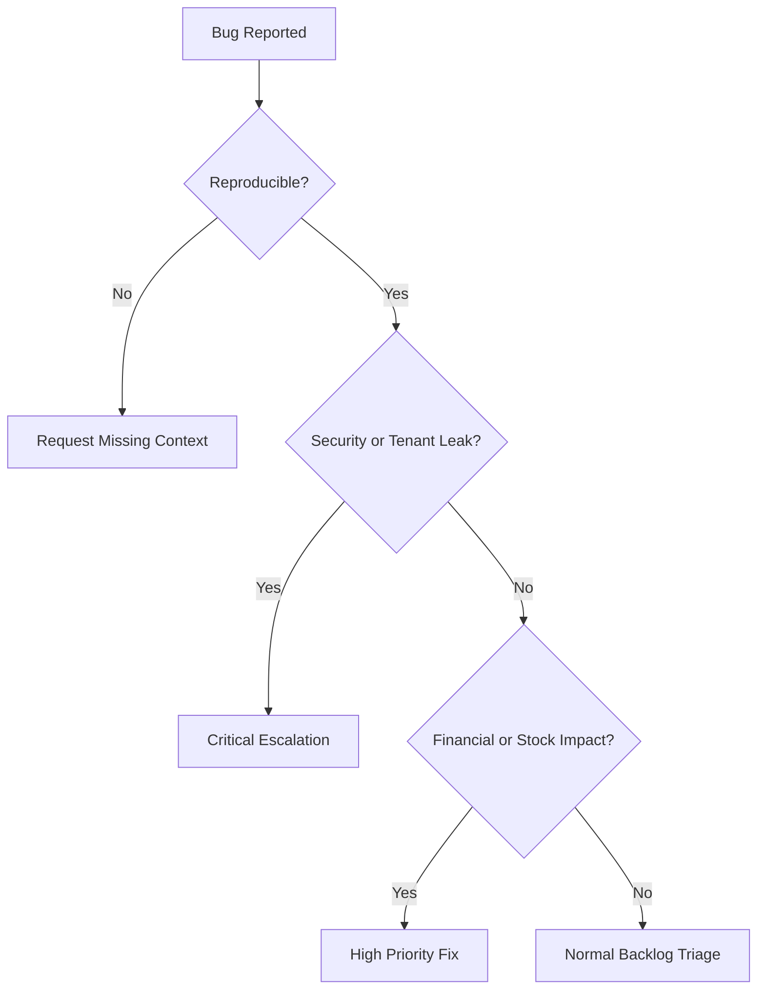

# Bug Report Template

## Purpose

Use this template to report reproducible defects in the Unified Commerce system.
A useful bug report must identify tenant context, actor rights, feature flags, role permissions, device/session context, and affected business data.
Do not report tenant-level access bugs without role, permission, feature entitlement, and runtime flag details.

## Bug Metadata

| Field | Value |
| --- | --- |
| Bug title | `<short defect title>` |
| Module | `[[07-modules/<module>]]` |
| Feature | `<feature name>` |
| Environment | `local | dev | staging | production` |
| Severity | `critical | high | medium | low` |
| Actor type | `platform-admin | tenant-user | outlet-user | customer` |
| Layout | `Super Admin | Tenant | POS Terminal | Auth` |

## Tenant and Access Context

| Item | Value |
| --- | --- |
| Tenant ID/code | `<tenant>` |
| Outlet ID/code | `<outlet or none>` |
| User role(s) | `<role codes>` |
| Permission codes | `<permissions assigned>` |
| Feature entitlement | `enabled | disabled` |
| Runtime flag scope | `tenant | outlet | user | none` |
| Device/till/session | `<POS context if applicable>` |

## Reproduction Steps

1. `<step 1>`
2. `<step 2>`
3. `<step 3>`
4. `<step 4>`

## Expected Result

`<Describe the correct behavior based on scope, data design, and architecture.>`

## Actual Result

`<Describe what happened.>`

## API Evidence

```http
POST /api/v1/<module>/<action>
Authorization: Bearer <jwt>
X-Tenant-Id: <tenant-id>

HTTP/1.1 500 Internal Server Error
{
  "success": false,
  "errors": [
    { "code": "<error-code>", "message": "<message>" }
  ]
}
```

## Database Evidence

```sql
-- Use read-only verification queries.
select id, tenant_id, status, created_at
from <table_name>
where tenant_id = '<tenant-id>'
order by created_at desc;
```

## Impact Classification

| Impact | Examples |
| --- | --- |
| Tenant isolation | Tenant A can see or modify Tenant B data. |
| Financial | Wrong sale, payment, refund, tax, or cash total. |
| Inventory | Wrong stock balance, reservation, or movement ledger. |
| Access control | User can perform action without configured right. |
| Offline sync | Duplicate sale, payment, receipt, or conflict not created. |
| Reporting | Summary differs from source transactions. |

## Triage Flow



## Developer Notes

- Do not fix by hardcoding role names.
- Verify tenant feature entitlement and role permission setup first.
- Check whether frontend visibility and backend authorization disagree.
- Check service transaction boundaries before changing repository code.
- For POS bugs, capture device, till, session, offline status, and sync batch when relevant.


## Template Quality Controls
- Confirm the document uses tenant context instead of global assumptions.
- Confirm every non-platform capability has configurable permission behavior.
- Confirm platform-admin-only actions are separated from tenant-admin actions.
- Confirm backend authority is stated wherever business state changes occur.
- Confirm database table names match the approved production schema.
- Confirm API examples include tenant, outlet, device, or session context where relevant.
- Confirm frontend notes align with React, TypeScript, TanStack Query, Zustand, and Tailwind CSS.
- Confirm offline POS behavior references IndexedDB through `core/offline` when applicable.
- Confirm service/repository pattern is used; do not introduce CQRS or MediatR.
- Confirm DTOs are placed in `Dtos/` with one DTO per `.cs` file.
- Confirm audit requirements exist for sensitive actions such as refunds, voids, reprints, adjustments, and permission changes.
- Confirm user-right examples do not hardcode cashier, manager, or admin behavior.
- Confirm feature checks include entitlement, role feature assignment, permission, and runtime flag where applicable.
- Confirm Mermaid diagrams are simple enough for GitHub and Obsidian rendering.
- Confirm related links point to the correct 2nd Brain folder.
- Confirm examples are implementation-oriented and not marketing descriptions.
- Confirm validation rules identify blocking conditions and expected error behavior.
- Confirm status transitions are controlled and not free-text developer choices.
- Confirm tenant-owned data is never shared across tenants.
- Confirm reporting references transaction data or read models, not manual totals.
- Confirm the document uses tenant context instead of global assumptions.
- Confirm every non-platform capability has configurable permission behavior.
- Confirm platform-admin-only actions are separated from tenant-admin actions.
- Confirm backend authority is stated wherever business state changes occur.
- Confirm database table names match the approved production schema.
- Confirm API examples include tenant, outlet, device, or session context where relevant.
- Confirm frontend notes align with React, TypeScript, TanStack Query, Zustand, and Tailwind CSS.
- Confirm offline POS behavior references IndexedDB through `core/offline` when applicable.
- Confirm service/repository pattern is used; do not introduce CQRS or MediatR.
- Confirm DTOs are placed in `Dtos/` with one DTO per `.cs` file.
- Confirm audit requirements exist for sensitive actions such as refunds, voids, reprints, adjustments, and permission changes.
- Confirm user-right examples do not hardcode cashier, manager, or admin behavior.
- Confirm feature checks include entitlement, role feature assignment, permission, and runtime flag where applicable.
- Confirm Mermaid diagrams are simple enough for GitHub and Obsidian rendering.
- Confirm related links point to the correct 2nd Brain folder.
- Confirm examples are implementation-oriented and not marketing descriptions.
- Confirm validation rules identify blocking conditions and expected error behavior.
- Confirm status transitions are controlled and not free-text developer choices.
- Confirm tenant-owned data is never shared across tenants.
- Confirm reporting references transaction data or read models, not manual totals.
- Confirm the document uses tenant context instead of global assumptions.
- Confirm every non-platform capability has configurable permission behavior.
- Confirm platform-admin-only actions are separated from tenant-admin actions.
