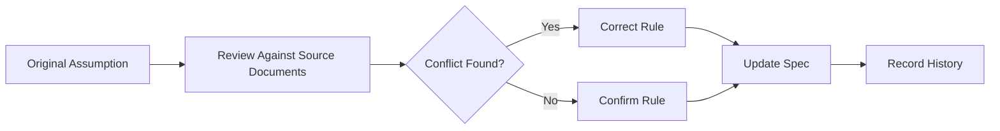

# Feature History Template

## Purpose

Use this template to record important decisions, changes, corrections, and implementation history for one feature or module.
Feature history prevents future developers or AI tools from reintroducing rejected patterns or outdated rules.
This document must not replace the current feature spec; it explains how the feature evolved.

## History Identity

| Field | Value |
| --- | --- |
| Feature/module | `<name>` |
| Current spec | `[[feature-spec-template]]` |
| Related module | `[[07-modules/<module>]]` |
| Related data doc | `[[03-data/<doc>]]` |
| Related API doc | `[[04-api/<doc>]]` |
| Current status | `planned | active | changed | deprecated` |

## Decision Log

| Date | Decision | Reason | Impact |
| --- | --- | --- | --- |
| YYYY-MM-DD | `<decision>` | `<why>` | `<affected files/modules>` |
| YYYY-MM-DD | `<changed rule>` | `<business or technical reason>` | `<implementation impact>` |

## Example Entry

| Date | Decision | Reason | Impact |
| --- | --- | --- | --- |
| 2026-05-10 | Use service/repository pattern only | Backend architecture does not use CQRS or MediatR | Application services own orchestration. |
| 2026-05-10 | Tenant roles are configurable | Business requires tenant-specific user rights | Do not hardcode cashier or manager rights. |

## Current Rule Snapshot

Summarize the latest accepted rule in direct terms.

- Current behavior: `<accepted behavior>`.
- Rejected behavior: `<rejected behavior>`.
- Reason: `<business/architecture reason>`.
- Source authority: `<scope/database/architecture document>`.

## Architecture Change Diagram

## Change Categories

| Category | Examples |
| --- | --- |
| Business rule | Return window, discount approval, feature access behavior. |
| Database alignment | Table, FK, uniqueness, tenant ownership correction. |
| API contract | Route, request, response, error format, idempotency. |
| Backend architecture | Service, repository, DTO, transaction boundary. |
| Frontend architecture | Layout, state, route guard, offline storage behavior. |
| Security | JWT, RBAC, feature entitlement, audit requirement. |

## Migration or Refactor Notes

- State whether existing code or docs must be updated.
- List affected backend modules and DTO files.
- List affected frontend pages, features, stores, and shells.
- List database migration impact if any.
- List testing impact and regression areas.

## Links

- Current feature spec: `[[<feature-spec>]]`.
- Module README: `[[<module-readme>]]`.
- API spec: `[[<api-spec>]]`.
- User flow: `[[<user-flow>]]`.
- Test cases: `[[<test-case>]]`.

## Template Quality Controls
- Confirm the document uses tenant context instead of global assumptions.
- Confirm every non-platform capability has configurable permission behavior.
- Confirm platform-admin-only actions are separated from tenant-admin actions.
- Confirm backend authority is stated wherever business state changes occur.
- Confirm database table names match the approved production schema.
- Confirm API examples include tenant, outlet, device, or session context where relevant.
- Confirm frontend notes align with React, TypeScript, TanStack Query, Zustand, and Tailwind CSS.
- Confirm offline POS behavior references IndexedDB through `core/offline` when applicable.
- Confirm service/repository pattern is used; do not introduce CQRS or MediatR.
- Confirm DTOs are placed in `Dtos/` with one DTO per `.cs` file.
- Confirm audit requirements exist for sensitive actions such as refunds, voids, reprints, adjustments, and permission changes.
- Confirm user-right examples do not hardcode cashier, manager, or admin behavior.
- Confirm feature checks include entitlement, role feature assignment, permission, and runtime flag where applicable.
- Confirm Mermaid diagrams are simple enough for GitHub and Obsidian rendering.
- Confirm related links point to the correct 2nd Brain folder.
- Confirm examples are implementation-oriented and not marketing descriptions.
- Confirm validation rules identify blocking conditions and expected error behavior.
- Confirm status transitions are controlled and not free-text developer choices.
- Confirm tenant-owned data is never shared across tenants.
- Confirm reporting references transaction data or read models, not manual totals.
- Confirm the document uses tenant context instead of global assumptions.
- Confirm every non-platform capability has configurable permission behavior.
- Confirm platform-admin-only actions are separated from tenant-admin actions.
- Confirm backend authority is stated wherever business state changes occur.
- Confirm database table names match the approved production schema.
- Confirm API examples include tenant, outlet, device, or session context where relevant.
- Confirm frontend notes align with React, TypeScript, TanStack Query, Zustand, and Tailwind CSS.
- Confirm offline POS behavior references IndexedDB through `core/offline` when applicable.
- Confirm service/repository pattern is used; do not introduce CQRS or MediatR.
- Confirm DTOs are placed in `Dtos/` with one DTO per `.cs` file.
- Confirm audit requirements exist for sensitive actions such as refunds, voids, reprints, adjustments, and permission changes.
- Confirm user-right examples do not hardcode cashier, manager, or admin behavior.
- Confirm feature checks include entitlement, role feature assignment, permission, and runtime flag where applicable.
- Confirm Mermaid diagrams are simple enough for GitHub and Obsidian rendering.
- Confirm related links point to the correct 2nd Brain folder.
- Confirm examples are implementation-oriented and not marketing descriptions.
- Confirm validation rules identify blocking conditions and expected error behavior.
- Confirm status transitions are controlled and not free-text developer choices.
- Confirm tenant-owned data is never shared across tenants.
- Confirm reporting references transaction data or read models, not manual totals.
- Confirm the document uses tenant context instead of global assumptions.
- Confirm every non-platform capability has configurable permission behavior.
- Confirm platform-admin-only actions are separated from tenant-admin actions.
- Confirm backend authority is stated wherever business state changes occur.
- Confirm database table names match the approved production schema.
- Confirm API examples include tenant, outlet, device, or session context where relevant.
- Confirm frontend notes align with React, TypeScript, TanStack Query, Zustand, and Tailwind CSS.
- Confirm offline POS behavior references IndexedDB through `core/offline` when applicable.
- Confirm service/repository pattern is used; do not introduce CQRS or MediatR.
- Confirm DTOs are placed in `Dtos/` with one DTO per `.cs` file.
- Confirm audit requirements exist for sensitive actions such as refunds, voids, reprints, adjustments, and permission changes.
- Confirm user-right examples do not hardcode cashier, manager, or admin behavior.
- Confirm feature checks include entitlement, role feature assignment, permission, and runtime flag where applicable.
- Confirm Mermaid diagrams are simple enough for GitHub and Obsidian rendering.
- Confirm related links point to the correct 2nd Brain folder.
- Confirm examples are implementation-oriented and not marketing descriptions.
- Confirm validation rules identify blocking conditions and expected error behavior.
- Confirm status transitions are controlled and not free-text developer choices.
- Confirm tenant-owned data is never shared across tenants.
- Confirm reporting references transaction data or read models, not manual totals.
- Confirm the document uses tenant context instead of global assumptions.
