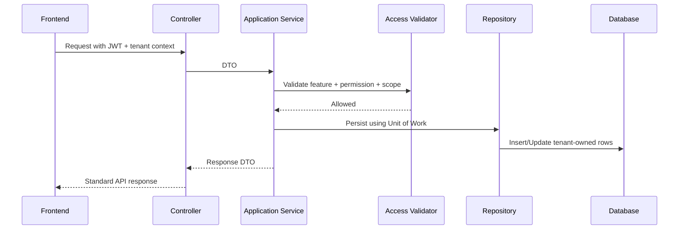

# Feature Spec Template

## Purpose

Use this template when a feature is ready to be analyzed for implementation.
The feature spec must connect business need, tenant-specific configuration, database tables, API contracts, backend service responsibilities, frontend behavior, validations, and test expectations.

## Feature Identity

| Field | Value |
| --- | --- |
| Feature name | `<feature-name>` |
| Module | `[[07-modules/<module>]]` |
| Actors | `<actor list>` |
| Channel | `pos | ecommerce | admin | platform | offline | mixed` |
| Tenant configurable | `yes | no-platform-only` |
| Permission code examples | `<module.action.scope>` |
| Related user flow | `[[08-user-flows/<flow>]]` |

## Business Goal

Describe the concrete business outcome.
Avoid generic wording such as "manage records".
Example: `Allow a tenant admin to configure outlet-level cashier roles without changing platform code.`

## Functional Scope

| Capability | Included? | Notes |
| --- | --- | --- |
| Create | Yes/No | Mention permission and validation. |
| Update | Yes/No | Mention immutable fields. |
| Delete/Archive | Yes/No | Prefer status change for transactional data. |
| Search/List | Yes/No | Mention tenant and outlet filters. |
| Approve/Override | Yes/No | Mention manager permission and audit. |
| Offline support | Yes/No | Mention IndexedDB and sync if relevant. |

## Tenant-Specific Behavior

| Control | Required Rule |
| --- | --- |
| Tenant entitlement | Feature must be enabled for the tenant unless platform-core. |
| Runtime flag | Feature may be restricted by tenant/outlet/user scope. |
| Role feature assignment | Role must be allowed to access the feature. |
| Permission | User role must include required permission. |
| User assignment | User must be assigned tenant or outlet role as required. |
| Backend validation | Service must enforce every control before state change. |

## Data Mapping

| Table | Operation | Notes |
| --- | --- | --- |
| `<table>` | insert/update/read | Must carry tenant context. |
| `audit_logs` | insert | Required for sensitive actions. |
| `tenant_feature_entitlements` | read | Used for feature availability. |
| `role_permissions` | read | Used for authorization. |

## API Example

```http
POST /api/v1/<module>/<feature>
Authorization: Bearer <jwt>
X-Tenant-Id: <tenant-id>
X-Outlet-Id: <outlet-id-if-required>
Content-Type: application/json

{
  "name": "Example",
  "status": "active"
}
```

## Backend Service Flow



## Validation Rules

- Required fields: `<list>`.
- Tenant-owned references must belong to the same tenant.
- Outlet-owned references must belong to the same tenant and allowed outlet.
- Status transitions must be explicitly allowed.
- Duplicate protection must use database constraints and service validation.
- Idempotency is required for payment, order, sale, and offline sync workflows.

## Frontend Rules

- Use TanStack Query for server data.
- Use Zustand only for local UI/session/interaction state.
- Use Tailwind CSS for layout and responsive behavior.
- Hide unavailable actions using permission context, but expect backend denial.
- POS offline features must store queued data through `core/offline` and IndexedDB.


## Template Quality Controls
- Confirm the document uses tenant context instead of global assumptions.
- Confirm every non-platform capability has configurable permission behavior.
- Confirm platform-admin-only actions are separated from tenant-admin actions.
- Confirm backend authority is stated wherever business state changes occur.
- Confirm database table names match the approved production schema.
- Confirm API examples include tenant, outlet, device, or session context where relevant.
- Confirm frontend notes align with React, TypeScript, TanStack Query, Zustand, and Tailwind CSS.
- Confirm offline POS behavior references IndexedDB through `core/offline` when applicable.
- Confirm service/repository pattern is used; do not introduce CQRS or MediatR.
- Confirm DTOs are placed in `Dtos/` with one DTO per `.cs` file.
- Confirm audit requirements exist for sensitive actions such as refunds, voids, reprints, adjustments, and permission changes.
- Confirm user-right examples do not hardcode cashier, manager, or admin behavior.
- Confirm feature checks include entitlement, role feature assignment, permission, and runtime flag where applicable.
- Confirm Mermaid diagrams are simple enough for GitHub and Obsidian rendering.
- Confirm related links point to the correct 2nd Brain folder.
- Confirm examples are implementation-oriented and not marketing descriptions.
- Confirm validation rules identify blocking conditions and expected error behavior.
- Confirm status transitions are controlled and not free-text developer choices.
- Confirm tenant-owned data is never shared across tenants.
- Confirm reporting references transaction data or read models, not manual totals.
- Confirm the document uses tenant context instead of global assumptions.
- Confirm every non-platform capability has configurable permission behavior.
- Confirm platform-admin-only actions are separated from tenant-admin actions.
- Confirm backend authority is stated wherever business state changes occur.
- Confirm database table names match the approved production schema.
- Confirm API examples include tenant, outlet, device, or session context where relevant.
- Confirm frontend notes align with React, TypeScript, TanStack Query, Zustand, and Tailwind CSS.
- Confirm offline POS behavior references IndexedDB through `core/offline` when applicable.
- Confirm service/repository pattern is used; do not introduce CQRS or MediatR.
- Confirm DTOs are placed in `Dtos/` with one DTO per `.cs` file.
- Confirm audit requirements exist for sensitive actions such as refunds, voids, reprints, adjustments, and permission changes.
- Confirm user-right examples do not hardcode cashier, manager, or admin behavior.
- Confirm feature checks include entitlement, role feature assignment, permission, and runtime flag where applicable.
- Confirm Mermaid diagrams are simple enough for GitHub and Obsidian rendering.
- Confirm related links point to the correct 2nd Brain folder.
- Confirm examples are implementation-oriented and not marketing descriptions.
- Confirm validation rules identify blocking conditions and expected error behavior.
- Confirm status transitions are controlled and not free-text developer choices.
- Confirm tenant-owned data is never shared across tenants.
- Confirm reporting references transaction data or read models, not manual totals.
- Confirm the document uses tenant context instead of global assumptions.
- Confirm every non-platform capability has configurable permission behavior.
- Confirm platform-admin-only actions are separated from tenant-admin actions.
- Confirm backend authority is stated wherever business state changes occur.
- Confirm database table names match the approved production schema.
- Confirm API examples include tenant, outlet, device, or session context where relevant.
- Confirm frontend notes align with React, TypeScript, TanStack Query, Zustand, and Tailwind CSS.
- Confirm offline POS behavior references IndexedDB through `core/offline` when applicable.
- Confirm service/repository pattern is used; do not introduce CQRS or MediatR.
- Confirm DTOs are placed in `Dtos/` with one DTO per `.cs` file.
- Confirm audit requirements exist for sensitive actions such as refunds, voids, reprints, adjustments, and permission changes.
- Confirm user-right examples do not hardcode cashier, manager, or admin behavior.
- Confirm feature checks include entitlement, role feature assignment, permission, and runtime flag where applicable.
- Confirm Mermaid diagrams are simple enough for GitHub and Obsidian rendering.
- Confirm related links point to the correct 2nd Brain folder.
