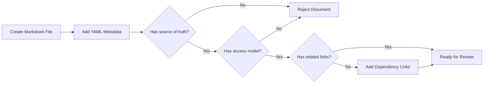

# Metadata Template

## Purpose

Use this template at the top of every 2nd Brain Markdown file.
Metadata makes documents searchable, reviewable, and traceable to project authority.
It also prevents undocumented assumptions from entering implementation.

## Example Minimal Header

Use this when the document is small but still part of the 2nd Brain.

```yaml
---
title: POS Till Session Notes
folder: 07-modules
document_type: module-note
system: Unified Commerce Platform
module: pos-till-session
access_model: tenant-configurable-rbac-feature-permissions
status: approved-draft
last_updated: 2026-05-10
---
```

## Field Rules

| Field | Rule | Example |
| --- | --- | --- |
| title | Human-readable document title | Catalog Feature Specification |
| folder | Current 2nd Brain folder | 07-modules |
| document_type | Purpose of the document | feature |
| module | Business or technical module | catalog |
| feature | Specific capability | product-create |
| access_model | Must state configurable access | tenant-configurable-rbac-feature-permissions |
| backend_pattern | Must not say CQRS or MediatR | clean-architecture-service-repository |
| status | Review state | approved-draft |

## Status Meaning

| Status | Meaning | Allowed Use |
| --- | --- | --- |
| draft | Not yet reviewed | Discussion only |
| approved-draft | Usable with caution | Planning and development prep |
| approved | Implementation authority | Development and review |
| deprecated | Superseded | Do not use for new work |

## Metadata Validation Workflow



## Required Related Links

Add links only where useful.
Do not add false links to appear complete.
For feature files, link to API, backend, frontend, data, and user-flow documents when available.
For template files, link to the template index and relevant dependent templates.


## Template Quality Controls
- Confirm the document uses tenant context instead of global assumptions.
- Confirm every non-platform capability has configurable permission behavior.
- Confirm platform-admin-only actions are separated from tenant-admin actions.
- Confirm backend authority is stated wherever business state changes occur.
- Confirm database table names match the approved production schema.
- Confirm API examples include tenant, outlet, device, or session context where relevant.
- Confirm frontend notes align with React, TypeScript, TanStack Query, Zustand, and Tailwind CSS.
- Confirm offline POS behavior references IndexedDB through `core/offline` when applicable.
- Confirm service/repository pattern is used; do not introduce CQRS or MediatR.
- Confirm DTOs are placed in `Dtos/` with one DTO per `.cs` file.
- Confirm audit requirements exist for sensitive actions such as refunds, voids, reprints, adjustments, and permission changes.
- Confirm user-right examples do not hardcode cashier, manager, or admin behavior.
- Confirm feature checks include entitlement, role feature assignment, permission, and runtime flag where applicable.
- Confirm Mermaid diagrams are simple enough for GitHub and Obsidian rendering.
- Confirm related links point to the correct 2nd Brain folder.
- Confirm examples are implementation-oriented and not marketing descriptions.
- Confirm validation rules identify blocking conditions and expected error behavior.
- Confirm status transitions are controlled and not free-text developer choices.
- Confirm tenant-owned data is never shared across tenants.
- Confirm reporting references transaction data or read models, not manual totals.
- Confirm the document uses tenant context instead of global assumptions.
