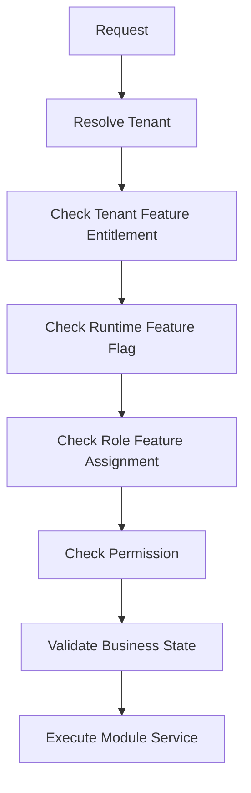

# Module README Template

## Purpose

Use this template to document one business or technical module.
A module README must explain ownership, scope, dependencies, database tables, API groups, frontend areas, backend services, and tenant-specific access behavior.
Do not use this template to document tiny features; use [[feature-spec-template]] for that.

## Module Identity

| Field | Value |
| --- | --- |
| Module name | `<module-name>` |
| Module type | `business | technical | cross-cutting` |
| Primary actors | `<platform-admin, tenant-admin, outlet-manager, cashier, customer>` |
| Tenant-owned? | `yes | no | mixed` |
| Platform-admin-only? | `yes | no | partial` |
| Related scope section | `[[01-product/project-scope]]` |
| Related data docs | `[[03-data/entities/<module>]]` |

## Scope Boundary

### In Scope

- `<capability 1>`
- `<capability 2>`
- `<capability 3>`

### Out of Scope

- `<excluded capability>`
- `<future integration>`

## Ownership Model

| Area | Owner | Rule |
| --- | --- | --- |
| Business rules | Application + Domain | Rules must match approved scope. |
| Tenant data | Database + backend service | Always scoped by `tenant_id` or tenant-owned parent. |
| Access control | Backend authorization layer | No hardcoded operational role behavior. |
| UI visibility | Frontend layout/guards | Hide unavailable actions but never trust hiding as security. |
| Audit | Audit service | Sensitive changes must be traceable. |

## Database Mapping

| Table | Purpose | Tenant Rule |
| --- | --- | --- |
| `<table_name>` | `<business purpose>` | `tenant_id required or inherited` |
| `<child_table>` | `<child purpose>` | `parent must belong to same tenant` |

## Backend Structure

```text
POS.Application/Modules/<Module>/
├── Services/<Module>Service.cs
├── Interfaces/I<Module>Service.cs
├── Dtos/<CreateDto>.cs
├── Dtos/<UpdateDto>.cs
├── Dtos/<ResponseDto>.cs
└── Validators/<Module>Validator.cs

POS.Infrastructure/Repositories/<Module>/
└── <Module>Repository.cs
```

## API Group Example

```http
GET /api/v1/<module>
POST /api/v1/<module>
GET /api/v1/<module>/{id}
PUT /api/v1/<module>/{id}
PATCH /api/v1/<module>/{id}/status
```

## Access Control Model



## Frontend Placement

- Pages: `src/pages/<Module>Page.tsx` where route-level screen is needed.
- Feature code: `src/features/<module>/`.
- Shared UI shell: `src/shells/<Module>Shell/` when reused.
- Server state: TanStack Query hooks inside feature API/hooks folders.
- Client state: Zustand only for interaction/session/UI state.

## Implementation Notes

- Use service/repository pattern, not CQRS.
- DTOs must be separate files in `Dtos/`.
- Service must own orchestration and transaction boundaries.
- Repository must not contain tenant authorization logic.
- All module write operations must be auditable where sensitive.


## Template Quality Controls
- Confirm the document uses tenant context instead of global assumptions.
- Confirm every non-platform capability has configurable permission behavior.
- Confirm platform-admin-only actions are separated from tenant-admin actions.
- Confirm backend authority is stated wherever business state changes occur.
- Confirm database table names match the approved production schema.
- Confirm API examples include tenant, outlet, device, or session context where relevant.
- Confirm frontend notes align with React, TypeScript, TanStack Query, Zustand, and Tailwind CSS.
- Confirm offline POS behavior references IndexedDB through `core/offline` when applicable.
- Confirm service/repository pattern is used; do not introduce CQRS or MediatR.
- Confirm DTOs are placed in `Dtos/` with one DTO per `.cs` file.
- Confirm audit requirements exist for sensitive actions such as refunds, voids, reprints, adjustments, and permission changes.
- Confirm user-right examples do not hardcode cashier, manager, or admin behavior.
- Confirm feature checks include entitlement, role feature assignment, permission, and runtime flag where applicable.
- Confirm Mermaid diagrams are simple enough for GitHub and Obsidian rendering.
- Confirm related links point to the correct 2nd Brain folder.
- Confirm examples are implementation-oriented and not marketing descriptions.
- Confirm validation rules identify blocking conditions and expected error behavior.
- Confirm status transitions are controlled and not free-text developer choices.
- Confirm tenant-owned data is never shared across tenants.
- Confirm reporting references transaction data or read models, not manual totals.
- Confirm the document uses tenant context instead of global assumptions.
- Confirm every non-platform capability has configurable permission behavior.
- Confirm platform-admin-only actions are separated from tenant-admin actions.
- Confirm backend authority is stated wherever business state changes occur.
- Confirm database table names match the approved production schema.
- Confirm API examples include tenant, outlet, device, or session context where relevant.
- Confirm frontend notes align with React, TypeScript, TanStack Query, Zustand, and Tailwind CSS.
- Confirm offline POS behavior references IndexedDB through `core/offline` when applicable.
- Confirm service/repository pattern is used; do not introduce CQRS or MediatR.
- Confirm DTOs are placed in `Dtos/` with one DTO per `.cs` file.
- Confirm audit requirements exist for sensitive actions such as refunds, voids, reprints, adjustments, and permission changes.
- Confirm user-right examples do not hardcode cashier, manager, or admin behavior.
- Confirm feature checks include entitlement, role feature assignment, permission, and runtime flag where applicable.
- Confirm Mermaid diagrams are simple enough for GitHub and Obsidian rendering.
- Confirm related links point to the correct 2nd Brain folder.
- Confirm examples are implementation-oriented and not marketing descriptions.
- Confirm validation rules identify blocking conditions and expected error behavior.
- Confirm status transitions are controlled and not free-text developer choices.
- Confirm tenant-owned data is never shared across tenants.
- Confirm reporting references transaction data or read models, not manual totals.
- Confirm the document uses tenant context instead of global assumptions.
- Confirm every non-platform capability has configurable permission behavior.
- Confirm platform-admin-only actions are separated from tenant-admin actions.
- Confirm backend authority is stated wherever business state changes occur.
- Confirm database table names match the approved production schema.
- Confirm API examples include tenant, outlet, device, or session context where relevant.
- Confirm frontend notes align with React, TypeScript, TanStack Query, Zustand, and Tailwind CSS.
- Confirm offline POS behavior references IndexedDB through `core/offline` when applicable.
- Confirm service/repository pattern is used; do not introduce CQRS or MediatR.
