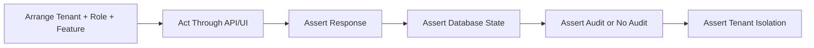

# Test Case Template

## Purpose

Use this template to define test coverage for one feature, workflow, API, or module.
Tests must verify business behavior, tenant isolation, configurable RBAC, feature assignment, permission rules, validation, audit, and frontend/backend responsibilities.

## Test Identity

| Field | Value |
| --- | --- |
| Test suite | `<module-feature-suite>` |
| Module | `[[07-modules/<module>]]` |
| Feature spec | `[[feature-spec-template]]` |
| API doc | `[[api-spec-template]]` |
| User flow | `[[user-flow-template]]` |
| Test level | `unit | integration | API | UI | E2E | security` |

## Test Data Context

| Data | Example | Required Rule |
| --- | --- | --- |
| Tenant A | `tenant_a` | Must not see Tenant B data. |
| Tenant B | `tenant_b` | Used for isolation test. |
| Role | `custom_cashier_role` | Permissions must be configurable. |
| Feature entitlement | `pos.sales.enabled` | Must control feature availability. |
| Runtime flag | `outlet POS enabled` | Must support scoped behavior. |
| Actor | `tenant user` | Must have tenant/outlet role assignment. |

## Test Case Format

| Field | Description |
| --- | --- |
| ID | Unique test identifier. |
| Scenario | Business scenario being tested. |
| Preconditions | Tenant, role, feature, data, and session setup. |
| Steps | Actions performed by actor or test client. |
| Expected result | Observable success or failure. |
| Database assertion | Rows, statuses, audit records, or constraints to verify. |
| Permission assertion | Expected access decision. |

## Example API Test

```csharp
[Fact]
public async Task CreateProduct_WhenRoleLacksPermission_ReturnsForbidden()
{
    var client = await TestClientFactory.ForTenantUserAsync(
        tenantId: TenantA,
        permissions: Array.Empty<string>());

    var response = await client.PostAsJsonAsync("/api/v1/products", new
    {
        name = "Blocked Product",
        productType = "simple"
    });

    Assert.Equal(HttpStatusCode.Forbidden, response.StatusCode);
}
```

## Permission Matrix Tests

| Condition | Expected Result |
| --- | --- |
| Feature disabled for tenant | 403 or feature-disabled error. |
| Feature enabled but role not assigned | 403 permission denied. |
| Role assigned but permission missing | 403 permission denied. |
| Permission exists but outlet mismatch | 403 or 404 scoped denial. |
| All controls valid | Action succeeds. |

## Workflow Diagram



## Frontend Test Notes

- Verify unavailable actions are hidden or disabled based on permission context.
- Verify backend denial is handled even if UI accidentally exposes action.
- Verify TanStack Query invalidates affected server-state keys after mutation.
- Verify Zustand stores do not persist cross-tenant state after logout or tenant switch.
- Verify POS offline storage writes to IndexedDB only for allowed offline workflows.


## Template Quality Controls
- Confirm the document uses tenant context instead of global assumptions.
- Confirm every non-platform capability has configurable permission behavior.
- Confirm platform-admin-only actions are separated from tenant-admin actions.
- Confirm backend authority is stated wherever business state changes occur.
- Confirm database table names match the approved production schema.
- Confirm API examples include tenant, outlet, device, or session context where relevant.
- Confirm frontend notes align with React, TypeScript, TanStack Query, Zustand, and Tailwind CSS.
- Confirm offline POS behavior references IndexedDB through `core/offline` when applicable.
- Confirm service/repository pattern is used; do not introduce CQRS or MediatR.
- Confirm DTOs are placed in `Dtos/` with one DTO per `.cs` file.
- Confirm audit requirements exist for sensitive actions such as refunds, voids, reprints, adjustments, and permission changes.
- Confirm user-right examples do not hardcode cashier, manager, or admin behavior.
- Confirm feature checks include entitlement, role feature assignment, permission, and runtime flag where applicable.
- Confirm Mermaid diagrams are simple enough for GitHub and Obsidian rendering.
- Confirm related links point to the correct 2nd Brain folder.
- Confirm examples are implementation-oriented and not marketing descriptions.
- Confirm validation rules identify blocking conditions and expected error behavior.
- Confirm status transitions are controlled and not free-text developer choices.
- Confirm tenant-owned data is never shared across tenants.
- Confirm reporting references transaction data or read models, not manual totals.
- Confirm the document uses tenant context instead of global assumptions.
- Confirm every non-platform capability has configurable permission behavior.
- Confirm platform-admin-only actions are separated from tenant-admin actions.
- Confirm backend authority is stated wherever business state changes occur.
- Confirm database table names match the approved production schema.
- Confirm API examples include tenant, outlet, device, or session context where relevant.
- Confirm frontend notes align with React, TypeScript, TanStack Query, Zustand, and Tailwind CSS.
- Confirm offline POS behavior references IndexedDB through `core/offline` when applicable.
- Confirm service/repository pattern is used; do not introduce CQRS or MediatR.
- Confirm DTOs are placed in `Dtos/` with one DTO per `.cs` file.
- Confirm audit requirements exist for sensitive actions such as refunds, voids, reprints, adjustments, and permission changes.
- Confirm user-right examples do not hardcode cashier, manager, or admin behavior.
- Confirm feature checks include entitlement, role feature assignment, permission, and runtime flag where applicable.
- Confirm Mermaid diagrams are simple enough for GitHub and Obsidian rendering.
- Confirm related links point to the correct 2nd Brain folder.
- Confirm examples are implementation-oriented and not marketing descriptions.
- Confirm validation rules identify blocking conditions and expected error behavior.
- Confirm status transitions are controlled and not free-text developer choices.
- Confirm tenant-owned data is never shared across tenants.
- Confirm reporting references transaction data or read models, not manual totals.
- Confirm the document uses tenant context instead of global assumptions.
- Confirm every non-platform capability has configurable permission behavior.
- Confirm platform-admin-only actions are separated from tenant-admin actions.
- Confirm backend authority is stated wherever business state changes occur.
- Confirm database table names match the approved production schema.
- Confirm API examples include tenant, outlet, device, or session context where relevant.
- Confirm frontend notes align with React, TypeScript, TanStack Query, Zustand, and Tailwind CSS.
- Confirm offline POS behavior references IndexedDB through `core/offline` when applicable.
- Confirm service/repository pattern is used; do not introduce CQRS or MediatR.
- Confirm DTOs are placed in `Dtos/` with one DTO per `.cs` file.
- Confirm audit requirements exist for sensitive actions such as refunds, voids, reprints, adjustments, and permission changes.
- Confirm user-right examples do not hardcode cashier, manager, or admin behavior.
- Confirm feature checks include entitlement, role feature assignment, permission, and runtime flag where applicable.
- Confirm Mermaid diagrams are simple enough for GitHub and Obsidian rendering.
- Confirm related links point to the correct 2nd Brain folder.
- Confirm examples are implementation-oriented and not marketing descriptions.
- Confirm validation rules identify blocking conditions and expected error behavior.
- Confirm status transitions are controlled and not free-text developer choices.
- Confirm tenant-owned data is never shared across tenants.
- Confirm reporting references transaction data or read models, not manual totals.
- Confirm the document uses tenant context instead of global assumptions.
- Confirm every non-platform capability has configurable permission behavior.
- Confirm platform-admin-only actions are separated from tenant-admin actions.
