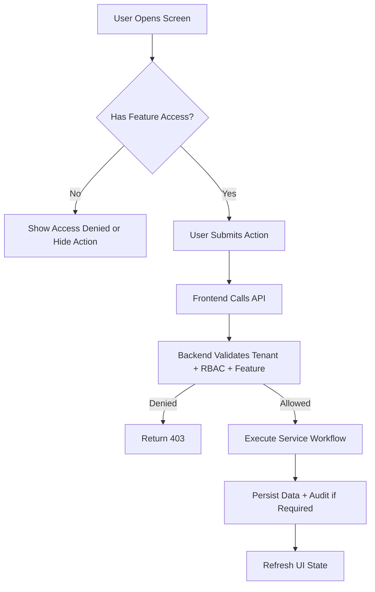

# User Flow Template

## Purpose

Use this template to document an actor journey across pages, modals, API calls, backend services, and database effects.
User flows must show tenant-specific access behavior and should not assume fixed roles.
A cashier, outlet manager, or tenant admin can perform an action only if their configured tenant role and permissions allow it.

## Flow Identity

| Field | Value |
| --- | --- |
| Flow name | `<actor-action-flow>` |
| Primary actor | `<platform-admin | tenant-admin | outlet-manager | cashier | customer>` |
| Layout | `<SuperAdminLayout | TenantLayout | POSLayout | AuthLayout>` |
| Feature/module | `[[07-modules/<module>]]` |
| Related API | `[[04-api/<api-doc>]]` |
| Related feature spec | `[[feature-spec-template]]` |

## Preconditions

- Actor is authenticated with JWT where required.
- Tenant context is resolved unless flow is platform-admin-only.
- Feature is enabled for tenant when tenant-level feature.
- Actor has role, user right, and permission for the action.
- Outlet/device/till/session context is available where required.

## Layout Rules

| Layout | Used For | Access Behavior |
| --- | --- | --- |
| Super Admin Layout | Platform tenant, plan, feature, support control | Platform-user permissions only. |
| Tenant Layout | Tenant admin, manager, back office users | Menu changes by tenant role and feature assignment. |
| POS Terminal Layout | Cashier-speed sales, payments, returns | Requires outlet, device, till/session context. |
| Auth Layout | Login, reset, OTP, session recovery | No business data until auth succeeds. |

## Flow Steps

| Step | Screen/Action | System Behavior | Validation |
| --- | --- | --- | --- |
| 1 | `<screen>` | `<what user sees>` | `<access check>` |
| 2 | `<action>` | `<API/service call>` | `<business rule>` |
| 3 | `<confirmation>` | `<state update>` | `<audit if sensitive>` |

## Mermaid Flow



## API Interaction Example

```typescript
const response = await api.post('/api/v1/<module>', payload, {
  headers: {
    Authorization: `Bearer ${token}`,
    'X-Tenant-Id': tenantId,
    'X-Outlet-Id': outletId,
  },
});
```

## Frontend State Guidance

- Server data belongs in TanStack Query.
- UI interaction state belongs in Zustand.
- POS cart/till/offline indicators may use local stores.
- Offline queues must write through `core/offline` into IndexedDB.
- Permission context controls visible navigation and actions.

## Failure States

- Permission denied: show controlled message, not raw API error.
- Feature disabled: explain tenant configuration requirement where appropriate.
- Session missing: redirect to outlet/till/session setup.
- Offline mode: queue allowed POS action or block unsupported action.
- Validation failure: highlight fields and preserve user input.


## Template Quality Controls
- Confirm the document uses tenant context instead of global assumptions.
- Confirm every non-platform capability has configurable permission behavior.
- Confirm platform-admin-only actions are separated from tenant-admin actions.
- Confirm backend authority is stated wherever business state changes occur.
- Confirm database table names match the approved production schema.
- Confirm API examples include tenant, outlet, device, or session context where relevant.
- Confirm frontend notes align with React, TypeScript, TanStack Query, Zustand, and Tailwind CSS.
- Confirm offline POS behavior references IndexedDB through `core/offline` when applicable.
- Confirm service/repository pattern is used; do not introduce CQRS or MediatR.
- Confirm DTOs are placed in `Dtos/` with one DTO per `.cs` file.
- Confirm audit requirements exist for sensitive actions such as refunds, voids, reprints, adjustments, and permission changes.
- Confirm user-right examples do not hardcode cashier, manager, or admin behavior.
- Confirm feature checks include entitlement, role feature assignment, permission, and runtime flag where applicable.
- Confirm Mermaid diagrams are simple enough for GitHub and Obsidian rendering.
- Confirm related links point to the correct 2nd Brain folder.
- Confirm examples are implementation-oriented and not marketing descriptions.
- Confirm validation rules identify blocking conditions and expected error behavior.
- Confirm status transitions are controlled and not free-text developer choices.
- Confirm tenant-owned data is never shared across tenants.
- Confirm reporting references transaction data or read models, not manual totals.
- Confirm the document uses tenant context instead of global assumptions.
- Confirm every non-platform capability has configurable permission behavior.
- Confirm platform-admin-only actions are separated from tenant-admin actions.
- Confirm backend authority is stated wherever business state changes occur.
- Confirm database table names match the approved production schema.
- Confirm API examples include tenant, outlet, device, or session context where relevant.
- Confirm frontend notes align with React, TypeScript, TanStack Query, Zustand, and Tailwind CSS.
- Confirm offline POS behavior references IndexedDB through `core/offline` when applicable.
- Confirm service/repository pattern is used; do not introduce CQRS or MediatR.
- Confirm DTOs are placed in `Dtos/` with one DTO per `.cs` file.
- Confirm audit requirements exist for sensitive actions such as refunds, voids, reprints, adjustments, and permission changes.
- Confirm user-right examples do not hardcode cashier, manager, or admin behavior.
- Confirm feature checks include entitlement, role feature assignment, permission, and runtime flag where applicable.
- Confirm Mermaid diagrams are simple enough for GitHub and Obsidian rendering.
- Confirm related links point to the correct 2nd Brain folder.
- Confirm examples are implementation-oriented and not marketing descriptions.
- Confirm validation rules identify blocking conditions and expected error behavior.
- Confirm status transitions are controlled and not free-text developer choices.
- Confirm tenant-owned data is never shared across tenants.
- Confirm reporting references transaction data or read models, not manual totals.
- Confirm the document uses tenant context instead of global assumptions.
- Confirm every non-platform capability has configurable permission behavior.
- Confirm platform-admin-only actions are separated from tenant-admin actions.
- Confirm backend authority is stated wherever business state changes occur.
- Confirm database table names match the approved production schema.
- Confirm API examples include tenant, outlet, device, or session context where relevant.
- Confirm frontend notes align with React, TypeScript, TanStack Query, Zustand, and Tailwind CSS.
- Confirm offline POS behavior references IndexedDB through `core/offline` when applicable.
- Confirm service/repository pattern is used; do not introduce CQRS or MediatR.
- Confirm DTOs are placed in `Dtos/` with one DTO per `.cs` file.
- Confirm audit requirements exist for sensitive actions such as refunds, voids, reprints, adjustments, and permission changes.
- Confirm user-right examples do not hardcode cashier, manager, or admin behavior.
- Confirm feature checks include entitlement, role feature assignment, permission, and runtime flag where applicable.
- Confirm Mermaid diagrams are simple enough for GitHub and Obsidian rendering.
- Confirm related links point to the correct 2nd Brain folder.
- Confirm examples are implementation-oriented and not marketing descriptions.
- Confirm validation rules identify blocking conditions and expected error behavior.
- Confirm status transitions are controlled and not free-text developer choices.
- Confirm tenant-owned data is never shared across tenants.
- Confirm reporting references transaction data or read models, not manual totals.
- Confirm the document uses tenant context instead of global assumptions.
- Confirm every non-platform capability has configurable permission behavior.
- Confirm platform-admin-only actions are separated from tenant-admin actions.
- Confirm backend authority is stated wherever business state changes occur.
- Confirm database table names match the approved production schema.
- Confirm API examples include tenant, outlet, device, or session context where relevant.
