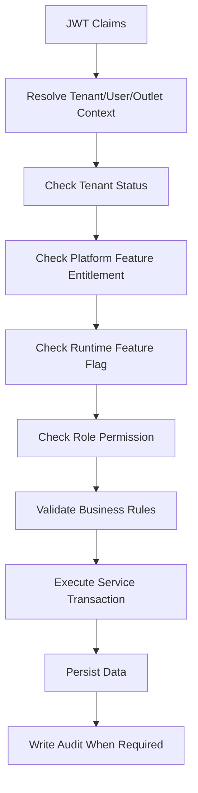

# Backend Feature Implementation Prompt Guide

## 1. Purpose

Use this file when asking Cursor or any AI IDE to implement a backend feature.

The goal is not to let the AI guess.

The AI must first read the correct 2nd Brain files, summarize understanding, then implement only the requested feature.

This project is a large multi-tenant Unified Commerce SaaS platform.

It is not an MVP and not a simple POS.

Backend implementation must follow Clean Architecture with Service Pattern and Repository Pattern.

Do not use CQRS.

Do not use MediatR.

Do not create new database tables unless the approved data documentation or database design already requires them.

Do not create generic cache tables.

PostgreSQL may be used for normal read optimization, indexes, projections, and query-level optimization.

Redis is not used now.

Backend is the final authority for tenant isolation, RBAC, feature access, pricing, tax, stock, payment, refund, offline sync acceptance, and audit.

---

## 2. Mandatory Rule Before Coding

Before writing code, the AI must read the project documents in this order.

The AI must not implement from memory.

The AI must not use assumptions when a rule exists in the 2nd Brain.

The AI must not modify unrelated modules.

The AI must not change frontend files during backend implementation.

The AI must not add random folders, random service styles, random DTO structure, or random response formats.

The AI must first respond with a short implementation understanding summary.

Only after that should it implement the feature.

---

## 3. Backend Reading Order

| Order | File / Folder | Why it must be read |
|---:|---|---|
| 1 | `../README.md` if available | Understand root 2nd Brain usage rules. |
| 2 | `../01-product/README.md` | Understand product scope and business boundary. |
| 3 | `../01-product/project-scope.md` | Confirm the feature is in scope. |
| 4 | `../01-product/product-vision.md` | Understand platform-level business direction. |
| 5 | `../02-architecture/system-overview.md` | Understand overall system ownership. |
| 6 | `../02-architecture/backend-architecture.md` | Confirm backend architecture approach. |
| 7 | `../02-architecture/tenancy-architecture.md` | Understand tenant isolation rules. |
| 8 | `../02-architecture/role-permission-capability-model.md` | Understand tenant-configurable RBAC and feature access. |
| 9 | `../02-architecture/security-architecture.md` | Understand security boundaries. |
| 10 | `../03-data/database-overview.md` | Understand database design direction. |
| 11 | `../03-data/schema-principles.md` | Understand schema ownership and constraints. |
| 12 | `../03-data/tenant-consistency-rules.md` | Enforce tenant consistency in every query. |
| 13 | `../03-data/entities/<relevant-entities>.md` | Read exact tables, PKs, FKs, constraints. |
| 14 | `../04-api/api-overview.md` | Understand API standards. |
| 15 | `../04-api/auth-and-authorization.md` | Apply JWT authentication and claims. |
| 16 | `../04-api/tenant-context-api-rules.md` | Apply tenant/outlet/user context rules. |
| 17 | `../04-api/feature-access-api-rules.md` | Apply feature entitlement and permission checks. |
| 18 | `../04-api/endpoint-design.md` | Follow endpoint naming and structure. |
| 19 | `../04-api/request-response-standard.md` | Follow request/response format. |
| 20 | `../04-api/error-contract.md` | Return standard errors. |
| 21 | `../04-api/idempotency-rules.md` | Use idempotency where duplicate requests are possible. |
| 22 | `../04-api/concurrency-rules.md` | Use concurrency handling where needed. |
| 23 | `../05-backend/README.md` | Understand backend documentation entry point. |
| 24 | `../05-backend/backend-overview.md` | Understand backend implementation style. |
| 25 | `../05-backend/backend-folder-structure.md` | Place files in the correct folders. |
| 26 | `../05-backend/clean-architecture-rules.md` | Respect layer boundaries. |
| 27 | `../05-backend/service-layer-rules.md` | Implement use case logic in services. |
| 28 | `../05-backend/repository-layer-rules.md` | Keep persistence logic in repositories. |
| 29 | `../05-backend/dto-handling.md` | Use DTOs correctly, one DTO per `.cs` file. |
| 30 | `../05-backend/validation-rules.md` | Apply validators and business validation. |
| 31 | `../05-backend/feature-access-handling.md` | Enforce tenant feature and permission checks. |
| 32 | `../05-backend/authentication-authorization.md` | Use JWT claims and authorization context. |
| 33 | `../05-backend/transaction-boundary-rules.md` | Use Unit of Work/transaction boundaries. |
| 34 | `../05-backend/exception-handling.md` | Use standard exception and error handling. |
| 35 | `../05-backend/mapping-rules.md` | Map entities and DTOs consistently. |
| 36 | `../05-backend/caching-strategy.md` | Apply PostgreSQL/read optimization only where allowed. |
| 37 | `../07-modules/<module>/README.md` | Understand module ownership. |
| 38 | `../07-modules/<module>/features/<feature>/feature-spec.md` | Understand the feature behavior. |
| 39 | `../07-modules/<module>/features/<feature>/api-spec.md` | Implement matching APIs. |
| 40 | `../07-modules/<module>/features/<feature>/feature-history.md` | Check accepted decisions and changes. |
| 41 | `../09-security-and-compliance/authorization-model.md` | Validate RBAC decisions. |
| 42 | `../09-security-and-compliance/data-isolation-controls.md` | Prevent cross-tenant access. |
| 43 | `../09-security-and-compliance/audit-requirements.md` | Add audit where required. |
| 44 | `../09-security-and-compliance/sensitive-actions.md` | Protect sensitive writes. |
| 45 | `../12-templates/feature-spec-template.md` | Match feature documentation style if updating docs. |
| 46 | `../12-templates/api-spec-template.md` | Match API documentation style if updating API docs. |

---

## 4. Conditional Backend Files

Read these only when the feature touches the related area.

| Scenario | Additional files to read |
|---|---|
| Offline POS sync | `../02-architecture/offline-first-architecture.md`, `../04-api/offline-sync-api-rules.md`, `../05-backend/offline-sync-backend-rules.md`, `../09-security-and-compliance/offline-data-protection.md` |
| POS device/till/session | `../04-api/device-session-api-rules.md`, `../03-data/entities/pos-device-sales-entities.md` |
| Payment/refund | `../03-data/entities/payments-entities.md`, `../09-security-and-compliance/payment-security-rules.md` |
| OTP/authentication | `../09-security-and-compliance/password-and-otp-rules.md`, `../09-security-and-compliance/session-rules.md` |
| Customer account | `../09-security-and-compliance/customer-account-security.md` |
| Stock/inventory | `../03-data/entities/inventory-entities.md`, `../04-api/concurrency-rules.md` |
| Pricing/tax/discount | `../03-data/entities/pricing-tax-entities.md`, `../03-data/entities/discounts-coupons-entities.md` |
| Reporting | `../03-data/entities/reporting-entities.md`, `../05-backend/caching-strategy.md` |
| Feature access/RBAC | `../03-data/entities/identity-access-entities.md`, `../02-architecture/role-permission-capability-model.md` |

---

## 5. Required Backend Implementation Structure

Use this structure unless the existing project already has a stricter folder pattern.

```text
POS.API/Modules/<Module>/
├── Controllers/
│   └── <Feature>Controller.cs
├── Requests/
│   ├── Create<Feature>Request.cs
│   └── Update<Feature>Request.cs
└── Responses/
    └── <Feature>Response.cs

POS.Application/Modules/<Module>/
├── Dtos/
│   ├── <Feature>Dto.cs
│   ├── Create<Feature>Dto.cs
│   └── Update<Feature>Dto.cs
├── Interfaces/
│   └── I<Feature>Service.cs
├── Validators/
│   ├── Create<Feature>Validator.cs
│   └── Update<Feature>Validator.cs
└── <Feature>Service.cs

POS.Domain/Modules/<Module>/
├── <Entity>.cs
└── <DomainService>.cs if pure domain logic is needed

POS.Infrastructure/
├── Persistence/
├── Repositories/<Module>/
│   └── <Feature>Repository.cs
└── UnitOfWork/
```

DTO rule: place DTOs under `Dtos/`, and use one DTO per `.cs` file.

Service rule: application service orchestrates workflow.

Repository rule: repository handles data access only.

Domain rule: domain entities protect core business invariants.

Controller rule: controller maps request to DTO, calls service, returns standardized response.

---

## 6. Backend Access Control Flow

Every tenant-level feature must validate access dynamically.

Do not hardcode access such as `if role == cashier`.

Use permissions, feature entitlement, role-feature assignment, and runtime flags.



Required checks:

| Check | Backend source |
|---|---|
| Tenant identity | JWT claims / tenant context middleware |
| Outlet identity | outlet context or route/body where valid |
| Feature entitlement | `tenant_feature_entitlements` |
| Runtime flag | `feature_flags` |
| Permission | `role_permissions`, `tenant_user_roles`, `outlet_user_roles` |
| Feature-role assignment | `role_feature_assignments` |
| Audit | `audit_logs` |

---

## 7. Standard Backend Prompt Template

Copy this prompt into Cursor when implementing a backend feature.

```md
You are a Senior Backend Software Engineer for the Unified Commerce multi-tenant SaaS platform.

Feature to implement:
[FEATURE NAME]

Module:
[MODULE NAME]

Feature folder:
../07-modules/[module]/features/[feature]/

Before coding, read these files in order:
1. ../01-product/README.md
2. ../01-product/project-scope.md
3. ../02-architecture/system-overview.md
4. ../02-architecture/backend-architecture.md
5. ../02-architecture/tenancy-architecture.md
6. ../02-architecture/role-permission-capability-model.md
7. ../02-architecture/security-architecture.md
8. ../03-data/database-overview.md
9. ../03-data/schema-principles.md
10. ../03-data/tenant-consistency-rules.md
11. ../03-data/entities/[relevant-entities].md
12. ../04-api/api-overview.md
13. ../04-api/auth-and-authorization.md
14. ../04-api/tenant-context-api-rules.md
15. ../04-api/feature-access-api-rules.md
16. ../04-api/endpoint-design.md
17. ../04-api/request-response-standard.md
18. ../04-api/error-contract.md
19. ../04-api/idempotency-rules.md
20. ../04-api/concurrency-rules.md
21. ../05-backend/README.md
22. ../05-backend/backend-overview.md
23. ../05-backend/backend-folder-structure.md
24. ../05-backend/clean-architecture-rules.md
25. ../05-backend/service-layer-rules.md
26. ../05-backend/repository-layer-rules.md
27. ../05-backend/dto-handling.md
28. ../05-backend/validation-rules.md
29. ../05-backend/feature-access-handling.md
30. ../05-backend/authentication-authorization.md
31. ../05-backend/transaction-boundary-rules.md
32. ../05-backend/exception-handling.md
33. ../05-backend/mapping-rules.md
34. ../05-backend/caching-strategy.md
35. ../07-modules/[module]/README.md
36. ../07-modules/[module]/features/[feature]/feature-spec.md
37. ../07-modules/[module]/features/[feature]/api-spec.md
38. ../07-modules/[module]/features/[feature]/feature-history.md
39. ../09-security-and-compliance/authorization-model.md
40. ../09-security-and-compliance/data-isolation-controls.md
41. ../09-security-and-compliance/audit-requirements.md
42. ../09-security-and-compliance/sensitive-actions.md

Important backend rules:
- Use Clean Architecture.
- Use Service Pattern and Repository Pattern.
- Do not use CQRS.
- Do not use MediatR.
- Do not create new tables unless the approved database/data docs require them.
- Do not create generic cache tables.
- Do not use Redis now.
- DTOs must be in Dtos/ folder, one DTO per .cs file.
- Backend must enforce tenant isolation, RBAC, feature entitlement, runtime feature flags, and permissions.
- Feature access must not be hardcoded by role name.
- Frontend hiding is not security.
- Do not modify unrelated modules.
- Do not change frontend files.

First output:
1. Feature understanding summary
2. Relevant database tables
3. Required permissions and feature checks
4. API endpoints to implement
5. Files you plan to create/update
6. Risks or missing clarification

Then implement only this feature.
```

---

## 8. Backend Output Expected From AI

The AI should provide this before coding:

| Section | Required content |
|---|---|
| Feature understanding | Business purpose and user actor. |
| Database mapping | Tables, PKs, FKs, unique constraints. |
| Access control | Feature key, permission codes, role scope. |
| API plan | Endpoints, request DTOs, response DTOs. |
| Service plan | Service methods and transaction boundaries. |
| Repository plan | Queries and persistence operations. |
| Audit plan | Sensitive events to audit. |
| Cache plan | PostgreSQL/read optimization only if useful. |
| Files plan | Exact file paths to create/update. |

Do not accept AI implementation that skips this planning output.

---

## 9. Backend Validation Rules

Every implementation must include validation at the correct layer.

| Validation type | Location |
|---|---|
| Request shape | API request model / validator |
| Required fields | Application validator |
| Tenant consistency | Service + repository query filter |
| Permission | Feature access service / authorization handling |
| Status transition | Domain or application service |
| Duplicate prevention | DB unique constraint + service check |
| Idempotency | API/service for retry-prone writes |
| Concurrency | Transaction + row locking where needed |

Examples:

```csharp
public sealed class CreateProductDto
{
    public Guid TenantId { get; init; }
    public string Name { get; init; } = string.Empty;
    public Guid? CategoryId { get; init; }
    public Guid ReturnPolicyId { get; init; }
    public bool IsSellablePos { get; init; }
    public bool IsSellableOnline { get; init; }
}
```

```csharp
public interface IProductService
{
    Task<ProductDto> CreateAsync(CreateProductDto dto, ActorContext actor, CancellationToken cancellationToken);
}
```

The DTO names above are examples only.

Use the actual feature and module names.

---

## 10. Backend Caching and Read Optimization

Current rule: do not use Redis.

Allowed backend read optimization:

| Area | Allowed approach |
|---|---|
| Frequently read reference data | PostgreSQL indexes and read queries. |
| Reporting summaries | Approved reporting read model tables. |
| Feature/permission lookup | Short-lived request-scoped or service-level computed result. |
| Product search | Indexed database queries. |
| Offline sync validation | Idempotency keys and unique constraints. |

Forbidden:

- `backend_cache` table
- `product_cache` table
- `tenant_cache` table
- `query_cache` table
- Redis dependency for now
- Cache as source of truth

---

## 11. Backend Completion Checklist

This checklist is for final review, not for repeating inside every generated feature file.

- Correct module folder used.
- Service Pattern used.
- Repository Pattern used.
- DTOs placed under `Dtos/`.
- One DTO per `.cs` file.
- JWT/tenant/user/outlet context handled.
- Tenant isolation enforced in queries.
- Feature entitlement checked.
- Runtime feature flag checked where applicable.
- Permission checked dynamically.
- No role-name hardcoding.
- Transaction boundary correct.
- Audit added for sensitive changes.
- API response/error format followed.
- Existing tests updated or new tests added.
- No unrelated files modified.
