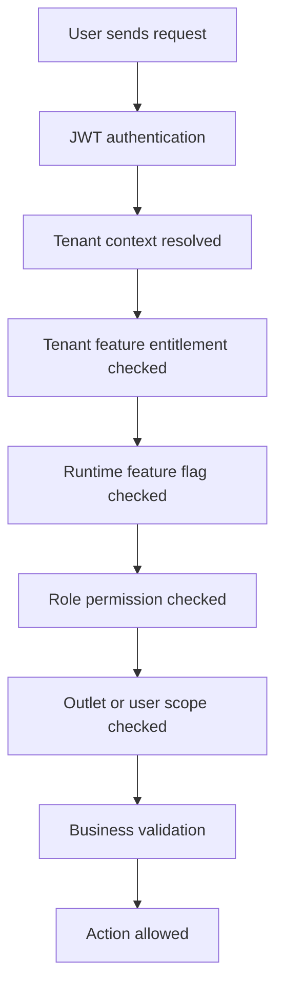

# Feature Documentation Authoring Guide

## Purpose

Use this guide when you need to write or regenerate documentation for **one feature inside one module** in the 2nd Brain knowledge base.

For every feature folder, the following three files must exist and must be fully written:

1. `feature-spec.md`
2. `api-spec.md`
3. `feature-history.md`

Do not write generic documentation. Use the approved Unified Commerce scope, database design, frontend architecture, backend architecture, module documents, security documents, and templates as the source of truth.

---

## Mandatory Reading Order Before Writing

Before writing documentation for any feature, read the files in this order.

### 1. Project and Scope Understanding

Read these first to understand the business boundary:

```text
00-start-here/README.md
01-product/README.md
01-product/project-scope.md
01-product/product-vision.md
01-product/business-objectives.md
```

Purpose:

- Understand this is a large enterprise Unified Commerce SaaS platform.
- Do not treat the feature as an isolated CRUD screen.
- Confirm whether the feature belongs to POS, E-Commerce, Tenant Admin, Super Admin, reporting, offline sync, or shared foundation.

---

### 2. Architecture Understanding

Read these to understand system rules and module ownership:

```text
02-architecture/README.md
02-architecture/system-architecture.md
02-architecture/multi-tenant-architecture.md
02-architecture/module-boundaries.md
02-architecture/frontend-backend-boundary.md
02-architecture/feature-access-architecture.md
```

Purpose:

- Understand tenant isolation.
- Understand frontend/backend responsibility split.
- Understand module boundaries.
- Confirm that backend is the final authority.
- Confirm that access must not be hardcoded.

---

### 3. Data and Entity Mapping

Read these to identify actual tables, relationships, constraints, and tenant ownership:

```text
03-data/README.md
03-data/database-overview.md
03-data/tenant-data-isolation.md
03-data/data-validation-rules.md
03-data/entities/<relevant-module-entity-file>.md
```

Examples:

| Feature | Entity files to read |
|---|---|
| Product create | `03-data/entities/catalog-tax-pricing.md` |
| Role assignment | `03-data/entities/identity-rbac-feature-access.md` |
| POS sale | `03-data/entities/pos-devices-sessions-sales.md` |
| Payment | `03-data/entities/payments-refunds-receipts.md` |
| Return | `03-data/entities/returns-exchanges.md` |
| Offline sync | `03-data/entities/receipts-audit-offline-sync.md` |
| E-Commerce order | `03-data/entities/customer-cart-ecommerce-orders.md` |

Purpose:

- Use real table names.
- Use real PK/FK relationships.
- Do not invent tables.
- Do not remove tenant context.
- Do not create generic cache tables.

---

### 4. API Standards

Read these before writing `api-spec.md`:

```text
04-api/README.md
04-api/api-design-standards.md
04-api/auth-and-authorization.md
04-api/error-response-format.md
04-api/idempotency-rules.md
04-api/pagination-filtering-sorting.md
04-api/versioning.md
```

Purpose:

- Use correct REST naming.
- Include JWT authentication rules.
- Include tenant/outlet context rules.
- Include RBAC/feature permission checks.
- Include request/response examples.
- Include validation and error examples.
- Include idempotency for payments, orders, sync, and other duplicate-risk operations.

---

### 5. Backend Implementation Rules

Read these before writing backend responsibility sections:

```text
05-backend/README.md
05-backend/backend-architecture.md
05-backend/service-pattern.md
05-backend/repository-pattern.md
05-backend/dto-rules.md
05-backend/validation-rules.md
05-backend/transaction-boundaries.md
05-backend/authentication-authorization.md
```

Mandatory backend rules:

- Use Clean Architecture.
- Use Service Pattern.
- Use Repository Pattern.
- Do not use CQRS.
- Do not use MediatR.
- Follow SOLID principles.
- Use `Dtos/` folder.
- Use one DTO per `.cs` file.
- Backend must enforce tenant isolation, RBAC, feature entitlement, feature flags, stock, tax, payment, refund, offline sync, and audit.

---

### 6. Frontend Implementation Rules

Read these before writing frontend responsibility sections:

```text
06-frontend/README.md
06-frontend/frontend-architecture.md
06-frontend/routing-and-guards.md
06-frontend/state-management.md
06-frontend/api-integration.md
06-frontend/layout-architecture.md
06-frontend/offline-pos-storage.md
```

Mandatory frontend rules:

- React with TypeScript.
- TanStack Query for API/server-state cache.
- Zustand for local workflow/session/cart UI state.
- Tailwind CSS for UI styling.
- IndexedDB through `core/offline` only for offline POS storage.
- UI may hide unavailable actions, but hiding is not security.
- Route guards and UI guards must mirror backend access rules.

---

### 7. Relevant Module and Feature Documents

Read the current module folder before writing the feature files:

```text
07-modules/<module-name>/README.md
07-modules/<module-name>/<feature-name>/feature-spec.md
07-modules/<module-name>/<feature-name>/api-spec.md
07-modules/<module-name>/<feature-name>/feature-history.md
```

If the existing content is outdated, replace it completely using this guide and the templates.

Also read any dependent feature folders. Example:

| Current feature | Dependency feature docs |
|---|---|
| Product create | Category, brand, supplier, tax class, return policy, pricing |
| POS checkout | Till session, cart, discounts, payments, receipts, inventory |
| Return create | Original sale/order lookup, refund, stock movement, audit |
| Tenant role assignment | Users, roles, permissions, feature entitlements |
| Offline sale sync | POS sale, payment, stock movement, receipt, sync conflict |

---

### 8. User Flow Documents

Read relevant flows before writing workflow sections:

```text
08-user-flows/README.md
08-user-flows/<relevant-flow-file>.md
```

Examples:

| Feature | Flow docs to read |
|---|---|
| Tenant creation | Super Admin tenant creation flow |
| Outlet creation | Tenant Admin outlet creation flow |
| Staff role assignment | Tenant Admin staff/role flow |
| POS billing | Cashier POS checkout flow |
| Till open/close | Cashier till session flow |
| Return/exchange | Manager/Cashier return flow |
| Offline sync | Offline POS reconnect/sync flow |

Purpose:

- Align feature docs with actual user journey.
- Include success, failure, validation, and permission paths.

---

### 9. Security and Compliance

Read these for every feature, not only security features:

```text
09-security-and-compliance/README.md
09-security-and-compliance/tenant-isolation.md
09-security-and-compliance/rbac-and-permissions.md
09-security-and-compliance/feature-access-control.md
09-security-and-compliance/audit-logging.md
09-security-and-compliance/jwt-authentication.md
09-security-and-compliance/offline-data-security.md
```

Purpose:

- Add tenant isolation rules.
- Add permission examples.
- Add feature entitlement checks.
- Add audit rules for sensitive operations.
- Add JWT and token context requirements.
- Add offline data security where applicable.

---

### 10. Templates

Use these templates as the final structure reference:

```text
12-templates/feature-spec-template.md
12-templates/api-spec-template.md
12-templates/feature-history-template.md
```

Do not copy the template blindly. Adapt it to the actual module, feature, database tables, API behavior, backend structure, frontend flow, and security rules.

---

## File 1: `feature-spec.md` Content Structure

When writing `feature-spec.md`, include these sections:

```md
---
title: <Feature Name> Feature Specification
folder: 07-modules/<module>/<feature>
document_type: feature-spec
status: approved-draft
source_of_truth:
  - 01-product/project-scope.md
  - 02-architecture/system-architecture.md
  - 03-data/entities/<relevant-entity-file>.md
  - 04-api/api-design-standards.md
  - 05-backend/backend-architecture.md
  - 06-frontend/frontend-architecture.md
---

# <Feature Name> Feature Specification

## 1. Purpose
## 2. Scope
## 3. Actors
## 4. Tenant-Specific Behavior
## 5. Permission and Feature Access Rules
## 6. Business Rules
## 7. Data Ownership and Table Mapping
## 8. Workflow
## 9. Backend Responsibilities
## 10. Frontend Responsibilities
## 11. Validation Rules
## 12. Caching and Storage Rules
## 13. Offline Rules, if applicable
## 14. Audit Rules
## 15. Failure Scenarios
## 16. Mermaid Flow Diagram
## 17. Related Documents
```

Important content rules:

- Mention exact tables from database design.
- Mention exact permissions using module-style permission names, for example `catalog.product.create`.
- Explain configurable access. Do not say a fixed role always has access.
- Use role examples only as examples, not hardcoded behavior.
- Include backend authority statement.
- Include frontend behavior statement.
- Include tenant/outlet/user scope where relevant.

---

## File 2: `api-spec.md` Content Structure

When writing `api-spec.md`, include these sections:

```md
---
title: <Feature Name> API Specification
folder: 07-modules/<module>/<feature>
document_type: api-spec
status: approved-draft
source_of_truth:
  - 04-api/api-design-standards.md
  - 04-api/auth-and-authorization.md
  - 05-backend/service-pattern.md
  - 03-data/entities/<relevant-entity-file>.md
---

# <Feature Name> API Specification

## 1. API Purpose
## 2. Authentication and Tenant Context
## 3. Required Permission Checks
## 4. Endpoints
## 5. Request DTOs
## 6. Response DTOs
## 7. Validation Rules
## 8. Error Responses
## 9. Idempotency and Concurrency
## 10. Backend Service Flow
## 11. Repository/Data Access Mapping
## 12. Audit Events
## 13. Cache/Revalidation Rules
## 14. Example Requests
## 15. Example Responses
## 16. Related Documents
```

API rules:

- Use JWT bearer authentication.
- Tenant must come from authenticated claims or trusted tenant context, not arbitrary body values.
- Outlet context must be validated when feature is outlet-scoped.
- All write endpoints must check:
  - tenant status
  - feature entitlement
  - runtime feature flag
  - role permission
  - input validation
  - business state
- Use DTO names aligned with backend structure.
- Do not expose EF entities directly.
- Do not invent database tables.

Example endpoint style:

```http
POST /api/v1/catalog/products
Authorization: Bearer <jwt>
X-Tenant-Id: <tenant-id>
Content-Type: application/json
```

Example validation error:

```json
{
  "success": false,
  "error": {
    "code": "VALIDATION_FAILED",
    "message": "The request contains invalid fields.",
    "details": [
      {
        "field": "name",
        "message": "Product name is required."
      }
    ]
  }
}
```

---

## File 3: `feature-history.md` Content Structure

When writing `feature-history.md`, include these sections:

```md
---
title: <Feature Name> Feature History
folder: 07-modules/<module>/<feature>
document_type: feature-history
status: active
source_of_truth:
  - 13-project-history/README.md
  - 01-product/project-scope.md
  - 03-data/entities/<relevant-entity-file>.md
---

# <Feature Name> Feature History

## 1. Current Feature Status
## 2. Decision Log
## 3. Version History
## 4. Architecture Decisions
## 5. Data Model Decisions
## 6. API Decisions
## 7. Permission and RBAC Decisions
## 8. Frontend Decisions
## 9. Backend Decisions
## 10. Caching and Offline Decisions
## 11. Rejected Approaches
## 12. Open Questions
## 13. Future Enhancements
## 14. Related Documents
```

History file rules:

- Do not write fake completed work.
- Use `approved-draft`, `planned`, `implemented`, or `changed` honestly.
- Record why decisions exist.
- Mention rejected patterns where relevant, such as:
  - no hardcoded role behavior
  - no CQRS/MediatR
  - no Redis currently
  - no generic cache tables
  - no frontend-only security

---

## Required RBAC and Feature Access Model

Every feature document must explain this access chain:



Access must be configurable per tenant.

Do not write:

```text
Cashier can create sales.
Manager can approve discounts.
Tenant admin can manage roles.
```

Write:

```text
A user can perform this action only when the tenant has the feature enabled, the runtime feature flag allows it, and one of the user's assigned tenant/outlet roles grants the required permission.
```

Role names can be used only as examples.

---

## Caching and Storage Placement Rules

Every feature document must mention caching/storage only where relevant.

| Area | Rule |
|---|---|
| Backend cache | Use PostgreSQL-backed read optimization/materialized projections only when needed. No Redis currently. |
| Generic cache tables | Do not create `backend_cache`, `product_cache`, `tenant_cache`, or similar generic cache tables. |
| Frontend server-state cache | Use TanStack Query for API results, lists, detail screens, and invalidation after mutations. |
| Frontend local workflow state | Use Zustand for cart, till session UI state, selected outlet, modal state, and temporary workflow state. |
| Offline POS storage | Use IndexedDB through `core/offline` only for offline POS sales, payments, receipts, sync queue, cached products, and cached pricing/tax data. |
| Backend authority | Cached/frontend/offline data is never final authority. Backend revalidates after submission/sync. |

---

## Standard Prompt To Generate One Feature Documentation Set

Use this prompt with Cursor / AI IDE:

```text
Act as a senior enterprise solution architect, system analyst, technical documentation architect, and SaaS platform designer.

Task:
Write complete documentation for this feature folder:

Module: [MODULE_NAME]
Feature: [FEATURE_NAME]
Feature folder path: 07-modules/[MODULE_NAME]/[FEATURE_NAME]/

Create or replace these files:
1. feature-spec.md
2. api-spec.md
3. feature-history.md

Before writing, read these project documents in order:

1. 00-start-here/README.md
2. 01-product/README.md
3. 01-product/project-scope.md
4. 02-architecture/README.md
5. 02-architecture/system-architecture.md
6. 02-architecture/multi-tenant-architecture.md
7. 02-architecture/module-boundaries.md
8. 02-architecture/feature-access-architecture.md
9. 03-data/README.md
10. 03-data/tenant-data-isolation.md
11. 03-data/data-validation-rules.md
12. 03-data/entities/[RELEVANT_ENTITY_FILE].md
13. 04-api/README.md
14. 04-api/api-design-standards.md
15. 04-api/auth-and-authorization.md
16. 05-backend/README.md
17. 05-backend/backend-architecture.md
18. 05-backend/service-pattern.md
19. 05-backend/repository-pattern.md
20. 05-backend/dto-rules.md
21. 06-frontend/README.md
22. 06-frontend/frontend-architecture.md
23. 06-frontend/state-management.md
24. 06-frontend/api-integration.md
25. 08-user-flows/[RELEVANT_USER_FLOW].md
26. 09-security-and-compliance/README.md
27. 09-security-and-compliance/tenant-isolation.md
28. 09-security-and-compliance/rbac-and-permissions.md
29. 09-security-and-compliance/feature-access-control.md
30. 09-security-and-compliance/audit-logging.md
31. 12-templates/feature-spec-template.md
32. 12-templates/api-spec-template.md
33. 12-templates/feature-history-template.md

Rules:
- Ignore any existing content inside the three feature docs.
- Use only the approved 2nd Brain documentation and uploaded source-of-truth architecture/scope/database documents.
- Do not create generic documentation.
- Do not invent tables, permissions, or endpoints without grounding them in the project design.
- Except platform-admin-only features, access must be tenant-configurable.
- Feature access must check tenant feature entitlement, runtime feature flag, role permission, and user/outlet scope.
- Backend must be final authority.
- Frontend hiding is not security.
- Backend uses Clean Architecture, Service Pattern, Repository Pattern, SOLID principles, DTO-per-file rule.
- Do not use CQRS or MediatR.
- Frontend uses React, TypeScript, TanStack Query, Zustand, Tailwind CSS.
- Offline POS storage uses IndexedDB through core/offline.
- Backend caching uses PostgreSQL/read optimization only where needed. Do not use Redis now.
- Do not create generic cache tables.
- Include tables, workflows, Mermaid diagrams, API examples, validation rules, permission examples, and implementation notes where useful.
- Keep each file preferably between 160 and 200 lines unless the topic is smaller.
- Add wiki-style links to related files.

Before writing the final files, first output:
1. Documents read
2. Feature understanding summary
3. Database tables involved
4. API endpoints planned
5. Permissions required
6. Frontend areas affected
7. Backend services/repositories affected
8. Risks or clarifications

Then write the three Markdown files.
```

---

## Example Mapping: Product Create Feature

Use this mapping when the feature is product creation:

```text
Module: catalog-management
Feature: product-create
Relevant entity file: 03-data/entities/catalog-tax-pricing.md
Relevant user flow: 08-user-flows/tenant-admin-product-create-flow.md
Required permission examples:
- catalog.product.create
- catalog.variant.create
- catalog.price.assign
- catalog.image.manage
Related tables:
- products
- product_variants
- categories
- brands
- suppliers
- product_suppliers
- product_attributes
- variant_attribute_values
- product_images
- price_lists
- price_list_items
- tax_classes
- return_policies
```

---

## Example Mapping: POS Sale Feature

Use this mapping when the feature is POS checkout/sale completion:

```text
Module: pos-sales-checkout
Feature: complete-sale
Relevant entity files:
- 03-data/entities/pos-devices-sessions-sales.md
- 03-data/entities/payments-refunds-receipts.md
- 03-data/entities/inventory-stock-control.md
- 03-data/entities/receipts-audit-offline-sync.md
Relevant user flow:
- 08-user-flows/cashier-pos-checkout-flow.md
Required permission examples:
- pos.sale.create
- pos.discount.apply
- pos.price.override
- payment.capture
- receipt.print
Related tables:
- sales
- sale_lines
- till_sessions
- pos_devices
- payments
- sale_payment_allocations
- stock_movements
- receipts
- receipt_print_logs
```

---

## Example Mapping: Role Assignment Feature

Use this mapping when the feature is role or permission assignment:

```text
Module: identity-rbac-feature-access
Feature: assign-role-permissions
Relevant entity file: 03-data/entities/identity-rbac-feature-access.md
Relevant user flow:
- 08-user-flows/tenant-admin-staff-role-permission-flow.md
Required permission examples:
- identity.role.create
- identity.permission.assign
- identity.user.role.assign
- feature.role.assign
Related tables:
- users
- roles
- permissions
- role_permissions
- tenant_user_roles
- outlet_user_roles
- platform_features
- tenant_feature_entitlements
- role_feature_assignments
- feature_flags
```
