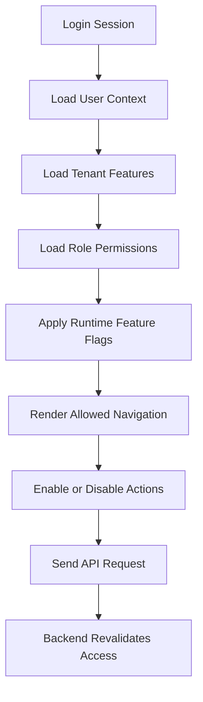

# Frontend Feature Implementation Prompt Guide

## 1. Purpose

Use this file when asking Cursor or any AI IDE to implement a frontend feature.

The AI must first read the correct 2nd Brain files, understand the target user flow, then implement only the requested UI/UX feature.

This frontend is part of a multi-tenant Unified Commerce SaaS platform.

It includes Super Admin, Tenant Admin, Outlet Manager, Cashier/POS, Inventory Staff, E-Commerce Ops, and Customer-facing flows.

Frontend must not decide security by itself.

Frontend may hide or disable actions based on permissions, but backend remains the final authority.

Feature access must be dynamic from tenant configuration, role permissions, feature entitlement, runtime feature flags, and user rights.

Do not hardcode access behavior by role name.

Do not make the cashier, manager, tenant admin, or platform admin behavior fixed unless the module is platform-admin-only.

---

## 2. Frontend Stack Rules

| Area | Required technology / rule |
|---|---|
| UI framework | React with TypeScript |
| Server state | TanStack Query |
| Local workflow state | Zustand |
| Styling | Tailwind CSS |
| Offline POS storage | IndexedDB through `core/offline` |
| API calls | `core/api` client and endpoint definitions |
| Auth/session | `core/auth` and session provider |
| Route protection | `AuthGuard`, `RoleGuard`, `TillSessionGuard` where applicable |
| Layouts | Super Admin, Tenant role-based layout, POS terminal layout, Auth layout |
| Hardware | `core/peripherals` for printer/scanner/cash drawer behavior |

Do not use random state libraries.

Do not store server data in Zustand when TanStack Query should own it.

Do not use IndexedDB for every feature.

IndexedDB is mainly for offline POS cache, offline transactions, sync queue, cached catalog/pricing/tax snapshot, and local receipt payloads.

---

## 3. Mandatory Rule Before Coding

Before writing code, the AI must read the correct files.

The AI must not implement based only on the feature name.

The AI must not modify backend code.

The AI must not create fake APIs when API specs already exist.

The AI must not create unrelated routes, screens, stores, or components.

The AI must first respond with a frontend implementation understanding summary.

Only after that should it implement the feature.

---

## 4. Frontend Reading Order

| Order | File / Folder | Why it must be read |
|---:|---|---|
| 1 | `../README.md` if available | Understand root 2nd Brain usage rules. |
| 2 | `../01-product/README.md` | Understand product documentation entry point. |
| 3 | `../01-product/project-scope.md` | Confirm the feature is in scope. |
| 4 | `../01-product/business-objectives.md` | Understand business outcome. |
| 5 | `../02-architecture/system-overview.md` | Understand end-to-end platform structure. |
| 6 | `../02-architecture/frontend-architecture.md` | Understand frontend architecture. |
| 7 | `../02-architecture/tenancy-architecture.md` | Understand tenant/outlet context. |
| 8 | `../02-architecture/role-permission-capability-model.md` | Understand configurable access behavior. |
| 9 | `../02-architecture/security-architecture.md` | Understand frontend security limits. |
| 10 | `../02-architecture/offline-first-architecture.md` | Read if POS/offline-related. |
| 11 | `../04-api/api-overview.md` | Understand API usage style. |
| 12 | `../04-api/auth-and-authorization.md` | Understand JWT/session expectations. |
| 13 | `../04-api/tenant-context-api-rules.md` | Pass tenant/outlet/device context correctly. |
| 14 | `../04-api/feature-access-api-rules.md` | Apply feature and permission-driven UI behavior. |
| 15 | `../04-api/endpoint-design.md` | Use correct endpoint style. |
| 16 | `../04-api/request-response-standard.md` | Use correct request/response handling. |
| 17 | `../04-api/error-contract.md` | Display API errors correctly. |
| 18 | `../04-api/module-endpoint-map.md` | Find related module endpoints. |
| 19 | `../06-frontend/README.md` | Understand frontend folder documentation. |
| 20 | `../06-frontend/frontend-overview.md` | Understand frontend purpose and boundaries. |
| 21 | `../06-frontend/frontend-folder-structure.md` | Place files correctly. |
| 22 | `../06-frontend/react-architecture-rules.md` | Follow React architecture rules. |
| 23 | `../06-frontend/api-client-and-query-rules.md` | Use TanStack Query correctly. |
| 24 | `../06-frontend/frontend-caching-rules.md` | Apply frontend caching rules. |
| 25 | `../06-frontend/offline-frontend-rules.md` | Use IndexedDB only where appropriate. |
| 26 | `../06-frontend/feature-access-ui-rules.md` | Hide/disable UI based on dynamic rights. |
| 27 | `../06-frontend/layout-architecture.md` | Use correct layout for actor/role. |
| 28 | `../06-frontend/component-design-rules.md` | Build reusable UI components correctly. |
| 29 | `../06-frontend/form-validation-rules.md` | Apply form validation. |
| 30 | `../06-frontend/frontend-coding-standards.md` | Follow coding style. |
| 31 | `../06-frontend/frontend-naming-conventions.md` | Use correct file/component names. |
| 32 | `../07-modules/<module>/README.md` | Understand module ownership. |
| 33 | `../07-modules/<module>/features/<feature>/feature-spec.md` | Understand feature behavior. |
| 34 | `../07-modules/<module>/features/<feature>/api-spec.md` | Use correct APIs. |
| 35 | `../07-modules/<module>/features/<feature>/feature-history.md` | Check decisions and feature changes. |
| 36 | `../08-user-flows/<actor>/README.md` | Understand actor-specific behavior. |
| 37 | `../08-user-flows/<actor>/<flow>.md` | Follow the exact user journey. |
| 38 | `../09-security-and-compliance/authorization-model.md` | Confirm frontend access behavior. |
| 39 | `../09-security-and-compliance/session-rules.md` | Confirm session behavior. |
| 40 | `../09-security-and-compliance/device-security-rules.md` | Read for POS/device-bound features. |
| 41 | `../09-security-and-compliance/offline-data-protection.md` | Read for offline POS features. |
| 42 | `../12-templates/user-flow-template.md` | Use if creating/updating user flow docs. |
| 43 | `../12-templates/feature-spec-template.md` | Use if updating feature docs. |

---

## 5. Conditional Frontend Files

Read these only when the feature touches the related area.

| Scenario | Additional files to read |
|---|---|
| POS screen or cashier workflow | `../06-frontend/layout-architecture.md`, `../06-frontend/offline-frontend-rules.md`, `../08-user-flows/cashier/README.md` |
| Super Admin UI | `../08-user-flows/platform-admin/README.md`, `../07-modules/platform-administration/README.md` |
| Tenant Admin UI | `../08-user-flows/tenant-admin/README.md`, `../07-modules/tenant-management/README.md`, `../07-modules/identity-access/README.md` |
| Outlet Manager UI | `../08-user-flows/manager/README.md`, `../07-modules/sales-pos/README.md`, `../07-modules/inventory/README.md` |
| E-Commerce customer UI | `../08-user-flows/ecommerce-customer/README.md`, `../07-modules/ecommerce-orders/README.md` |
| E-Commerce ops UI | `../08-user-flows/ecommerce-ops/README.md`, `../07-modules/fulfillment-logistics/README.md` |
| Offline POS | `../02-architecture/offline-first-architecture.md`, `../04-api/offline-sync-api-rules.md`, `../06-frontend/offline-frontend-rules.md`, `../09-security-and-compliance/offline-data-protection.md` |
| Payment/refund UI | `../09-security-and-compliance/payment-security-rules.md`, `../07-modules/payments/README.md` |
| OTP/customer auth UI | `../09-security-and-compliance/password-and-otp-rules.md`, `../09-security-and-compliance/customer-account-security.md` |

---

## 6. Required Frontend Implementation Structure

Use the existing frontend architecture.

```text
src/
├── features/<feature>/
│   ├── api/
│   │   └── <feature>.api.ts
│   ├── components/
│   │   └── <Feature>Panel.tsx
│   ├── hooks/
│   │   └── use<Feature>.ts
│   ├── services/
│   │   └── <feature>.service.ts
│   ├── types/
│   │   └── <feature>.types.ts
│   └── index.ts
├── pages/
│   └── <Feature>Page.tsx
├── shells/
│   └── <Feature>Shell/
├── state/
│   └── <feature>.store.ts when local workflow state is needed
└── core/
    ├── api/
    ├── auth/
    ├── offline/
    └── peripherals/
```

Use `features/` for module-specific UI, API hooks, services, and types.

Use `pages/` for route-level screens only.

Use `shells/` for large POS/admin composition areas.

Use `state/` only for workflow state that is not server-owned.

Use `core/offline` for IndexedDB and sync queue logic only.

Use `core/peripherals` for printer/scanner/cash drawer integration only.

---

## 7. Layout Selection Rules

| Actor / area | Layout |
|---|---|
| Platform admin / super admin | Super Admin layout inside AdminLayout pattern. |
| Tenant admin | Tenant role-based layout. |
| Outlet manager | Tenant layout with outlet context and manager permissions. |
| Cashier POS terminal | POS terminal layout. |
| Auth/login | AuthLayout. |
| Customer e-commerce | Customer/storefront layout if present in project. |

Tenant layout must be permission-driven.

It must render navigation based on enabled tenant features and user rights.

Do not hardcode every tenant admin to see all features.

POS layout must respect till session state.

If till session is required and inactive, POS billing should be blocked or redirected through `TillSessionGuard`.

---

## 8. Frontend Access Flow



Frontend responsibilities:

| Responsibility | Frontend behavior |
|---|---|
| Navigation | Show only allowed modules/features. |
| Actions | Hide or disable unauthorized buttons. |
| Forms | Validate required fields before API call. |
| Tenant context | Send/maintain correct tenant/outlet/device context. |
| Session | Redirect expired sessions to login. |
| Offline POS | Show offline status and queue actions safely. |

Backend responsibilities:

- Recheck every permission.
- Recheck tenant isolation.
- Recalculate totals.
- Accept or reject offline sync.
- Write audit records.

---

## 9. Standard Frontend Prompt Template

Copy this prompt into Cursor when implementing a frontend feature.

```md
You are a Senior Frontend Engineer for the Unified Commerce multi-tenant SaaS platform.

Feature to implement:
[FEATURE NAME]

Module:
[MODULE NAME]

Target actor/layout:
[Super Admin / Tenant Admin / Outlet Manager / Cashier POS / Customer / E-Commerce Ops]

Feature folder:
../07-modules/[module]/features/[feature]/

User flow folder:
../08-user-flows/[actor]/[flow].md

Before coding, read these files in order:
1. ../01-product/README.md
2. ../01-product/project-scope.md
3. ../01-product/business-objectives.md
4. ../02-architecture/system-overview.md
5. ../02-architecture/frontend-architecture.md
6. ../02-architecture/tenancy-architecture.md
7. ../02-architecture/role-permission-capability-model.md
8. ../02-architecture/security-architecture.md
9. ../04-api/api-overview.md
10. ../04-api/auth-and-authorization.md
11. ../04-api/tenant-context-api-rules.md
12. ../04-api/feature-access-api-rules.md
13. ../04-api/endpoint-design.md
14. ../04-api/request-response-standard.md
15. ../04-api/error-contract.md
16. ../04-api/module-endpoint-map.md
17. ../06-frontend/README.md
18. ../06-frontend/frontend-overview.md
19. ../06-frontend/frontend-folder-structure.md
20. ../06-frontend/react-architecture-rules.md
21. ../06-frontend/api-client-and-query-rules.md
22. ../06-frontend/frontend-caching-rules.md
23. ../06-frontend/offline-frontend-rules.md
24. ../06-frontend/feature-access-ui-rules.md
25. ../06-frontend/layout-architecture.md
26. ../06-frontend/component-design-rules.md
27. ../06-frontend/form-validation-rules.md
28. ../06-frontend/frontend-coding-standards.md
29. ../06-frontend/frontend-naming-conventions.md
30. ../07-modules/[module]/README.md
31. ../07-modules/[module]/features/[feature]/feature-spec.md
32. ../07-modules/[module]/features/[feature]/api-spec.md
33. ../07-modules/[module]/features/[feature]/feature-history.md
34. ../08-user-flows/[actor]/README.md
35. ../08-user-flows/[actor]/[flow].md
36. ../09-security-and-compliance/authorization-model.md
37. ../09-security-and-compliance/session-rules.md

Important frontend rules:
- Use React with TypeScript.
- Use TanStack Query for server state.
- Use Zustand only for local workflow state.
- Use Tailwind CSS for styling.
- Use IndexedDB only through core/offline for offline POS storage.
- Do not hardcode role access behavior.
- UI must be driven by tenant feature entitlement, role permissions, runtime flags, and user rights.
- Frontend hiding is not security; backend validates final authority.
- Do not create fake APIs.
- Do not change backend files.
- Do not modify unrelated frontend modules.

First output:
1. Feature understanding summary
2. Target actor and layout
3. Required API endpoints
4. Required permission/feature checks
5. State management decision: TanStack Query / Zustand / IndexedDB
6. Files you plan to create/update
7. Risks or missing clarification

Then implement only this frontend feature.
```

---

## 10. Frontend State Decision Guide

| Data type | Use |
|---|---|
| Products from server | TanStack Query |
| Tenant features/permissions | TanStack Query, cached carefully |
| Current cart | Zustand for active POS workflow |
| Payment step state | Zustand if multi-step local workflow |
| Modal open/close | Local React state or Zustand if shared |
| Offline sale queue | IndexedDB through `core/offline` |
| Cached POS catalog | IndexedDB through `core/offline` |
| API errors | TanStack Query mutation state + error contract |
| Form values | Component form state/form library, not global store by default |

Do not use Zustand as a database.

Do not use IndexedDB for normal admin pages.

Do not trust IndexedDB data as final truth after sync.

---

## 11. Frontend API Hook Example

Example only; adapt names to actual feature.

```ts
import { useQuery, useMutation, useQueryClient } from '@tanstack/react-query';
import { apiClient } from '@/core/api/http';
import type { ProductDto, CreateProductRequest } from '../types/product.types';

export function useProducts(tenantId: string) {
  return useQuery({
    queryKey: ['tenant', tenantId, 'products'],
    queryFn: async (): Promise<ProductDto[]> => {
      const response = await apiClient.get('/api/v1/products');
      return response.data.data;
    },
    enabled: Boolean(tenantId),
  });
}

export function useCreateProduct() {
  const queryClient = useQueryClient();
  return useMutation({
    mutationFn: async (request: CreateProductRequest) => {
      const response = await apiClient.post('/api/v1/products', request);
      return response.data.data;
    },
    onSuccess: (_data, variables) => {
      queryClient.invalidateQueries({ queryKey: ['tenant', variables.tenantId, 'products'] });
    },
  });
}
```

Do not copy this blindly if your API spec uses a different route or response shape.

Read the feature `api-spec.md` first.

---

## 12. Frontend Completion Checklist

This checklist is for final review, not for repeating in every feature file.

- Correct layout used.
- Correct feature folder used.
- API hooks use TanStack Query.
- Workflow state uses Zustand only where needed.
- IndexedDB used only through `core/offline`.
- UI respects tenant feature access and permissions.
- Unauthorized actions are hidden or disabled.
- Backend API is still called for final validation.
- Forms validate required fields.
- API errors use standard error contract.
- Loading, empty, success, and error states are handled.
- Touch-friendly rules applied for POS screens.
- No backend files modified.
- No unrelated frontend modules modified.
