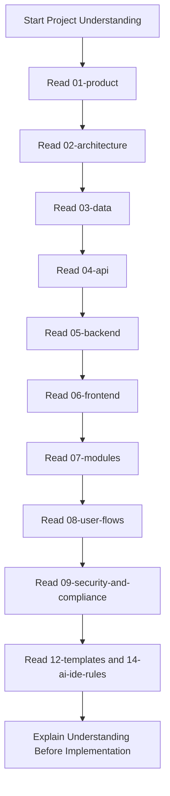
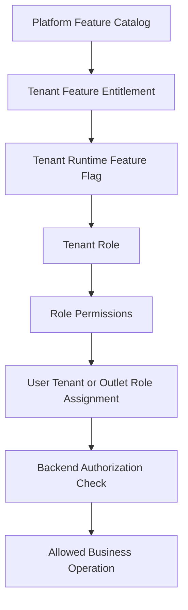

# Project Understanding Read Guide

## 1. Purpose

This file defines what a developer, Cursor, or AI IDE must read before claiming it understands the Unified Commerce project.

This guide is for project-level understanding, not direct feature implementation.

Before writing code, generating APIs, changing UI, modifying database logic, or updating feature documentation, the AI IDE must read the required files listed here.

The project is a full enterprise Unified Commerce SaaS platform, not an MVP.

The system includes POS, E-Commerce, multi-tenancy, tenant-specific RBAC, feature entitlement, outlet operations, inventory, payments, refunds, offline POS, audit, and reporting.

---

## 2. Core Understanding Rule

The AI IDE must not depend on assumptions.

It must understand the project from the 2nd Brain in this order:

1. Product scope
2. Architecture
3. Data model
4. API rules
5. Backend rules
6. Frontend rules
7. Module-specific rules
8. User flows
9. Security and compliance
10. Templates and AI IDE rules



---

## 3. Mandatory Source Priority

When documents conflict, use this priority order.

| Priority | Source | Reason |
|---:|---|---|
| 1 | Approved scope, database, frontend architecture, backend architecture | Original system authority |
| 2 | 01-product | Business scope and product rules |
| 3 | 02-architecture | System and module architecture |
| 4 | 03-data | Database, entities, relationships, constraints |
| 5 | 09-security-and-compliance | Tenant isolation, RBAC, JWT, audit, security |
| 6 | 04-api | API contracts and request/response standards |
| 7 | 05-backend | Backend implementation rules |
| 8 | 06-frontend | Frontend implementation rules |
| 9 | 07-modules | Feature-level implementation documentation |
| 10 | 08-user-flows | User journey and workflow context |
| 11 | 12-templates | Documentation format standards |
| 12 | 14-ai-ide-rules | Prompting and AI coding control rules |

---

## 4. Files to Read First for Full Project Understanding

The AI IDE must read these files first.

| Step | File or Folder | Purpose |
|---:|---|---|
| 1 | `README.md` | Root navigation and project structure |
| 2 | `00-start-here/README.md` if available | 2nd Brain entry point |
| 3 | `01-product/README.md` | Product folder overview |
| 4 | `01-product/product-vision.md` | Enterprise platform vision |
| 5 | `01-product/business-objectives.md` | Business goals and success criteria |
| 6 | `01-product/project-scope.md` | Full in-scope system boundary |
| 7 | `02-architecture/README.md` | Architecture folder overview |
| 8 | `02-architecture/*` | System architecture, module boundaries, tenancy, integration |
| 9 | `03-data/README.md` | Data folder overview |
| 10 | `03-data/entities/*` | Module-wise table/entity understanding |
| 11 | `04-api/README.md` | API folder overview |
| 12 | `04-api/auth-and-authorization.md` | JWT, tenant context, authorization rules |
| 13 | `05-backend/README.md` | Backend folder overview |
| 14 | `05-backend/*` | Clean Architecture, Service Pattern, Repository Pattern |
| 15 | `06-frontend/README.md` | Frontend folder overview |
| 16 | `06-frontend/*` | React, TypeScript, TanStack Query, Zustand, Tailwind, IndexedDB rules |
| 17 | `07-modules/README.md` if available | Module documentation overview |
| 18 | `07-modules/**/feature-spec.md` | Feature purpose, scope, rules |
| 19 | `07-modules/**/api-spec.md` | Feature API expectations |
| 20 | `07-modules/**/feature-history.md` | Feature decision/change history |
| 21 | `08-user-flows/README.md` | User-flow folder overview |
| 22 | `08-user-flows/*` | Super Admin, Tenant Admin, POS, customer, offline flows |
| 23 | `09-security-and-compliance/README.md` | Security folder overview |
| 24 | `09-security-and-compliance/*` | Tenant isolation, RBAC, permission, audit, JWT, offline security |
| 25 | `12-templates/*` | Documentation structure and required format |
| 26 | `14-ai-ide-rules/*` | AI IDE implementation and documentation rules |

---

## 5. Required Business Understanding

After reading the files, the AI IDE must understand these points.

| Area | Required Understanding |
|---|---|
| Platform type | Multi-tenant Unified Commerce SaaS |
| Main channels | POS and E-Commerce |
| Tenant model | Each customer tenant has isolated data, users, roles, settings, outlets, stock, customers, and reports |
| Admin model | Platform Admin controls platform-level features and tenant entitlements |
| Tenant model | Tenant Admin configures tenant-specific roles, permissions, users, outlets, and feature behavior |
| Staff model | Outlet Manager, Cashier, Inventory Staff, and other roles are configurable, not hardcoded |
| Customer model | Customer identity is tenant-scoped, not globally shared |
| Feature access | Tenant entitlements + feature flags + RBAC + permissions must be checked |
| Security model | Backend is the final authority |

---

## 6. Tenant-Configurable Access Rule

This is a mandatory system rule.

Except platform-admin-only features, every feature must support tenant-specific access configuration.

Access must not be hardcoded.

Correct access flow:



Wrong approach:

```text
if user.role == "cashier" then allowSaleCreate()
```

Correct approach:

```text
Check tenant entitlement
Check runtime feature flag
Check user role assignment
Check required permission
Check outlet scope when needed
Allow only after backend validation
```

---

## 7. Backend Understanding Required

The backend uses Clean Architecture with Service Pattern and Repository Pattern.

The AI IDE must understand these rules before implementation.

| Rule | Required Behavior |
|---|---|
| CQRS | Do not use CQRS |
| MediatR | Do not use MediatR |
| Service Pattern | Application services orchestrate business workflows |
| Repository Pattern | Repositories handle persistence logic |
| DTOs | Use `Dtos/` folder with one DTO per `.cs` file |
| Domain | Domain layer contains pure business entities and rules |
| Infrastructure | EF Core, repositories, integrations, Unit of Work |
| Transactions | Use Unit of Work for multi-table writes |
| Validation | Validate request, tenant, permission, feature, status, and business rule |
| Authority | Backend recalculates final totals and validates all sensitive operations |

Example backend feature understanding path:

```text
05-backend/README.md
05-backend/architecture-rules.md
05-backend/service-pattern.md
05-backend/repository-pattern.md
05-backend/dto-rules.md
05-backend/validation-rules.md
09-security-and-compliance/rbac-and-permissions.md
07-modules/<module>/<feature>/feature-spec.md
07-modules/<module>/<feature>/api-spec.md
```

---

## 8. Frontend Understanding Required

The frontend uses React with TypeScript.

The AI IDE must understand these rules before implementation.

| Area | Required Technology or Rule |
|---|---|
| Framework | React |
| Language | TypeScript |
| Server state | TanStack Query |
| Client workflow state | Zustand |
| Styling | Tailwind CSS |
| Offline POS storage | IndexedDB through `core/offline` |
| API access | Centralized through `core/api` |
| Auth | Token/session handling through `core/auth` |
| Layouts | Super Admin layout, Tenant role-based layout, POS terminal layout, Auth layout |
| Guards | AuthGuard, RoleGuard, TillSessionGuard where applicable |
| Security | UI hiding is not security; backend remains final authority |

Example frontend feature understanding path:

```text
06-frontend/README.md
06-frontend/frontend-architecture.md
06-frontend/state-management.md
06-frontend/api-state-management.md
06-frontend/layout-architecture.md
06-frontend/offline-pos-storage.md
09-security-and-compliance/frontend-security.md
07-modules/<module>/<feature>/feature-spec.md
08-user-flows/<related-flow>.md
```

---

## 9. Database Understanding Required

The AI IDE must understand database ownership and table relationships before backend implementation.

Important data areas:

| Data Area | Examples |
|---|---|
| Tenant foundation | `tenants`, `outlets`, `outlet_addresses`, `document_sequences` |
| Identity and RBAC | `users`, `roles`, `permissions`, `role_permissions`, `tenant_user_roles`, `outlet_user_roles` |
| Feature control | `platform_features`, `tenant_feature_entitlements`, `role_feature_assignments`, `feature_flags` |
| Catalog | `products`, `product_variants`, `categories`, `brands`, `suppliers`, `price_lists` |
| Inventory | `inventory_balances`, `stock_movements`, `stock_reservations` |
| POS | `tills`, `pos_devices`, `till_sessions`, `sales`, `sale_lines` |
| E-Commerce | `customers`, `carts`, `orders`, `order_items`, `deliveries` |
| Payments | `payments`, `payment_transactions`, `sale_payment_allocations`, `order_payment_allocations`, `refunds` |
| Offline sync | `offline_sync_batches`, `offline_sync_items`, `offline_sync_conflicts` |
| Audit | `audit_logs`, `offline_sync_audit_logs` |

The AI IDE must not invent tables unless the approved database design requires them.

---

## 10. API Understanding Required

The AI IDE must understand the API contract before generating controllers or frontend API clients.

Required API rules:

- JWT authentication must be used.
- Tenant context must come from authenticated claims in production.
- Temporary headers may be allowed only if current backend setup documents say so.
- Every tenant-owned endpoint must validate tenant scope.
- Sensitive actions must validate feature entitlement, feature flag, role, permission, and outlet scope.
- API responses must follow the documented standard response format.
- Duplicate-sensitive operations require idempotency.
- Offline sync operations require client IDs and conflict-safe processing.

Example authorization header:

```http
Authorization: Bearer <jwt-token>
```

Example tenant-scoped request:

```http
POST /api/v1/catalog/products
Authorization: Bearer <jwt-token>
Content-Type: application/json
```

---

## 11. User Flow Understanding Required

The AI IDE must read relevant user flows before feature work.

| Actor | Read Flow Type |
|---|---|
| Platform Admin | Tenant creation, entitlement assignment, platform user management |
| Tenant Admin | Outlet setup, staff setup, role/permission setup, configuration |
| Outlet Manager | Till/session, approvals, stock, reports |
| Cashier | POS login, till open, sale, payment, receipt, return |
| Inventory Staff | Stock receiving, adjustment, transfer, stocktake |
| E-Commerce Customer | Browse, cart, checkout, order tracking |
| Operations Staff | Order fulfillment, pickup, delivery |

User flow docs help identify frontend pages, backend APIs, validation points, and audit requirements.

---

## 12. Caching and Offline Understanding Required

The AI IDE must understand caching placement.

| Layer | Allowed Strategy | Not Allowed |
|---|---|---|
| Backend | PostgreSQL-backed read optimization, query tuning, indexes, read models | Redis for now |
| Backend | Existing reporting summary tables | Generic cache tables |
| Frontend | TanStack Query cache for server data | Treating cache as source of truth |
| Frontend | Zustand for local workflow state | Storing sensitive authorization decisions as trusted state |
| Offline POS | IndexedDB through `core/offline` | Storing all system data offline without scope control |

Backend remains final authority even when frontend uses cache.

---

## 13. Required Output Before Implementation

Before implementing any feature, the AI IDE must first output a project understanding summary.

Required format:

```md
# Project Understanding Summary

## Feature or Task
<name>

## Files Read
- <file 1>
- <file 2>
- <file 3>

## Business Understanding
<summary>

## Data Understanding
<tables and relationships>

## API Understanding
<endpoints and contracts>

## Backend Understanding
<services, repositories, DTOs, validation, transaction needs>

## Frontend Understanding
<pages, components, state, API hooks, layout>

## Security and Access Understanding
<tenant, RBAC, feature, permission, audit rules>

## Risks or Clarifications
<only real conflicts or missing decisions>
```

Implementation should start only after this summary is correct.

---

## 14. Ready-Made Cursor Prompt

Use this prompt when asking Cursor or an AI IDE to understand the project.

```text
You are a senior enterprise solution architect and senior software engineer.

Before implementing anything, read and understand the Unified Commerce 2nd Brain.

Read these first:
1. README.md
2. 01-product/README.md
3. 01-product/product-vision.md
4. 01-product/business-objectives.md
5. 01-product/project-scope.md
6. 02-architecture/README.md
7. 02-architecture/*
8. 03-data/README.md
9. 03-data/entities/*
10. 04-api/README.md
11. 04-api/auth-and-authorization.md
12. 05-backend/README.md
13. 05-backend/*
14. 06-frontend/README.md
15. 06-frontend/*
16. 07-modules/**/feature-spec.md
17. 07-modules/**/api-spec.md
18. 08-user-flows/*
19. 09-security-and-compliance/*
20. 12-templates/*
21. 14-ai-ide-rules/*

Understand that this is not an MVP. It is a multi-tenant enterprise Unified Commerce SaaS platform.

Except platform-admin-level features, every tenant-level feature must support tenant-specific configuration, role-based permission control, feature assignment, and user-right customization.

Do not hardcode feature access by role name.

Backend must be the final authority for tenant isolation, RBAC, feature access, validation, pricing, tax, stock, payment, refund, offline sync acceptance, and audit.

Backend uses Clean Architecture with Service Pattern and Repository Pattern. Do not use CQRS or MediatR.

Frontend uses React with TypeScript, TanStack Query, Zustand, Tailwind CSS, and IndexedDB through core/offline for offline POS.

Before coding, output:
1. Project understanding summary
2. Architecture understanding summary
3. Database understanding summary
4. Backend understanding summary
5. Frontend understanding summary
6. Security/RBAC understanding summary
7. Risks or clarification points

Do not implement until the understanding is complete.
```

---

## 15. Final Rule

The AI IDE must not say it understands the system until it can explain:

- tenant isolation
- platform admin vs tenant admin ownership
- configurable RBAC
- feature entitlements
- role permissions
- outlet-level role assignment
- JWT and backend authorization
- database table ownership
- frontend state separation
- backend Service/Repository pattern
- offline POS storage and sync
- audit and security rules

If it cannot explain these, it has not understood the project.
